# cm013 Notes and Exercises
Vincenzo Coia  
October 17, 2017  


Today we'll talk about a collection of plotting-related things. These notes consist of my own musings, along with ideas from Jenny's notes here:

- [Using colors in R](block018_colors.html)
- [Taking control of qualitative colors in `ggplot2`](block019_enforce-color-scheme.html)
- [Secrets of a happy graphing life](block016_secrets-happy-graphing.html)
- [Writing figures to file](block017_write-figure-to-file.html)
   

```r
suppressPackageStartupMessages(library(tidyverse))
suppressPackageStartupMessages(library(gapminder))
```


# 1 Best Practices

### 1.1 Don't over-assign variables

You've seen me make a plot like this before:

```
ggplot(gapminder, aes(year, lifeExp)) +
    geom_point()
```

_and_ this:

```
p <- ggplot(gapminder, aes(year, lifeExp)) +
    geom_point()
p
```

Both produce the same output, but why bother with the `p`? General rule of thumb: _don't assign plots to variables unless you'd be repeating repeating yourself otherwise_.

Some examples follow.

#### Multiple plots

To make the following two plots, this code is repetitive:


```r
ggplot(gapminder, aes(year, lifeExp)) + 
    geom_jitter(alpha=0.5)
```

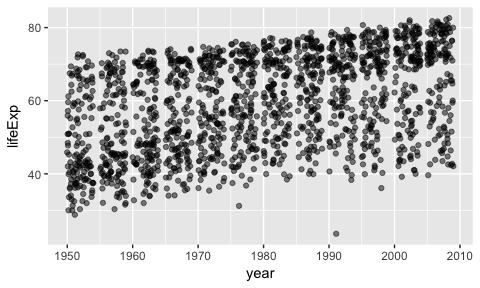

```r
ggplot(gapminder, aes(year, lifeExp)) + 
    geom_line(aes(group=country), alpha=0.2)
```

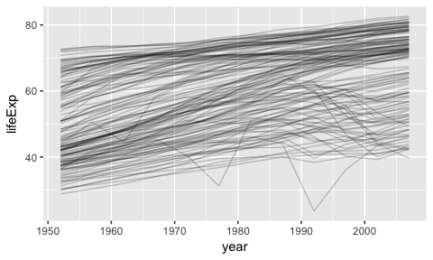

The first line is repetitive. Let's assign the first line to a variable, to avoid repeating ourselves:


```r
p <- ggplot(gapminder, aes(year, lifeExp))
p + geom_jitter(alpha=0.5)
```


```r
p + geom_line(aes(group=country), alpha=0.2)
```


#### One-time data wrangling

Let's say you want to run an analysis on Chile's `gapminder` data.

You might be tempted to make a plot:


```r
gapminder %>% 
    filter(country == "Chile") %>% 
    arrange(year) %>% 
    ggplot(aes(gdpPercap, lifeExp)) +
    geom_path()
```


But then you have to re-wrangle the data for your downstream analyses!

Try this:


```r
gapminder_chile <- gapminder %>% 
    filter(country == "Chile") %>% 
    arrange(year)
ggplot(gapminder_chile, aes(gdpPercap, lifeExp)) +
    geom_path()
```


Now you can run further analyses on `gapminder_chile`. 

#### You want to save a figure to file

We'll see this in the next topic, but saving to file:

- Requires you to save the plot as a variable (`ggsave` or `save`), or
- Requires you to print the plot "behind a wall" (with plotting devices)
    - ...in which case it's just good practice to _also_ print the plot interactively for your own eyes first. 


#### Avoid "variable chains"... you probably don't need them

Feel the need to do this?


```r
p <- ggplot(gapminder, aes(year, lifeExp))
p <- p + geom_line(aes(group=country), alpha=0.2, colour="red")
p <- p + geom_point(alpha=0.5)
p
```

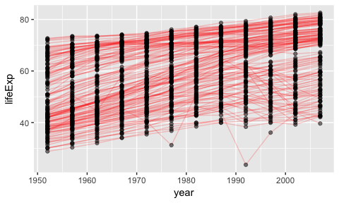

This relies on you _always_ executing these lines from top to bottom -- and I can assure you, when programming interactively, this does not always happen.

Better is this...


```r
p1 <- ggplot(gapminder, aes(year, lifeExp))
p2 <- p1 + geom_line(aes(group=country), alpha=0.2, colour="red")
p3 <- p2 + geom_point(alpha=0.5)
p3
```


But even better would be to get rid of the chain of `p`'s altogether. They're just confusing and make the code hard to read.

Easy-to-read version:


```r
ggplot(gapminder, aes(year, lifeExp)) +
    geom_line(aes(group=country), alpha=0.2, colour="red") +
    geom_point(alpha=0.5)
```


### 1.2 Keep stuff in data frames

Do you find yourself doing the following?


```r
life_exp <- gapminder$lifeExp
year <- gapminder$year
```

Problems:

- Breaks the "don't repeat yourself" principle.
    - How? Two instances of the data are created (one as a variable, another in the data frame).
- Pertinent for data frames: `life_exp` and `year` are _no longer linked_ as they are in the data frame, and can get shuffled.
    - Maybe one gets `sort`ed, or another loses some entries with `na.omit`. 

It's better practice to work directly from the data frame. Most "high-use" R functions require the specification of a data frame:


```r
lm(lifeExp ~ year, data=gapminder)
```

```
## 
## Call:
## lm(formula = lifeExp ~ year, data = gapminder)
## 
## Coefficients:
## (Intercept)         year  
##   -585.6522       0.3259
```

...is better than


```r
lm(life_exp ~ year)
```

```
## 
## Call:
## lm(formula = life_exp ~ year)
## 
## Coefficients:
## (Intercept)         year  
##   -585.6522       0.3259
```

But not all functions allow the input of a data frame -- let's try finding the correlation of two variables:

```
# This produces an error:
cor(lifeExp, gdpPercap, data=gapminder)
```

Instead, use the `with` function. Syntax: `with(dataframe, function_of_df_variables)`.


```r
with(gapminder, cor(lifeExp, gdpPercap))
```

```
## [1] 0.5837062
```

### 1.3 Making data frames/Tibbles

Consider putting variables into a data frame instead of having them as loose variables. 

- Old-school way: `data.frame`


```r
data.frame(x = 1:5, 
           y = (1:5)^2, 
           text = c("alpha", "beta", "gamma", "delta", "epsilon"))
```

```
##   x  y    text
## 1 1  1   alpha
## 2 2  4    beta
## 3 3  9   gamma
## 4 4 16   delta
## 5 5 25 epsilon
```

- Easier way: `tibble::tibble()`, or `tribble()` for smaller data frames "by hand". Jenny's example:


```r
tibble(x = 1:5,
       y = x ^ 2,
       text = c("alpha", "beta", "gamma", "delta", "epsilon"))
```

```
## # A tibble: 5 × 3
##       x     y    text
##   <int> <dbl>   <chr>
## 1     1     1   alpha
## 2     2     4    beta
## 3     3     9   gamma
## 4     4    16   delta
## 5     5    25 epsilon
```

```r
## if you're truly "hand coding", tribble() is an alternative
tribble(
  ~ x, ~ y,    ~ text,
    1,   1,   "alpha",
    2,   4,    "beta",
    3,   9,   "gamma",
    4,  16,   "delta",
    5,  25, "epsilon"
)
```

```
## # A tibble: 5 × 3
##       x     y    text
##   <dbl> <dbl>   <chr>
## 1     1     1   alpha
## 2     2     4    beta
## 3     3     9   gamma
## 4     4    16   delta
## 5     5    25 epsilon
```

- `expand.grid` is also a useful function. Makes a row for every combination:


```r
expand.grid(type=c("A", "B", "C"),
            level=1:4)
```

```
##    type level
## 1     A     1
## 2     B     1
## 3     C     1
## 4     A     2
## 5     B     2
## 6     C     2
## 7     A     3
## 8     B     3
## 9     C     3
## 10    A     4
## 11    B     4
## 12    C     4
```


# 2 Saving Figures to File

There are a few ways you can do this, but first let's look at two main _types_ of image files.

### 2.0 Types of Image Files

Images are stored on your computer as either _vector_ or _raster_.

- __Raster__: an `n` by `m` grid of pixels, each with its own colour.
    - Digital cameras do this. `jpeg`, `png`, `gif`, `bmp`.
    - Look horrible when expanded.
- __Vector__: represented as shapes and lines.
    - `pdf`, [`svg`](http://blog.revolutionanalytics.com/2011/07/r-svg-graphics.html).
    - Can scale naturally when expanded. `svg` is actually just [plain text](https://www.w3schools.com/graphics/svg_intro.asp).

There's no gold standard for which file format is best. Perhaps use both. I use `png` and `pdf` ([so does Jenny](http://stat545.com/block017_write-figure-to-file.html#graphics-devices)).

Want more advice? Check out [10 tips for making your R graphics look their best](http://blog.revolutionanalytics.com/2009/01/10-tips-for-making-your-r-graphics-look-their-best.html).

### 2.1 Method 1: Graphics Devices

Here's how to save an image using this method. 

1. Open a specific graphics device with a function like `pdf()`, `png()`, `jpeg()`, etc. Put the desired filename/path in here.
2. Print the plot.
3. Close the graphics device with `dev.off()`.

Here's an example that will write a plot to a pdf called `my_plot.pdf`:

```
(p <- ggplot(gapminder, aes(year, lifeExp)) +
     geom_point())
pdf("my_plot.pdf", width=12, height=6)
p
dev.off()
```

Check out the [devices documentation](https://www.rdocumentation.org/packages/grDevices/versions/3.4.1/topics/Devices) to learn all about this. Works for other plot types too.

### 2.2 Method 2: Using `ggsave`

You can save `ggplot2` plots using the `ggsave` function. Here's an example.

```
p <- ggplot(gapminder, aes(gdpPercap, lifeExp)) +
    geom_point(alpha=0.2) +
    scale_x_log10()
# p    # Uncomment when working interactively
ggsave("my_plot.pdf", p)
ggsave("my_plot.png", p)
```

`ggsave` guesses which arguments are best (and the file extension!), but sometimes you'll need to specify them yourself. 

### 2.3 Problems

Sometimes you'll end up seeing an empty plot. More details can be found [here](http://stat545.com/block017_write-figure-to-file.html#despair-over-non-existent-or-empty-figures), but one example is when using a `for` loop:


```r
for (i in 1){
    qplot(1,1)
}
```

Nothing appears. This is because you need to wrap the plot with `print`:


```r
for (i in 1){
    qplot(1,1) %>% 
        print
}
```

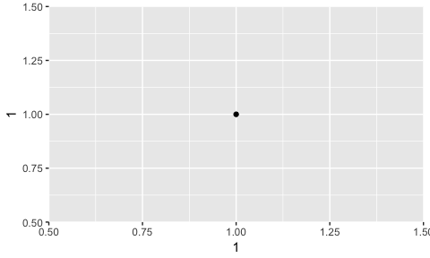

PS: when working interactively, `print` is usually run for you "behind the scenes".

# 3 Colours

### 3.1 Using different Colour Schemes

Don't like the default colour scheme that comes with `ggplot2`? Let's say we want to change the colours in the following plots:

(Psst: for `p1`, can you see the difference between `colour` and `fill`?)


```r
(p1 <- gapminder %>% 
        filter(year > 1990) %>%
        ggplot(aes(x=year)) +
        geom_bar(aes(weight=gdpPercap, fill=continent),
                 position="dodge",
                 colour="black") +
        scale_y_continuous("GDP Per Capita"))
```

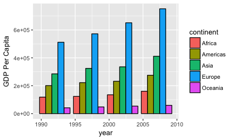

```r
(p2 <- ggplot(gapminder, aes(gdpPercap, lifeExp)) +
        geom_point(aes(colour=year)) +
        scale_x_log10())
```


```r
(p3 <- gapminder %>% 
        filter(continent=="Europe") %>% 
        group_by(country) %>% 
        arrange(year) %>% 
        mutate(chpop=(pop-lag(pop))/lag(pop)) %>%
        filter(!is.na(chpop)) %>% 
        ggplot(aes(gdpPercap, lifeExp)) +
        geom_point(aes(colour=chpop)) +
        scale_x_log10())
```


Each of these plots represent different types of scales. Here are the scales, and the corresponding `ggplot2` scales to modify the colours:

1. __Qualitative__ (`p1`). Coloured by categorical data. 
    - Use `scale_colour_manual` or `scale_fill_manual`, with the `values` argument
2. __Sequential__ (`p2`). Coloured from low to high.
    - Use `scale_colour_gradient` or `scale_fill_gradient`, with the `low` and `high` arguments.
3. __Diverging__ (`p3`). Coloured from negative to zero to positive.
    - Use `scale_colour_gradient2` or `scale_fill_gradient2`, with the `low`, `mid`, and `high` arguments.

Note: there's also `scale_colour_gradientn` and `scale_fill_gradientn` for "`n`-colour gradients", fading between `n` colours. Use the `colours` argument. 

Let's try the qualitative plot:


```r
my_cols <- c("red", "blue", "green", "wheat3", "orange")
p1 + scale_fill_manual(values=my_cols)
```

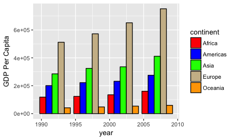

```r
# You can even name the colour vector according the levels:
names(my_cols) <- c("Europe", "Americas", "Africa", "Asia", "Oceania")
p1 + scale_fill_manual(values=my_cols)
```


The sequential plot:


```r
p2 + scale_colour_gradient(low="black", high="red")
```


The diverging plot:


```r
p3 + scale_colour_gradient2(low="blue", mid="white", high="red")
```

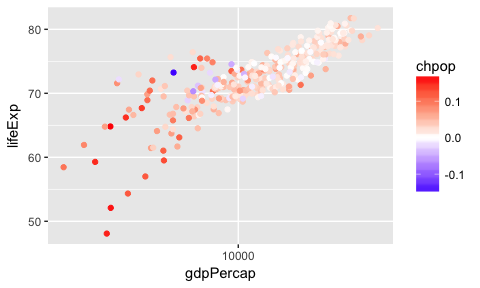

### 3.2 Identifying Colours in R

How would anyone know that R understands `wheat3`? R has lots of colours pre-defined -- see them all by running `colors()`:


```r
colors() %>% head
```

```
## [1] "white"         "aliceblue"     "antiquewhite"  "antiquewhite1"
## [5] "antiquewhite2" "antiquewhite3"
```

Or, check out Jenny's cheatsheet with [white background](http://stat545.com/img/r.col.white.bkgd.pdf) or [black background](http://stat545.com/img/r.col.black.bkgd.pdf).

You could also specify the hexadecimal colour. 


```r
p1 + scale_fill_manual(values=c("#9b5123", "#5dd8a6", "#11ad52", "#dde91d", "#0113d7"))
```


### 3.3 Palettes

Unless you're an expert in colours, it's best to leave choosing colours to an expert to balance all sorts of colour dimensions based on the intended purpose.

The `RColorBrewer` is a nice R package, based on designs by Cynthia Brewer, a colour expert. Here are the palettes available:


```r
library(RColorBrewer)
display.brewer.all()
```


Notice that they're separated into the three types of scales. 

Of note: the qualitative scales consist of colours of equal "importance" -- not one "dominates" the other in prominence. My favourite is `Dark2`.

Let's display and print the hexadecimal codes of the `Dark2` palette -- the first 5. Note that we need to specify the number of colours from the palette!


```r
display.brewer.pal(n=5, "Dark2")
```

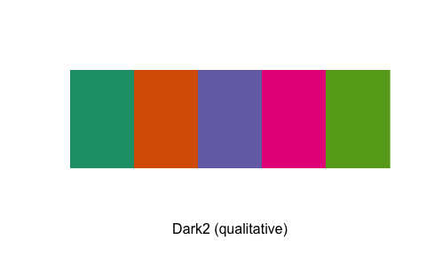

```r
brewer.pal(n=5, "Dark2")
```

```
## [1] "#1B9E77" "#D95F02" "#7570B3" "#E7298A" "#66A61E"
```

Go ahead and put this into the qualitative plot:


```r
p1 + scale_fill_manual(values=brewer.pal(n=5, "Dark2"))
```


We can also use the functions that are built-in to `ggplot2`:

- `scale_colour_brewer` or `scale_fill_brewer`, with the `palette` argument, for _discrete data only_. 
- `scale_colour_distiller` interpolates the colours in a given palette. 


```r
p1 + scale_fill_brewer(palette="Dark2")
```

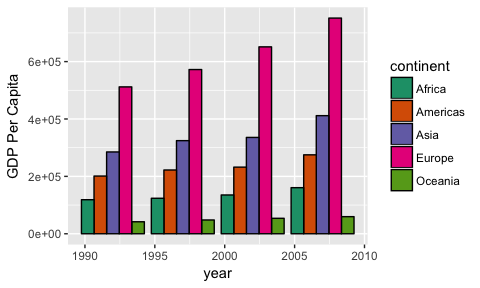

```r
p2 + scale_colour_distiller(palette="Greens", direction=1)
```


```r
p3 + scale_colour_distiller(palette="Spectral")
```


Other useful R packages:

- `dichromat` package. Converts a colour palette into various colour-blind views. 
- [`viridis`](https://cran.r-project.org/web/packages/viridis/vignettes/intro-to-viridis.html) package. Provides colour-blind friendly scales. 


```r
library(viridis)
```

```
## Loading required package: viridisLite
```

```r
p2 + scale_colour_viridis(option="inferno")
```

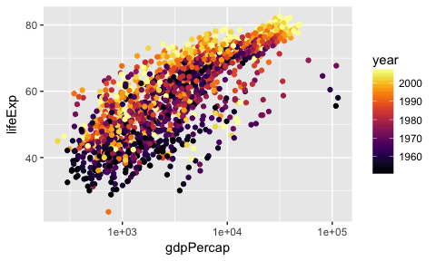

```r
p3 + scale_colour_viridis()
```

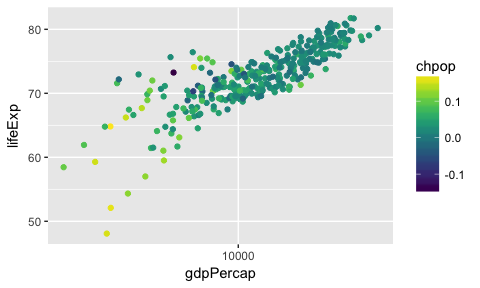

# 4 Exercise Set 1

1. Make histograms of Life Expectancies, facetted by `continent`. Paint the histogram by continent, using a colour palette of your choice from `RColorBrewer`.


```r
ggplot(gapminder, aes(lifeExp)) +
    facet_wrap(~ continent) +
    geom_histogram(aes(y=..density.., 
                       fill=continent)) +
    scale_fill_brewer(palette="Dark2")
```

```
## `stat_bin()` using `bins = 30`. Pick better value with `binwidth`.
```

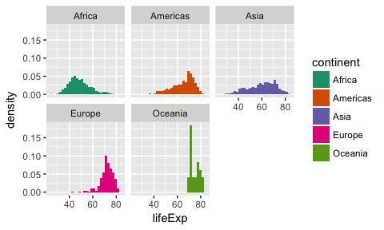

2. Make a trend plot/spaghetti plot of life Expectancies over time for each country. Highlight Rwanda in red (ensure the legend shows this, too).


```r
colour_layer <- scale_colour_manual("", 
                        labels=c("Other Countries", "Rwanda"),
                        values=c("black", "red"))
ggplot(gapminder, aes(year, lifeExp)) +
    geom_line(aes(group=country,
                  colour=country=="Rwanda"), alpha=0.2) +
    colour_layer
```


BONUS: make all countries besides Rwanda have alpha transparency of 0.2, and Rwanda be non-transparent.


```r
ggplot(gapminder, aes(year, lifeExp)) +
    geom_line(aes(group=country,
                  colour=country=="Rwanda",
                  alpha=country=="Rwanda")) +
    colour_layer +
    scale_alpha_discrete(range=c(0.2, 1),
                         guide=FALSE)
```


# 5 Adding layers as a list

You might have noticed in the above solutions that we can save individual layers as R variables:


```r
(my_layer <- geom_point(alpha=0.2))
```

```
## geom_point: na.rm = FALSE
## stat_identity: na.rm = FALSE
## position_identity
```

```r
ggplot(gapminder, aes(gdpPercap, lifeExp)) +
    my_layer
```


You can also save multiple layers in a _single R variable_ -- a list.


```r
my_layer2 <- geom_line(aes(group=country),
                       alpha=0.2)
multiple_layers <- list(my_layer, my_layer2)
ggplot(gapminder, aes(year, lifeExp)) +
    multiple_layers
```

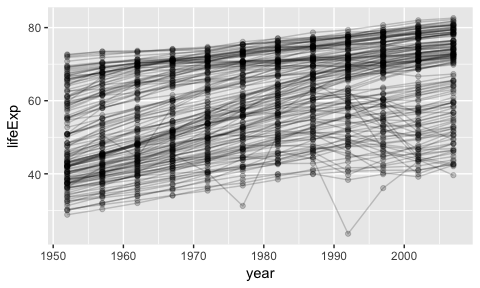

This becomes really useful when you want to plot multiple layers iteratively. Let's plot `f(x)=sin(k*x)` where `k` ranges from 1 to 4:


```r
fun_layers <- lapply(1:4, function(k) 
    list(stat_function(fun=function(x) sin(k*x),
                       colour=brewer.pal(8, "Dark2")[k])))
ggplot(data.frame(x=c(0, 2*pi)), aes(x)) +
    fun_layers +
    scale_colour_manual(labels=1:4)
```


Making a legend in this case requires some hard-coding. See [this Stack Overflow page](https://stackoverflow.com/questions/19219411/stat-function-and-legends-create-plot-with-two-separate-colour-legends-mapped-t) for advice. 

# 6 Scatterplot Symbols

You can change the "points" that get plotted in a scatterplot. Anything (?) on your keyboard works with the `shape` argument:


```r
p <- gapminder %>% 
    filter(country == "Canada") %>% 
    ggplot(aes(lifeExp, gdpPercap))
p + geom_point(shape="%", size=5)
```


```r
p + geom_point(shape='"', size=5)
```


Or, you can specify a ["`p`lotting `ch`aracter" (pch)](http://www.endmemo.com/program/R/pchsymbols.php) by its symbol number. Let's try `21`.


```r
p + geom_point(shape=21, size=5)
```


```r
# Also works:
p + geom_point(pch=21, size=5)
```


21-pch is great when used in conjunction with a `size` aesthetic:


```r
gapminder %>% 
    filter(continent=="Asia") %>% 
    ggplot(aes(gdpPercap, lifeExp, size=pop)) +
    geom_point(shape=21) +
    scale_x_log10()
```

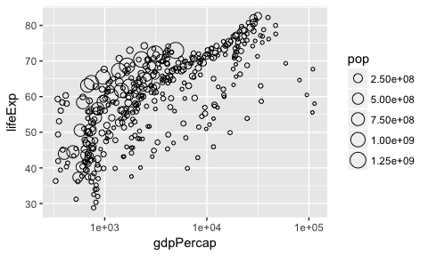

## Exercise Set 2

1. For the `gapminder` data in 2007, for all continents except Oceania, make a scatterplot of `gdpPercap` vs `lifeExp` facetted by `continent`, so that the size is proportional to the `pop`, the circumference of each circular "point" is black, and the interior is coloured by the country colours in the vector `country_colors` (NOTE: this vector comes with the `gapminder` package). Hide the legend. 


```r
(e2_1 <- gapminder %>%
    filter(year == 2007, continent != "Oceania") %>% 
    ggplot(aes(gdpPercap, lifeExp)) +
    facet_wrap(~ continent) +
    geom_point(aes(size=pop,
                   fill=country),
               shape=21) +
    scale_x_log10() +
    scale_fill_manual(values=country_colors,
                      guide=FALSE))
```


2. Save the above plot to file, as a `pdf` and `png`.


```r
# ggsave("tmp/e2_1.png", e2_1)
# ggsave("tmp/e2_1.pdf", e2_1)
```
