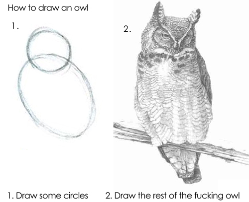

```{r setup, include = FALSE, cache = FALSE}
knitr::opts_chunk$set(collapse = TRUE, error = TRUE)
set.seed(328)
```



This [image](http://imgur.com/gallery/RadSf) is often used to illustrate how hard it can be to go from simple examples to the real thing you actually want.

I recently needed to draw a f\*cking owl in R, so I decided to record the process as an experiment.

When I teach [STAT545](http://stat545-ubc.github.io) or [Software Carpentry](http://software-carpentry.org), I try to convey as much about *process* as anything else. You can always look up technical details, e.g., syntax, but you don't usually get to see how other people work. This is also how I approach teaching about [writing R functions](http://stat545-ubc.github.io/block011_write-your-own-function-01.html). Newcomers often look at finished code and assume it flowed perfectly formed out of someone's fingertips. It probably did not.

My *modus operandi*: start with something that works and add features in small increments, maniacally checking that everything still works. Other people undoubtedly move faster (and, therefore, travel faster but crash harder), but I'm OK with that.

## Context: writing a function factory

I have an R package [`googlesheets`](https://github.com/jennybc/googlesheets) that gets Google Sheets in and out of R. Lately we've had alot of trouble with  `Internal Server Error (HTTP 500)`, which, as you might expect, is an error on the Google server side. All you can do as a user is try, try again. But this is a showstopper for unattended scripts or multi-step operations, like building and checking the package. A single error renders lots of other work moot, which is completely infuriating.

I want to catch these errors and automatically retry the request after an appropriate delay.

The brute force approach would be to literally drop little `for` or `while` loops all over the package, to inspect the response and retry if necessary. But I try to follow the [DRY principle](https://en.wikipedia.org/wiki/Don%27t_repeat_yourself), so would prefer to write a new "retry-capable" version of the function that makes these http requests.

It also turns out there's more than one function for making these requests. I'm talking about the [HTTP verbs you use with REST APIs](http://www.restapitutorial.com/lessons/httpmethods.html): GET, POST, PATCH, etc. I potentially need to give them all the "retry" treatment. So what I really need is a *function factory*: an HTTP verb goes in and out comes a retry-capable version of the verb.

It turns out you can write R (or S) for ~20 years and not be very facile with this technique. I certainly am not! But I can read, which is how I got the two circles to start my owl.

## Start at the beginning

My reference is the section of Wickham's [Advanced R](http://adv-r.had.co.nz) that is about [closures](http://adv-r.had.co.nz/Functional-programming.html#closures), "functions written by functions". Here's one of the two main examples: a function that creates an exponentiation function.

```{r}
power <- function(exponent) {
  function(x) {
    x ^ exponent
  }
}

square <- power(2)
square(2)
square(4)

cube <- power(3)
cube(2)
cube(4)
```

I make myself type all this code in and run it. No shortcuts!

What have I learned? I can write a factory, `power()`, that takes some input, `exponent`, and gives me back a function, such as `square()` or `cube()`.

But let's be honest, this is pretty far from what I need to do.

## Can the input be a function?

My problem is different. My input is a *function*, not an exponent like 2 or 3. Can I even do that?

The simplest thing I could think of that sort of looks like my problem:

  * the factory takes a function as input
  * it returns a function that executes the input function twice, with whatever inputs that function had in the first place
  
```{r}
call_me_twice <- function(f) {
  function(...) {
    f(...)
    f(...)
  }
}
```

Now I need an input function to be the guinea pig. It needs to take input and be chatty, so I can tell if it's getting executed. Make sure it works as expected!

```{r}
jfun <- function(x) cat(x, "\n")
jfun("a")
jfun(1)
```

Put it all together.

```{r}
jfunner <- call_me_twice(jfun)
jfunner("a")
jfunner(1)
```

I won't lie, I'm pleasantly surprised this worked. Morale boost.
 
## Faux VERB

I need a placeholder for the HTTP verbs with these qualities:

  * takes some input
  * generates a non-deterministic status
  * returns a list with the input, status, and some content

```{r}
VERB <- function(url = "URL!")
  list(url = url,
       status = sample(c(200, 500), size = 1, prob = c(0.6, 0.4)),
       content = rnorm(5))
VERB()
VERB()
```

Oh wait, we have functions in R to do something over and over again.

```{r}
replicate(5, VERB())
```

Send `VERB()` off to the function factory.

```{r}
VERB_twice <- call_me_twice(VERB)
replicate(5, VERB_twice())
```

Hmmmm ... I only see one output per call of `VERB_twice()`. But why? Is it because `VERB()` is only getting called once? That means I've screwed up. Or is `VERB()` getting called twice but I'm only seeing evidence of the second call?

## A better faux VERB

```{r}
VERB <- function(url = "URL!") {
  req <- list(url = url,
              status = sample(c(200, 500), size = 1, prob = c(0.6, 0.4)),
              content = rnorm(5))
  message(req$status)
  req
}
replicate(5, VERB())
```

Why is this better? Each call of `VERB()` causes a message AND returns something.

Send new and improved `VERB()` off to the function factory.

```{r}
VERB_twice <- call_me_twice(VERB)
replicate(5, VERB_twice())
```

I like it! What do I like about it?

  * 5 calls produce 10 messages, which tells me `VERB()` is getting called twice.
  * 5 calls produce 5 outputs, which is good for my eventual goal, where I will only want to return the value of the last call of the enclosed function.

## Retry `n` times ... and a temporary setback

Instead of hard-wiring 2 calls of the enclosed function `f`, let's call it `n` times via a `for` loop.

```{r}
call_me_n <- function(f, n = 3) {
  function(...) for (i in seq_len(n)) f(...)
}
```

Let's try my new function factory.

```{r}
VERB_3 <- call_me_n(VERB)
VERB_3()
```

That's disappointing. I see the message, but get no actual output. Is there really no output coming back? Or is it just invisible?

```{r}
x <- VERB_3()
str(x)
```

Nope, there really is no output. Fix that.

```{r}
call_me_n <- function(f, n = 3) {
  function(...) {
    for (i in seq_len(n)) out <- f(...)
    out
  }
}
VERB_3 <- call_me_n(VERB)
VERB_3()
```

YAY! Before I move on, let's make sure I can actually set the `n` argument to something other than 3.

```{r}
VERB_4 <- call_me_n(VERB, 4)
VERB_4()
```

## Conditional retries

Almost done!

My real factory needs to use the output of the enclosed HTTP verb to decide whether a retry is sensible. The new name reflects HTTP verb specificity. I now add the actual logic and behavior I need in real life.

```{r}
VERB_n <- function(VERB, n = 3) {
  force(VERB)
  force(n)
  function(...) {
    for (i in seq_len(n)) {
      out <- VERB(...)
      if (out$status < 499 || i == n) break
      backoff <- runif(n = 1, min = 0, max = 2 ^ i - 1)
      message("HTTP error ", out$status, " on attempt ", i,
              " ... retrying after a back off of ", round(backoff, 2),
              " seconds.")
      Sys.sleep(backoff)
    }
    out
  }
}
```

I send my existing faux `VERB()` off to the new and improved factory. Start providing input again, just to make sure that all still works.

```{r}
VERB_5 <- VERB_n(VERB, n = 5)
VERB_5("Owls can rotate their necks 270 degrees.")
VERB_5("Owls are cute.")
VERB_5("A group of owls is called a Parliament.")
```

And we have drawn some f\*cking owls, with retries!


## The final result is not that exciting

Now in real life, I create retry-capable HTTP verbs like so: `rGET <- VERB_n(httr::GET)`. Then just replace all instances of `httr::GET()` with `rGet()`. It's terribly anticlimactic.

The final version of the function factory is about a dozen lines of fairly pedestrian code. I probably wrote and discarded at least 10x that. This is typical, so don't be surprised if this is how it works for you too. Get a working example and take tiny steps to morph it into the thing you need.

*The __results__ of this effort are, however, pretty gratifying. I have had zero build/check failures locally and on Travis, since I implemented retries on `httr::GET()`. Or, to be honest, I've had failures, but for other reasons. So it was totally worth it! I also thank Konrad Rudolph and Kevin Ushey for [straightening me out](https://gist.github.com/jennybc/65c577f98c2bad7e2b3d0ccb773dfaf8) on the need to use `force()` inside the function factory.*
