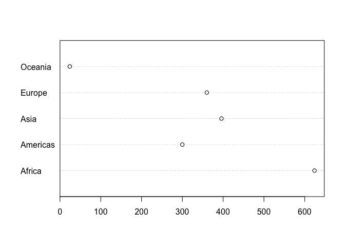
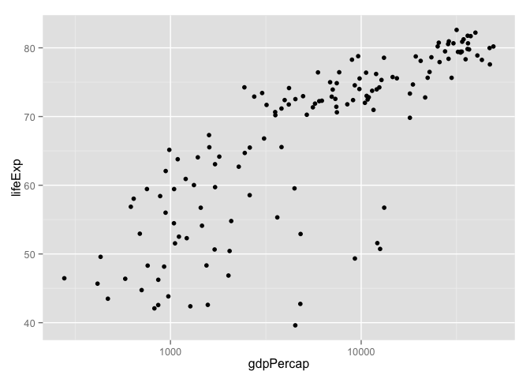
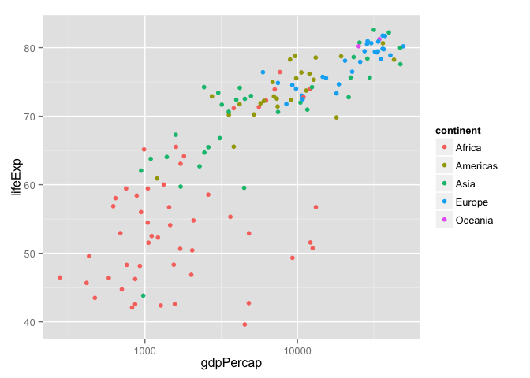
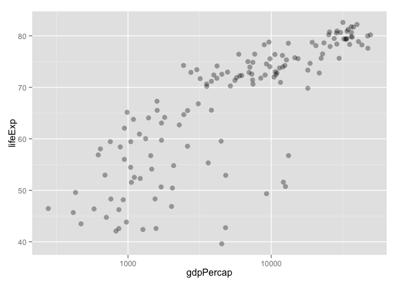
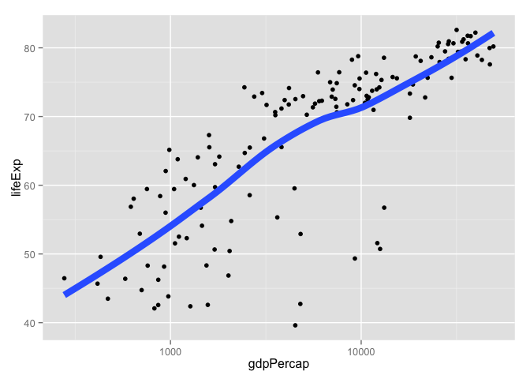
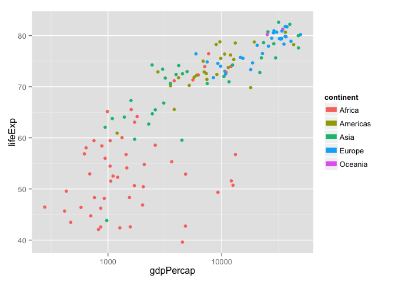
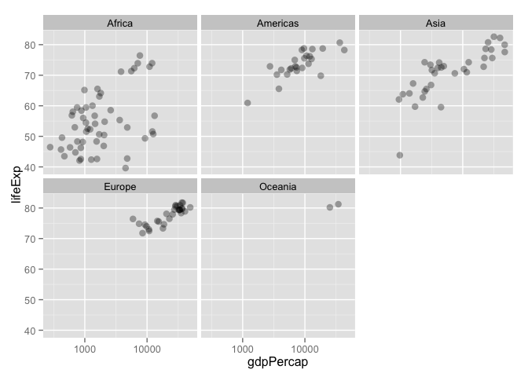

# Basic care and feeding of data in R

__NOTE: ROUGH DRAFT AFTER BRINGING CONTENT OVER FROM 2013. I still need to modernize some things (e.g. the transition to `ggplot2` from `lattice`), so look for an update soon.__

### Buckle your seatbelt

*Ignore if you don't need this bit of support.*

Now is the time to make sure you are working in an appropriate directory on your computer, probably through the use of an [RStudio Project](block002_hello-r-workspace-wd-project.html). Enter `getwd()` in the Console to see current working directory or, in RStudio, this is displayed in the bar at the top of Console.

You should clean out your workspace. In RStudio, click on the "Clear" broom icon from the Environment tab or use Session > Clear Workspace. You can also enter `rm(list = ls())` in the Console to accomplish same.

Now restart R. This will ensure you don't have any packages loaded from previous calls to `library()`. In RStudio, use Session > Restart R. Otherwise, quit R with `q()` and re-launch it.

Why do we do this? So that the code you write is complete and re-runnable. If you return to a clean slate often, you will root out hidden dependencies where one snippet of code only works because it relies on objects created by code saved elsewhere or, much worse, never saved at all. Similary, an aggressive clean slate approach will expose any usage of packages that have not been explicitly loaded. 

Finally, open a new R script and develop and run your code from there. In RStudio, use File > New File > R Script. Save this script with a name ending in `.r` or `.R`, containing no spaces or other funny stuff, and that evokes whatever it is we're doing today. Example: `session03_data-aggregation.r`.

### Get the Gapminder data

We will work with some of the data from the [Gapminder project](http://www.gapminder.org). Here is an excerpt prepared for your use. Please save this file locally, for example, in the directory associated with your RStudio Project:

  * <http://www.stat.ubc.ca/~jenny/notOcto/STAT545A/examples/gapminder/data/gapminderDataFiveYear.txt>
  * Nicer URL: <http://tiny.cc/gapminder>
  
You should now have a plain text file called `gapminderDataFiveYear.txt` on your computer, in your working directory. Do this to confirm:


```r
list.files()
```

If you __don't__ see `gapminderDataFiveYear.txt` there, DEAL WITH THAT BEFORE YOU MOVE ON.

### Create a data.frame via import

In real life you will usually bring data into R from an outside file. This rarely goes smoothly for "wild caught" datasets, which have little gremlins lurking in them that complicate import and require cleaning. Since this is not our focus today, we will work with a "domesticated" dataset JB uses a lot in teaching, an extract from the Gapminder data Hans Rosling has popularized.

> Assumption:  The file `gapminderDataFiveYear.txt` is saved on your computer and available for reading in R's current working directory.

Bring the data into R. Note that RStudio's tab completion facilities can help you with filenames, as well as function and object names. Try it out!

```r
gDat <- read.delim("gapminderDataFiveYear.txt")
```

One can also read data directly from a URL, though this is more of a party trick than a great general strategy.

```r
## data import from URL
gdURL <- "http://www.stat.ubc.ca/~jenny/notOcto/STAT545A/examples/gapminder/data/gapminderDataFiveYear.txt"
gdURL <- "http://tiny.cc/gapminder"
gDat <- read.delim(file = gdURL)
```
The R function `read.table()` is the main workhorse for importing rectangular spreadsheet-y data into an R data.frame. Use it. Read the documentation. There you will learn about handy wrappers around `read.table()`, such as `read.delim()` where many arguments have been preset to anticipate some common file formats. Competent use of the many arguments of `read.table()` can eliminate a very great deal of agony and post-import fussing around.

Whenever you have rectangular, spreadsheet-y data, your default data receptacle in R is a data.frame. Do not depart from this without good reason. data.frames are awesome because...

  * data.frames package related variables neatly together,
    - keeping them in sync vis-a-vis row order
    - applying any filtering of observations uniformly
  * most functions for inference, modelling, and graphing are happy to be passed a data.frame via a `data =` argument as the place to find the variables you're working on; the latest and greatest packages actually __require__ that your data be in a data.frame
  * data.frames -- unlike general arrays or, specifically, matrices in R -- can hold variables of different flavors (heuristic term defined later), such as character data (subject ID or name), quantitative data (white blood cell count), and categorical information (treated vs. untreated)

Get an overview of the object we just created with `str()` which displays the structure of an object. It will provide a sensible description of almost anything and, worst case, nothing bad can actually happen. When in doubt, just `str()` some of the recently created objects to get some ideas about what to do next.

```r
str(gDat)
```

```
## 'data.frame':	1704 obs. of  6 variables:
##  $ country  : Factor w/ 142 levels "Afghanistan",..: 1 1 1 1 1 1 1 1 1 1 ...
##  $ year     : int  1952 1957 1962 1967 1972 1977 1982 1987 1992 1997 ...
##  $ pop      : num  8425333 9240934 10267083 11537966 13079460 ...
##  $ continent: Factor w/ 5 levels "Africa","Americas",..: 3 3 3 3 3 3 3 3 3 3 ...
##  $ lifeExp  : num  28.8 30.3 32 34 36.1 ...
##  $ gdpPercap: num  779 821 853 836 740 ...
```
We could print the whole thing to screen (not so useful with datasets of any size) but it's nicer to look at the first bit or the last bit or a random snippet (I've written a function `peek()` to look at some random rows).

```r
head(gDat)
```

```
##       country year      pop continent lifeExp gdpPercap
## 1 Afghanistan 1952  8425333      Asia   28.80     779.4
## 2 Afghanistan 1957  9240934      Asia   30.33     820.9
## 3 Afghanistan 1962 10267083      Asia   32.00     853.1
## 4 Afghanistan 1967 11537966      Asia   34.02     836.2
## 5 Afghanistan 1972 13079460      Asia   36.09     740.0
## 6 Afghanistan 1977 14880372      Asia   38.44     786.1
```

```r
tail(gDat)
```

```
##       country year      pop continent lifeExp gdpPercap
## 1699 Zimbabwe 1982  7636524    Africa   60.36     788.9
## 1700 Zimbabwe 1987  9216418    Africa   62.35     706.2
## 1701 Zimbabwe 1992 10704340    Africa   60.38     693.4
## 1702 Zimbabwe 1997 11404948    Africa   46.81     792.4
## 1703 Zimbabwe 2002 11926563    Africa   39.99     672.0
## 1704 Zimbabwe 2007 12311143    Africa   43.49     469.7
```

```r
#peek(gDat) # you won't have this function!
```

*JB note to self: possible sidebar constructing `peek()` here*

More ways to query basic info on a data.frame. Note: with some of the commands below we're benefitting from the fact that even though data.frames are technically NOT matrices, it's usually fine to think of them that way and many functions have reasonable methods for both types of input.

```r
names(gDat)# variable or column names
```

```
## [1] "country"   "year"      "pop"       "continent" "lifeExp"   "gdpPercap"
```

```r
ncol(gDat)
```

```
## [1] 6
```

```r
length(gDat)
```

```
## [1] 6
```

```r
head(rownames(gDat)) # boring, in this case
```

```
## [1] "1" "2" "3" "4" "5" "6"
```

```r
dim(gDat)
```

```
## [1] 1704    6
```

```r
nrow(gDat)
```

```
## [1] 1704
```

```r
#dimnames(gDat) # ill-advised here ... too many rows
```

A statistical overview can be obtained with `summary()`

```r
summary(gDat)
```

```
##         country          year           pop              continent  
##  Afghanistan:  12   Min.   :1952   Min.   :6.00e+04   Africa  :624  
##  Albania    :  12   1st Qu.:1966   1st Qu.:2.79e+06   Americas:300  
##  Algeria    :  12   Median :1980   Median :7.02e+06   Asia    :396  
##  Angola     :  12   Mean   :1980   Mean   :2.96e+07   Europe  :360  
##  Argentina  :  12   3rd Qu.:1993   3rd Qu.:1.96e+07   Oceania : 24  
##  Australia  :  12   Max.   :2007   Max.   :1.32e+09                 
##  (Other)    :1632                                                   
##     lifeExp       gdpPercap     
##  Min.   :23.6   Min.   :   241  
##  1st Qu.:48.2   1st Qu.:  1202  
##  Median :60.7   Median :  3532  
##  Mean   :59.5   Mean   :  7215  
##  3rd Qu.:70.8   3rd Qu.:  9325  
##  Max.   :82.6   Max.   :113523  
## 
```

Although we haven't begun our formal coverage of visualization yet, it's so important for smell-testing dataset that we will make a few figures anyway. The mysteries of these commands are revealed elsewhere.


```r
plot(lifeExp ~ year, gDat)
plot(lifeExp ~ gdpPercap, gDat)
plot(lifeExp ~ log(gdpPercap), gDat)
```

> Sidebar on equals: A single equal sign `=` is most commonly used to specify values of arguments when calling functions in R, e.g. `group = continent`. It can be used for assignment but we advise against that, in favor of `<-`. A double equal sign `==` is a binary comparison operator, akin to less than `<` or greater than `>`, returning the logical value `TRUE` in the case of equality and `FALSE` otherwise. Although you may not yet understand exactly why, `subset = country == "Colombia"` restricts operation -- scatterplotting, in above examples -- to observations where the country is Colombia.

Let's go back to the result of `str()` to talk about data.frames and vectors in R

```r
str(gDat)
```

```
## 'data.frame':	1704 obs. of  6 variables:
##  $ country  : Factor w/ 142 levels "Afghanistan",..: 1 1 1 1 1 1 1 1 1 1 ...
##  $ year     : int  1952 1957 1962 1967 1972 1977 1982 1987 1992 1997 ...
##  $ pop      : num  8425333 9240934 10267083 11537966 13079460 ...
##  $ continent: Factor w/ 5 levels "Africa","Americas",..: 3 3 3 3 3 3 3 3 3 3 ...
##  $ lifeExp  : num  28.8 30.3 32 34 36.1 ...
##  $ gdpPercap: num  779 821 853 836 740 ...
```
A data.frame is a special case of a *list*, which is used in R to hold just about anything. data.frames are the special case where the length of each list component is the same. data.frames are superior to matrices in R because they can hold vectors of different flavors (heuristic term explained below), e.g. numeric, character, and categorical data can be stored together. This comes up alot.

To specify a single variable from a data.frame, use the dollar sign `$`. Let's explore the numeric variable for life expectancy.

```r
head(gDat$lifeExp)
```

```
## [1] 28.80 30.33 32.00 34.02 36.09 38.44
```

```r
summary(gDat$lifeExp)
```

```
##    Min. 1st Qu.  Median    Mean 3rd Qu.    Max. 
##    23.6    48.2    60.7    59.5    70.8    82.6
```

```r
hist(gDat$lifeExp)
```

 

The year variable is a numeric integer variable, but since there are so few unique values it also functions a bit like a categorical variable.

```r
summary(gDat$year)
```

```
##    Min. 1st Qu.  Median    Mean 3rd Qu.    Max. 
##    1950    1970    1980    1980    1990    2010
```

```r
table(gDat$year)
```

```
## 
## 1952 1957 1962 1967 1972 1977 1982 1987 1992 1997 2002 2007 
##  142  142  142  142  142  142  142  142  142  142  142  142
```

The variables for country and continent hold truly categorical information, which is stored as a *factor* in R.

```r
class(gDat$continent)
```

```
## [1] "factor"
```

```r
summary(gDat$continent)
```

```
##   Africa Americas     Asia   Europe  Oceania 
##      624      300      396      360       24
```

```r
levels(gDat$continent)
```

```
## [1] "Africa"   "Americas" "Asia"     "Europe"   "Oceania"
```

```r
nlevels(gDat$continent)
```

```
## [1] 5
```

```r
table(gDat$continent)
```

```
## 
##   Africa Americas     Asia   Europe  Oceania 
##      624      300      396      360       24
```

```r
barplot(table(gDat$continent))
```

 

```r
dotchart(table(gDat$continent))
```

```
## Warning: 'x' is neither a vector nor a matrix: using as.numeric(x)
```

 

```r
#dotplot(table(gDat$continent), type = "h", col.line = NA)
#dotplot(table(gDat$continent), type = c("p", "h"), col.line = NA)
str(gDat$continent)
```

```
##  Factor w/ 5 levels "Africa","Americas",..: 3 3 3 3 3 3 3 3 3 3 ...
```
The __levels__ of the factor `continent` are "Africa", "Americas", etc. and this is what's usually presented to your eyeballs by R. In general, the levels are friendly human-readable character strings, like "male/female" and "control/treated". But never ever ever forget that, under the hood, R is really storing integer codes 1, 2, 3, etc. Look at the result from `str(gDat$continent)` if you are skeptical. This [Janus](http://en.wikipedia.org/wiki/Janus)-like nature of factors means they are rich with booby traps for the unsuspecting but they are a necessary evil. I recommend you resolve to learn how to properly care and feed for factors. The pros far outweigh the cons. Specifically in modelling and figure-making, factors are anticipated and accomodated by the functions and packages you will want to exploit. ~~In the figures below, the continent factor is easily mapped into panels or colors and a legend by `xyplot()` from the `lattice` package (and you will find factors equally powerful within `ggplot2`)~~.


```r
library(ggplot2)
p <- ggplot(gDat, aes(x = gdpPercap, y = lifeExp)) # just initializes
p <- ggplot(subset(gDat, year == 2007),
            aes(x = gdpPercap, y = lifeExp)) # just initializes
p <- p + scale_x_log10() # log the x axis the right way
p + geom_point() # scatterplot
```

 

```r
p + geom_point(aes(color = continent)) # map continent to color
```

 

```r
p + geom_point(alpha = (1/3), size = 3)
```

 

```r
p + geom_point() + geom_smooth(lwd = 3, se = FALSE)
```

```
## geom_smooth: method="auto" and size of largest group is <1000, so using loess. Use 'method = x' to change the smoothing method.
```

 

```r
p + aes(color = continent) + geom_point() + geom_smooth(lwd = 3, se = FALSE)
```

```
## geom_smooth: method="auto" and size of largest group is <1000, so using loess. Use 'method = x' to change the smoothing method.
```

```
## Warning: span too small.   fewer data values than degrees of freedom.
## Warning: at  4.4005
## Warning: radius  4.6147e-07
## Warning: all data on boundary of neighborhood. make span bigger
## Warning: pseudoinverse used at 4.4005
## Warning: neighborhood radius 0.00067931
## Warning: reciprocal condition number  1
## Warning: at  4.5377
## Warning: radius  4.6147e-07
## Warning: all data on boundary of neighborhood. make span bigger
## Warning: There are other near singularities as well. 4.6147e-07
## Warning: zero-width neighborhood. make span bigger
## Warning: zero-width neighborhood. make span bigger
```

 

```r
p + geom_point(alpha = (1/3), size = 3) + facet_wrap(~ continent)
```

 

### `subset()` is the nicest way to isolate bits of data.frames (and other things)

Logical little pieces of data.frames are useful for sanity checking, prototyping visualizations or computations for later scale-up, etc. Many functions are happy to restrict their operations to a subset of observations via a formal `subset =` argument. In fact, you've already seen that in many of the examples above. There is a stand-alone function, also confusingly called `subset()`, that can isolate pieces of an object for inspection or assignment. Although `subset()` can work on objects other than data.frames, we focus on that usage here.

The `subset()` function has a `subset =` argument (sorry, not my fault it's so confusing) for specifying which observations to keep. This expression will be evaluated within the specified data.frame, which is non-standard but convenient.

```r
subset(gDat, subset = country == "Uruguay")
```

```
##      country year     pop continent lifeExp gdpPercap
## 1621 Uruguay 1952 2252965  Americas   66.07      5717
## 1622 Uruguay 1957 2424959  Americas   67.04      6151
## 1623 Uruguay 1962 2598466  Americas   68.25      5603
## 1624 Uruguay 1967 2748579  Americas   68.47      5445
## 1625 Uruguay 1972 2829526  Americas   68.67      5703
## 1626 Uruguay 1977 2873520  Americas   69.48      6504
## 1627 Uruguay 1982 2953997  Americas   70.81      6920
## 1628 Uruguay 1987 3045153  Americas   71.92      7452
## 1629 Uruguay 1992 3149262  Americas   72.75      8137
## 1630 Uruguay 1997 3262838  Americas   74.22      9230
## 1631 Uruguay 2002 3363085  Americas   75.31      7727
## 1632 Uruguay 2007 3447496  Americas   76.38     10611
```
Contrast the above command with this one accomplishing the same thing:

```r
gDat[1621:1632, ]
```

```
##      country year     pop continent lifeExp gdpPercap
## 1621 Uruguay 1952 2252965  Americas   66.07      5717
## 1622 Uruguay 1957 2424959  Americas   67.04      6151
## 1623 Uruguay 1962 2598466  Americas   68.25      5603
## 1624 Uruguay 1967 2748579  Americas   68.47      5445
## 1625 Uruguay 1972 2829526  Americas   68.67      5703
## 1626 Uruguay 1977 2873520  Americas   69.48      6504
## 1627 Uruguay 1982 2953997  Americas   70.81      6920
## 1628 Uruguay 1987 3045153  Americas   71.92      7452
## 1629 Uruguay 1992 3149262  Americas   72.75      8137
## 1630 Uruguay 1997 3262838  Americas   74.22      9230
## 1631 Uruguay 2002 3363085  Americas   75.31      7727
## 1632 Uruguay 2007 3447496  Americas   76.38     10611
```
Yes, these both return the same result. But the second command is horrible for these reasons:

  * It contains [Magic Numbers](http://en.wikipedia.org/wiki/Magic_number_(programming)). The reason for keeping rows 1621 to 1632 will be non-obvious to someone else and that includes __you__ in a couple of weeks.
  * It is fragile. If the rows of `gDat` are reordered or if some observations are eliminated, these rows may no longer correspond to the Uruguay data.

In contrast, the first command, using `subset()`, is self-documenting; one does not need to be an R expert to take a pretty good guess at what's happening. It's also more robust. It will still produce the correct result even if `gDat` has undergone some reasonable set of transformations.

The `subset()` function can also be used to select certain variables via the `select` argument. It also offers unusual flexibility, so you can, for example, provide the names of variables you wish to keep without surrounding by quotes. I suppose this is mostly a good thing, but even the documentation stresses that the `subset()` function is intended for interactive use (which I interpret more broadly to mean data analysis, as opposed to programming).

You can use `subset =` and `select =` together to simultaneously filter rows and columns or variables.

```r
subset(gDat, subset = country == "Mexico",
       select = c(country, year, lifeExp))
```

```
##     country year lifeExp
## 985  Mexico 1952   50.79
## 986  Mexico 1957   55.19
## 987  Mexico 1962   58.30
## 988  Mexico 1967   60.11
## 989  Mexico 1972   62.36
## 990  Mexico 1977   65.03
## 991  Mexico 1982   67.41
## 992  Mexico 1987   69.50
## 993  Mexico 1992   71.45
## 994  Mexico 1997   73.67
## 995  Mexico 2002   74.90
## 996  Mexico 2007   76.19
```

<!---
Let's get the data for just 2007.
How many rows?
How many observations per continent?
Scatterplot life expectancy against GDP per capita.
Variants of that: indicate continent by color, do for just one continent, do for multiple continents at once but in separate plots

```r
hDat <- subset(gDat, subset = year == 2007)
str(hDat)
```

```
## 'data.frame':	142 obs. of  6 variables:
##  $ country  : Factor w/ 142 levels "Afghanistan",..: 1 2 3 4 5 6 7 8 9 10 ...
##  $ year     : int  2007 2007 2007 2007 2007 2007 2007 2007 2007 2007 ...
##  $ pop      : num  31889923 3600523 33333216 12420476 40301927 ...
##  $ continent: Factor w/ 5 levels "Africa","Americas",..: 3 4 1 1 2 5 4 3 3 4 ...
##  $ lifeExp  : num  43.8 76.4 72.3 42.7 75.3 ...
##  $ gdpPercap: num  975 5937 6223 4797 12779 ...
```

```r
table(hDat$continent)
```

```
## 
##   Africa Americas     Asia   Europe  Oceania 
##       52       25       33       30        2
```

```r
#xyplot(lifeExp ~ gdpPercap, hDat)
#xyplot(lifeExp ~ gdpPercap, hDat, group = continent, auto.key = TRUE)
#xyplot(lifeExp ~ gdpPercap | continent, hDat)
```
--->

Many of the functions for inference, modelling, and graphics that permit you to specify a data.frame via`data = ` also offer a `subset =` argument that limits the computation to certain observations. You've seen this in various graphing commands above. Here's an example when fitting a linear model:

```r
p <- ggplot(subset(gDat, country == "Colombia"), aes(x = year, y = lifeExp))
p + geom_point() + geom_smooth(lwd = 1, se = FALSE, method = "lm")
```

 

```r
(minYear <- min(gDat$year))
```

```
## [1] 1952
```

```r
myFit <- lm(lifeExp ~ I(year - minYear), gDat, subset = country == "Colombia")
summary(myFit)
```

```
## 
## Call:
## lm(formula = lifeExp ~ I(year - minYear), data = gDat, subset = country == 
##     "Colombia")
## 
## Residuals:
##    Min     1Q Median     3Q    Max 
## -2.784 -0.382  0.184  0.841  1.803 
## 
## Coefficients:
##                   Estimate Std. Error t value Pr(>|t|)    
## (Intercept)        53.4271     0.7122    75.0  4.3e-15 ***
## I(year - minYear)   0.3808     0.0219    17.4  8.5e-09 ***
## ---
## Signif. codes:  0 '***' 0.001 '**' 0.01 '*' 0.05 '.' 0.1 ' ' 1
## 
## Residual standard error: 1.31 on 10 degrees of freedom
## Multiple R-squared:  0.968,	Adjusted R-squared:  0.965 
## F-statistic:  301 on 1 and 10 DF,  p-value: 8.54e-09
```

### Review of data.frames and the best ways to exploit them

Use data.frames

Work within your data.frames by passing them to the `data =` argument of functions that offer that. If you need to restrict operations, use the `subset =` argument. Do computations or make figures *in situ* -- don't create little copies and excerpts of your data. This will leave a cleaner workspace and cleaner code.

This workstyle leaves behind code that is also fairly self-documenting, e.g.,

```r
lm(lifeExp ~ year, gDat, subset = country == "Colombia")
plot(lifeExp ~ year, gDat, subset = country == "Colombia")
```

The availability and handling of `data =` and `subset =` arguments is broad enough-- though sadly not universal -- that sometimes you can even copy and paste these argument specifications, for example, from an exploratory plotting command into a model-fitting command. Consistent use of this convention also makes you faster at writing and reading such code. 

Two important practices

  * give variables short informative names (`lifeExp` versus "X5")
  * refer to variables by name, not by column number
  
This will produce code that is self-documenting and more robust. Variable names often propagate to downstream outputs like figures and numerical tables and therefore good names have a positive multiplier effect throughout an analysis.

If a function doesn't have a `data =` argument where you can provide a data.frame, you can fake it with `with()`. `with()` helps you avoid the creation of temporary, confusing little partial copies of your data. Use it -- possibly in combination with `subset()` -- to do specific computations without creating all the intermediate temporary objects you have no lasting interest in. `with()` is also useful if you are tempted to use `attach()` in order to save some typing. __Never ever use `attach()`. It is evil.__ If you've never heard of it, consider yourself lucky.

Example: How would you compute the correlation of life expectancy and GDP per capita for the country of Colombia? The `cor()` function sadly does not offer the usual `data =` and `subset =` arguments. Here's a nice way to combine `with()` and `subset()` to accomplish without unnecessary object creation and with fairly readable code.

```r
with(subset(gDat, subset = country == "Colombia"),
     cor(lifeExp, gdpPercap))
```

```
## [1] 0.9515
```
