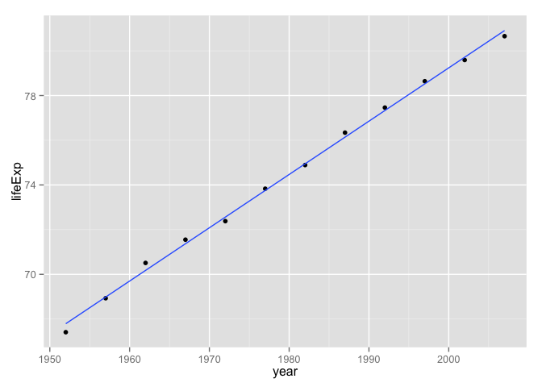
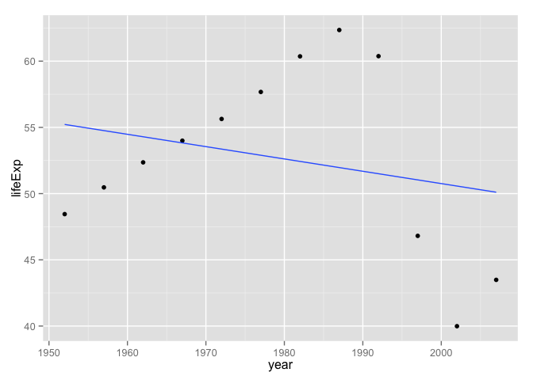

# Linear regression of life expectancy on year


### Overview

We recently learned how to write our own R functions ([Part 1](block011_write-your-own-function-01.html), [Part 2](block011_write-your-own-function-02.html), [Part 3](block011_write-your-own-function-03.html)).

Now we use that knowledge to write another useful function, within the context of the Gapminder data:

  * Input: a data.frame that contains (at least) a life expectancy variable `lifeExp` and a variable for year `year`
  * Output: a vector of estimated intercept and slope, from a linear regression of `lifeExp` on `year`
  
The ultimate goal is to apply this function to the Gapminder data for a specific country. We will eventually scale up to *all* countries using external machinery, e.g., the `plyr` package.

### Load the Gapminder data

As usual, load the Gapminder excerpt. Load `ggplot2` because we'll make some plots.


```r
library(ggplot2)
gDat <- read.delim("gapminderDataFiveYear.txt")
str(gDat)
## 'data.frame':	1704 obs. of  6 variables:
##  $ country  : Factor w/ 142 levels "Afghanistan",..: 1 1 1 1 1 1 1 1 1 1 ...
##  $ year     : int  1952 1957 1962 1967 1972 1977 1982 1987 1992 1997 ...
##  $ pop      : num  8425333 9240934 10267083 11537966 13079460 ...
##  $ continent: Factor w/ 5 levels "Africa","Americas",..: 3 3 3 3 3 3 3 3 3 3 ...
##  $ lifeExp  : num  28.8 30.3 32 34 36.1 ...
##  $ gdpPercap: num  779 821 853 836 740 ...
## or do this if the file isn't lying around already
## gd_url <- "http://tiny.cc/gapminder"
## gDat <- read.delim(gd_url)
```

### Get data to practice with

I extract the data for one country in order to develop some working code interactively.


```r
j_country <- "France" # pick, but do not hard wire, an example
(j_dat <- subset(gDat, country == j_country))
##     country year      pop continent lifeExp gdpPercap
## 529  France 1952 42459667    Europe  67.410  7029.809
## 530  France 1957 44310863    Europe  68.930  8662.835
## 531  France 1962 47124000    Europe  70.510 10560.486
## 532  France 1967 49569000    Europe  71.550 12999.918
## 533  France 1972 51732000    Europe  72.380 16107.192
## 534  France 1977 53165019    Europe  73.830 18292.635
## 535  France 1982 54433565    Europe  74.890 20293.897
## 536  France 1987 55630100    Europe  76.340 22066.442
## 537  France 1992 57374179    Europe  77.460 24703.796
## 538  France 1997 58623428    Europe  78.640 25889.785
## 539  France 2002 59925035    Europe  79.590 28926.032
## 540  France 2007 61083916    Europe  80.657 30470.017
```

Always always always plot the data. Yes, even now.


```r
p <- ggplot(j_dat, aes(x = year, y = lifeExp))
p + geom_point() + geom_smooth(method = "lm", se = FALSE)
```

 

### Get some code that works

Fit the regression

```r
j_fit <- lm(lifeExp ~ year, j_dat)
coef(j_fit)
##  (Intercept)         year 
## -397.7646019    0.2385014
```

Whoa, check out that crazy intercept! Apparently the life expectancy in France around year 0 A.D. was minus 400 years! Never forget to sanity check a model. In this case, a reparametrization is in order. I think it makes more sense for the intercept to correspond to life expectancy in 1952, the earliest date in our dataset. Estimate the intercept eye-ball-o-metrically from the plot and confirm that we've got something sane and interpretable now.


```r
j_fit <- lm(lifeExp ~ I(year - 1952), j_dat)
coef(j_fit)
##    (Intercept) I(year - 1952) 
##     67.7901282      0.2385014
```

#### Sidebar: regression stuff

There are two things above that might prompt questions.

First, how did I know to get the estimated coefficients from a fitted model via `coef()`? Years of experience. But how might a novice learn such things? Read [the documentation for `lm()`](http://www.rdocumentation.org/packages/stats/functions/lm), in this case. The "See also" section advises us about many functions that can operate on fitted linear model objects, including, but by no means limited to, `coef()`. Read [the documentation on `coef()`](http://www.rdocumentation.org/packages/stats/functions/coef) too.

Second, what am I doing here: `lm(lifeExp ~ I(year - 1952))`? I want the intercept to correspond to 1952 and an easy way to accomplish that is to create a new predictor on the fly: year minus 1952. The way I achieve that in the model formula, `I(year - 1952)`, uses the `I()` function which "inhibits interpretation/conversion of objects". By protecting the expression `year - 1952`, I ensure it is interpreted in the obvious arithmetical way.

### Turn working code into a function

Create the basic definition of a function and drop your working code inside. Add arguments and edit the inner code to match. Apply it to the practice data. Do you get the same result as before?


```r
le_lin_fit <- function(dat, offset = 1952) {
  the_fit <- lm(lifeExp ~ I(year - offset), dat)
  coef(the_fit)
}
le_lin_fit(j_dat)
##      (Intercept) I(year - offset) 
##       67.7901282        0.2385014
```

I had to decide how to handle the offset. Given that I will scale this up to many countries, which, in theory, might have data for different dates, I chose to set a default of 1952. Strategies that compute the offset from data, either the main Gapminder dataset or the excerpt passed to this function, are also reasonable to consider.

I loathe the names on this return value. This is not my first rodeo and I know that, downstream, these will contaminate variable names and factor levels and show up in public places like plots and tables. Fix names early!


```r
le_lin_fit <- function(dat, offset = 1952) {
  the_fit <- lm(lifeExp ~ I(year - offset), dat)
  setNames(coef(the_fit), c("intercept", "slope"))
}
le_lin_fit(j_dat)
##  intercept      slope 
## 67.7901282  0.2385014
```

Much better!

### Test on other data and in a clean workspace

It's always good to rotate through examples during development. The most common error this will help you catch is when you accidentally hard-wire your example into your function. If you're paying attention to your informal tests, you will find it creepy that your function returns __exactly the same results__ regardless which input data you give it. This actually happened to me while I was writing this document, I kid you not! I had left `j_fit` inside the call to `coef()`, instead of switching it to `the_fit`. How did I catch that error? I saw the fitted line below, which clearly did not have an intercept in the late 60s and a positive slope, as my first example did. Figures are a mighty weapon in the fight against nonsense. I don't trust analyses that have few/no figures.


```r
j_country <- "Zimbabwe"
(j_dat <- subset(gDat, country == j_country))
##       country year      pop continent lifeExp gdpPercap
## 1693 Zimbabwe 1952  3080907    Africa  48.451  406.8841
## 1694 Zimbabwe 1957  3646340    Africa  50.469  518.7643
## 1695 Zimbabwe 1962  4277736    Africa  52.358  527.2722
## 1696 Zimbabwe 1967  4995432    Africa  53.995  569.7951
## 1697 Zimbabwe 1972  5861135    Africa  55.635  799.3622
## 1698 Zimbabwe 1977  6642107    Africa  57.674  685.5877
## 1699 Zimbabwe 1982  7636524    Africa  60.363  788.8550
## 1700 Zimbabwe 1987  9216418    Africa  62.351  706.1573
## 1701 Zimbabwe 1992 10704340    Africa  60.377  693.4208
## 1702 Zimbabwe 1997 11404948    Africa  46.809  792.4500
## 1703 Zimbabwe 2002 11926563    Africa  39.989  672.0386
## 1704 Zimbabwe 2007 12311143    Africa  43.487  469.7093
p <- ggplot(j_dat, aes(x = year, y = lifeExp))
p + geom_point() + geom_smooth(method = "lm", se = FALSE)
```

 

```r
le_lin_fit(j_dat)
##   intercept       slope 
## 55.22124359 -0.09302098
```

The linear fit is comically bad, but yes I believe the visual line and the regression results match up.

It's also a good idea to clean out the workspace, rerun the minimum amount of code, and retest your function. This will help you catch another common mistake: accidentally relying on objects that were lying around in the workspace during development but that are not actually defined in your function nor passed as formal arguments.


```r
rm(list = ls())
gDat <- read.delim("gapminderDataFiveYear.txt")
le_lin_fit <- function(dat, offset = 1952) {
  the_fit <- lm(lifeExp ~ I(year - offset), dat)
  setNames(coef(the_fit), c("intercept", "slope"))
}
le_lin_fit(subset(gDat, country == "Zimbabwe"))
##   intercept       slope 
## 55.22124359 -0.09302098
```

### Are we there yet?

Yes.

Given how I plan to use this function, I don't feel the need to put it under formal unit tests or put in argument validity checks. Let's move on to [the exciting part](http://stat545-ubc.github.io/block013_plyr-ddply.html), which is scaling this up to __all__ countries.
