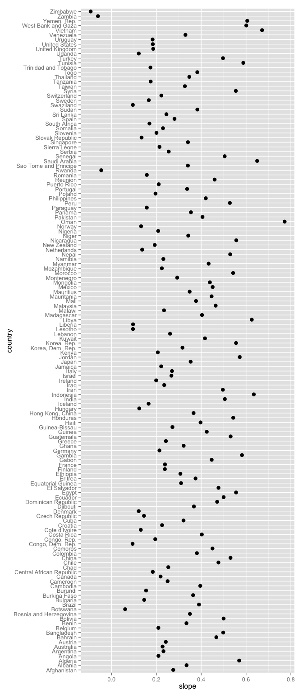
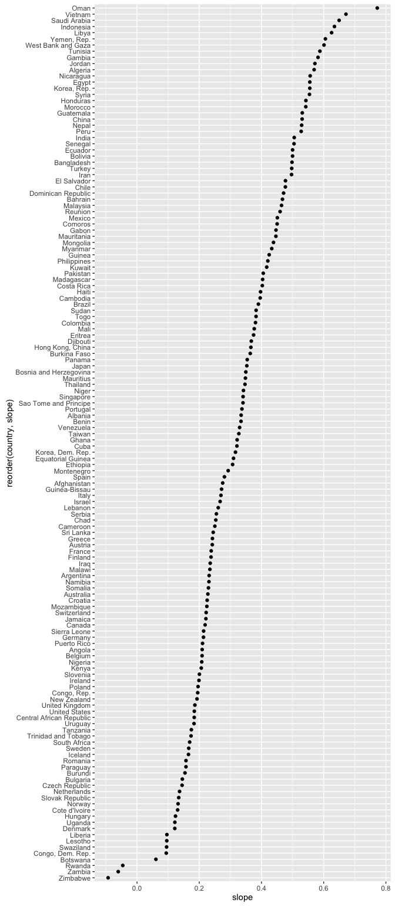
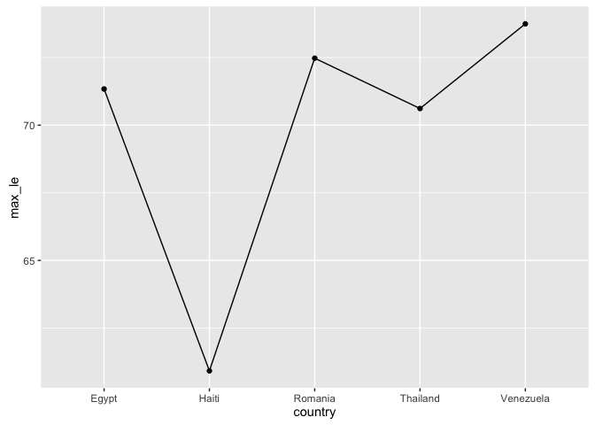
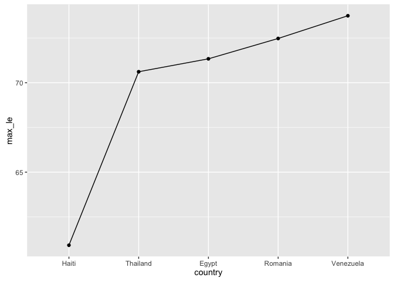
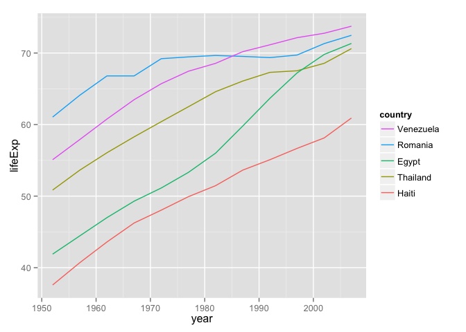
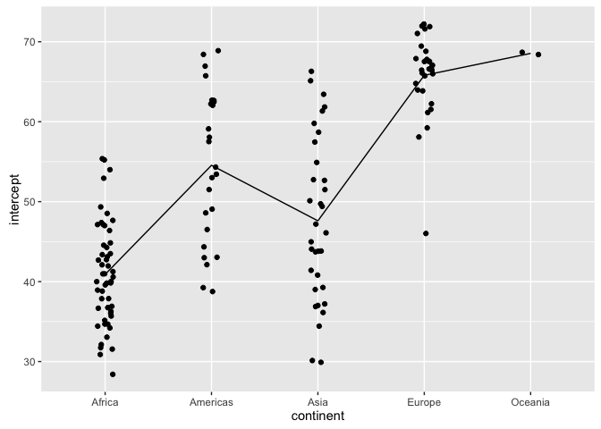
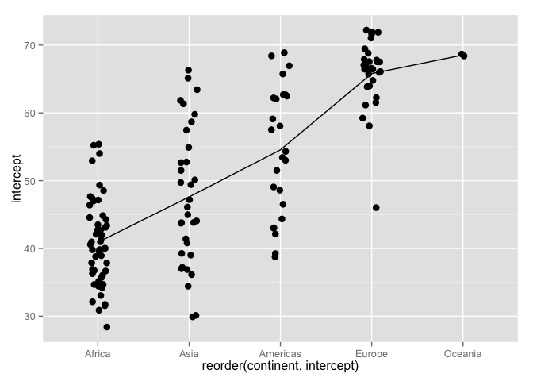

# Be the boss of your factors


### Load the Gapminder data

As usual, load the Gapminder excerpt. Load the `plyr`, `dplyr` (__in that order__), and `ggplot2` packages.


```r
library(gapminder)
library(plyr)
suppressPackageStartupMessages(library(dplyr))
library(ggplot2)
```

### Model life expectancy as a function of year

For each country, retain estimated intercept and slope from a linear fit -- regressing life expectancy on year. I include `country` AND `continent` in the factors on which to split, so that the `continent` factor appears in my result.


```r
j_coefs <- ddply(gapminder, ~ country + continent,
                 function(dat, offset = 1952) {
                   the_fit <- lm(lifeExp ~ I(year - offset), dat)
                   setNames(coef(the_fit), c("intercept", "slope"))
                 })
```

### Get to know the country factor


```r
str(j_coefs)
## 'data.frame':	142 obs. of  4 variables:
##  $ country  : Factor w/ 142 levels "Afghanistan",..: 1 2 3 4 5 6 7 8 9 10 ...
##  $ continent: Factor w/ 5 levels "Africa","Americas",..: 3 4 1 1 2 5 4 3 3 4 ...
##  $ intercept: num  29.9 59.2 43.4 32.1 62.7 ...
##  $ slope    : num  0.275 0.335 0.569 0.209 0.232 ...
levels(j_coefs$country)
##   [1] "Afghanistan"              "Albania"                 
##   [3] "Algeria"                  "Angola"                  
##   [5] "Argentina"                "Australia"               
##   [7] "Austria"                  "Bahrain"                 
##   [9] "Bangladesh"               "Belgium"                 
##  [11] "Benin"                    "Bolivia"                 
##  [13] "Bosnia and Herzegovina"   "Botswana"                
##  [15] "Brazil"                   "Bulgaria"                
##  [17] "Burkina Faso"             "Burundi"                 
##  [19] "Cambodia"                 "Cameroon"                
##  [21] "Canada"                   "Central African Republic"
##  [23] "Chad"                     "Chile"                   
##  [25] "China"                    "Colombia"                
##  [27] "Comoros"                  "Congo, Dem. Rep."        
##  [29] "Congo, Rep."              "Costa Rica"              
##  [31] "Cote d'Ivoire"            "Croatia"                 
##  [33] "Cuba"                     "Czech Republic"          
##  [35] "Denmark"                  "Djibouti"                
##  [37] "Dominican Republic"       "Ecuador"                 
##  [39] "Egypt"                    "El Salvador"             
##  [41] "Equatorial Guinea"        "Eritrea"                 
##  [43] "Ethiopia"                 "Finland"                 
##  [45] "France"                   "Gabon"                   
##  [47] "Gambia"                   "Germany"                 
##  [49] "Ghana"                    "Greece"                  
##  [51] "Guatemala"                "Guinea"                  
##  [53] "Guinea-Bissau"            "Haiti"                   
##  [55] "Honduras"                 "Hong Kong, China"        
##  [57] "Hungary"                  "Iceland"                 
##  [59] "India"                    "Indonesia"               
##  [61] "Iran"                     "Iraq"                    
##  [63] "Ireland"                  "Israel"                  
##  [65] "Italy"                    "Jamaica"                 
##  [67] "Japan"                    "Jordan"                  
##  [69] "Kenya"                    "Korea, Dem. Rep."        
##  [71] "Korea, Rep."              "Kuwait"                  
##  [73] "Lebanon"                  "Lesotho"                 
##  [75] "Liberia"                  "Libya"                   
##  [77] "Madagascar"               "Malawi"                  
##  [79] "Malaysia"                 "Mali"                    
##  [81] "Mauritania"               "Mauritius"               
##  [83] "Mexico"                   "Mongolia"                
##  [85] "Montenegro"               "Morocco"                 
##  [87] "Mozambique"               "Myanmar"                 
##  [89] "Namibia"                  "Nepal"                   
##  [91] "Netherlands"              "New Zealand"             
##  [93] "Nicaragua"                "Niger"                   
##  [95] "Nigeria"                  "Norway"                  
##  [97] "Oman"                     "Pakistan"                
##  [99] "Panama"                   "Paraguay"                
## [101] "Peru"                     "Philippines"             
## [103] "Poland"                   "Portugal"                
## [105] "Puerto Rico"              "Reunion"                 
## [107] "Romania"                  "Rwanda"                  
## [109] "Sao Tome and Principe"    "Saudi Arabia"            
## [111] "Senegal"                  "Serbia"                  
## [113] "Sierra Leone"             "Singapore"               
## [115] "Slovak Republic"          "Slovenia"                
## [117] "Somalia"                  "South Africa"            
## [119] "Spain"                    "Sri Lanka"               
## [121] "Sudan"                    "Swaziland"               
## [123] "Sweden"                   "Switzerland"             
## [125] "Syria"                    "Taiwan"                  
## [127] "Tanzania"                 "Thailand"                
## [129] "Togo"                     "Trinidad and Tobago"     
## [131] "Tunisia"                  "Turkey"                  
## [133] "Uganda"                   "United Kingdom"          
## [135] "United States"            "Uruguay"                 
## [137] "Venezuela"                "Vietnam"                 
## [139] "West Bank and Gaza"       "Yemen, Rep."             
## [141] "Zambia"                   "Zimbabwe"
head(j_coefs$country)
## [1] Afghanistan Albania     Algeria     Angola      Argentina   Australia  
## 142 Levels: Afghanistan Albania Algeria Angola Argentina ... Zimbabwe
```

The levels are in alphabetical order. Why? Because. Just because. Do you have a better idea? THEN STEP UP AND DO SOMETHING ABOUT IT.

### Why the order of factor levels matters


```r
ggplot(j_coefs, aes(x = slope, y = country)) + geom_point(size = 3)
ggplot(j_coefs, aes(x = slope, y = reorder(country, slope))) +
  geom_point(size = 3)
```



Which figure do you find easier to navigate? Which is more interesting? The unsorted, i.e. alphabetical, is an example of visual [data puke](http://junkcharts.typepad.com/numbersruleyourworld/2014/09/dont-data-puke-says-avinash-kaushik.html), because there is no effort to help the viewer learn anything from the plot, even though it is really easy to do so. At the very least, always consider sorting your factor levels in some principled way.

The same point generally applies to tables as well.

Exercise (part of [HW05](hw05_factor-boss-files-out-in.html)): Consider `post_arrange`, `post_reorder`, and `post_both` as defined below. State how the objects differ and discuss the differences in terms of utility within an exploratory analysis. If I swapped out `arrange(country)` for `arrange(slope)`, would we get the same result? Do you have any preference for one arrange statement over the other?


```r
post_arrange <- j_coefs %>% arrange(slope)
post_reorder <- j_coefs %>%
  mutate(country = reorder(country, slope))
post_both <- j_coefs %>%
  mutate(country = reorder(country, slope)) %>%
  arrange(country)
```

### `droplevels()` to drop unused factor levels

Many demos will be clearer if we create a smaller dataset with just a few countries.


Let's look at these five countries: Egypt, Haiti, Romania, Thailand, Venezuela. 


```r
h_countries <- c("Egypt", "Haiti", "Romania", "Thailand", "Venezuela")
hDat <- gapminder %>%
  filter(country %in% h_countries)
hDat %>% str
## 'data.frame':	60 obs. of  6 variables:
##  $ country  : Factor w/ 142 levels "Afghanistan",..: 39 39 39 39 39 39 39 39 39 39 ...
##  $ continent: Factor w/ 5 levels "Africa","Americas",..: 1 1 1 1 1 1 1 1 1 1 ...
##  $ year     : num  1952 1957 1962 1967 1972 ...
##  $ lifeExp  : num  41.9 44.4 47 49.3 51.1 ...
##  $ pop      : num  22223309 25009741 28173309 31681188 34807417 ...
##  $ gdpPercap: num  1419 1459 1693 1815 2024 ...
```

Look at the `country` factor. Look at it hard.


```r
#table(hDat$country)
#levels(hDat$country)
nlevels(hDat$country)
## [1] 142
```

Even though `hDat` contains data for only 5 countries, the other 137 countries remain as possible levels of the `country` factor. Sometimes this is exactly what you want but sometimes it's not.

When you want to drop unused factor levels, use `droplevels()`.


```r
iDat  <- hDat %>% droplevels ## of droplevels(hDat)
iDat %>% str
## 'data.frame':	60 obs. of  6 variables:
##  $ country  : Factor w/ 5 levels "Egypt","Haiti",..: 1 1 1 1 1 1 1 1 1 1 ...
##  $ continent: Factor w/ 4 levels "Africa","Americas",..: 1 1 1 1 1 1 1 1 1 1 ...
##  $ year     : num  1952 1957 1962 1967 1972 ...
##  $ lifeExp  : num  41.9 44.4 47 49.3 51.1 ...
##  $ pop      : num  22223309 25009741 28173309 31681188 34807417 ...
##  $ gdpPercap: num  1419 1459 1693 1815 2024 ...
table(iDat$country)
## 
##     Egypt     Haiti   Romania  Thailand Venezuela 
##        12        12        12        12        12
levels(iDat$country)
## [1] "Egypt"     "Haiti"     "Romania"   "Thailand"  "Venezuela"
nlevels(iDat$country)
## [1] 5
```

### `reorder()` to reorder factor levels

Now that we have a more manageable set of 5 countries, let's compute their max life expectancies, view them, and view life expectancy vs. year.


```r
i_le_max <- iDat %>%
  group_by(country) %>%
  summarize(max_le = max(lifeExp))
i_le_max
## Source: local data frame [5 x 2]
## 
##     country max_le
##      (fctr)  (dbl)
## 1     Egypt 71.338
## 2     Haiti 60.916
## 3   Romania 72.476
## 4  Thailand 70.616
## 5 Venezuela 73.747
```


```r
ggplot(i_le_max, aes(x = country, y = max_le, group = 1)) +
  geom_path() + geom_point(size = 3)
ggplot(iDat, aes(x = year, y = lifeExp, group = country)) +
  geom_line(aes(color = country))
```



Here's a plot of the max life expectancies and a spaghetti plot of life expectancy over time. Notice how the first plot jumps around? Notice how the legend of the second plot is completely out of order with the data?

Use the function `reorder()` to change the order of factor levels. Read [its documentation](http://www.rdocumentation.org/packages/stats/functions/reorder.factor).


```r
reorder(your_factor, your_quant_var, your_summarization_function)
```

Let's reorder the country factor __logically__, in this case by maximum life expectancy. Even though `i_le_max` already holds these numbers, I'm going to enact the reordering with the "raw" data to illustrate more about the `reorder()` function.


```r
jDat <- iDat %>%
  mutate(country = reorder(country, lifeExp, max))
data.frame(before = levels(iDat$country), after = levels(jDat$country))
##      before     after
## 1     Egypt     Haiti
## 2     Haiti  Thailand
## 3   Romania     Egypt
## 4  Thailand   Romania
## 5 Venezuela Venezuela
j_le_max <- i_le_max %>%
  mutate(country = reorder(country, max_le))
j_le_max <- i_le_max %>%
  mutate(country = factor(country, levels = levels(jDat$country)))
```

Let's revisit the two figures to see how much more natural they are.


```r
ggplot(j_le_max, aes(x = country, y = max_le, group = 1)) +
  geom_line() + geom_point(size = 3)
ggplot(jDat, aes(x = year, y = lifeExp)) +
  geom_line(aes(color = country)) +
  guides(color = guide_legend(reverse = TRUE))
```



Conclusion: Use `reorder()` to reorder a factor according to a quantitative variable. A simple call like this:


```r
reorder(your_factor, your_quant_var)
```

implies that the summarization function will default to `mean()`. If that's not what you want, specify your own summarization function. It could be built-in, such as `max()`, or could be written by you on-the-fly or in advance.

You can do this and alter your actual data (or a new copy thereof). Or you can do this reordering on-the-fly, i.e. in an actual plotting or tabulation call, leaving the underlying data untouched.

### `reorder()` exercise

Reorder the `continent` factor, according to the estimated intercepts.

To review, here's where to pick up the story:


```r
j_coefs <- ddply(gapminder, ~ country + continent,
                 function(dat, offset = 1952) {
                   the_fit <- lm(lifeExp ~ I(year - offset), dat)
                   setNames(coef(the_fit), c("intercept", "slope"))
                 })
head(j_coefs)
##       country continent intercept     slope
## 1 Afghanistan      Asia  29.90729 0.2753287
## 2     Albania    Europe  59.22913 0.3346832
## 3     Algeria    Africa  43.37497 0.5692797
## 4      Angola    Africa  32.12665 0.2093399
## 5   Argentina  Americas  62.68844 0.2317084
## 6   Australia   Oceania  68.40051 0.2277238
```

The figure on the left gives a stripplot of estimate intercepts, by continent, with continent in alphabetical order. The line connects continent-specific averages of the intercepts (approx. equal to life expectancy in 1952). The figure on the right gives same plot after the continents have been reordered by average estimated intercept.



Write the `reorder()` statement to do this.

### Revaluing factor levels

What if you want to recode factor levels? I usually use the `revalue()` function from `plyr`; sometime I use `plyr::mapvalues()` which is a bit more general. In the past I have also used the `recode()` function from the `car` package.


```r
k_countries <- c("Australia", "Korea, Dem. Rep.", "Korea, Rep.")
kDat <- gapminder %>%
  filter(country %in% k_countries & year > 2000) %>%
  droplevels
kDat
##            country continent year lifeExp      pop gdpPercap
## 1        Australia   Oceania 2002  80.370 19546792 30687.755
## 2        Australia   Oceania 2007  81.235 20434176 34435.367
## 3 Korea, Dem. Rep.      Asia 2002  66.662 22215365  1646.758
## 4 Korea, Dem. Rep.      Asia 2007  67.297 23301725  1593.065
## 5      Korea, Rep.      Asia 2002  77.045 47969150 19233.988
## 6      Korea, Rep.      Asia 2007  78.623 49044790 23348.140
levels(kDat$country)
## [1] "Australia"        "Korea, Dem. Rep." "Korea, Rep."
kDat <- kDat %>%
  mutate(new_country = revalue(country,
                               c("Australia" = "Oz",
                                 "Korea, Dem. Rep." = "North Korea",
                                 "Korea, Rep." = "South Korea")))
data.frame(levels(kDat$country), levels(kDat$new_country))
##   levels.kDat.country. levels.kDat.new_country.
## 1            Australia                       Oz
## 2     Korea, Dem. Rep.              North Korea
## 3          Korea, Rep.              South Korea
kDat
##            country continent year lifeExp      pop gdpPercap new_country
## 1        Australia   Oceania 2002  80.370 19546792 30687.755          Oz
## 2        Australia   Oceania 2007  81.235 20434176 34435.367          Oz
## 3 Korea, Dem. Rep.      Asia 2002  66.662 22215365  1646.758 North Korea
## 4 Korea, Dem. Rep.      Asia 2007  67.297 23301725  1593.065 North Korea
## 5      Korea, Rep.      Asia 2002  77.045 47969150 19233.988 South Korea
## 6      Korea, Rep.      Asia 2007  78.623 49044790 23348.140 South Korea
```

### Grow a factor object

Try to avoid this. If you must `rbind()`ing data.frames works much better than `c()`ing vectors.


```r
usa <- gapminder %>%
  filter(country == "United States" & year > 2000) %>%
  droplevels
mex <- gapminder %>%
  filter(country == "Mexico" & year > 2000) %>%
  droplevels
str(usa)
## 'data.frame':	2 obs. of  6 variables:
##  $ country  : Factor w/ 1 level "United States": 1 1
##  $ continent: Factor w/ 1 level "Americas": 1 1
##  $ year     : num  2002 2007
##  $ lifeExp  : num  77.3 78.2
##  $ pop      : num  2.88e+08 3.01e+08
##  $ gdpPercap: num  39097 42952
str(mex)
## 'data.frame':	2 obs. of  6 variables:
##  $ country  : Factor w/ 1 level "Mexico": 1 1
##  $ continent: Factor w/ 1 level "Americas": 1 1
##  $ year     : num  2002 2007
##  $ lifeExp  : num  74.9 76.2
##  $ pop      : num  1.02e+08 1.09e+08
##  $ gdpPercap: num  10742 11978
usa_mex <- rbind(usa, mex)
str(usa_mex)
## 'data.frame':	4 obs. of  6 variables:
##  $ country  : Factor w/ 2 levels "United States",..: 1 1 2 2
##  $ continent: Factor w/ 1 level "Americas": 1 1 1 1
##  $ year     : num  2002 2007 2002 2007
##  $ lifeExp  : num  77.3 78.2 74.9 76.2
##  $ pop      : num  2.88e+08 3.01e+08 1.02e+08 1.09e+08
##  $ gdpPercap: num  39097 42952 10742 11978

(oops <- c(usa$country, mex$country))
## [1] 1 1 1 1
(yeah <- factor(c(levels(usa$country)[usa$country],
                  levels(mex$country)[mex$country])))
## [1] United States United States Mexico        Mexico       
## Levels: Mexico United States
```

If you really want to catenate factors with different levels, you must first convert to their levels as character data, combine, then re-convert to factor.

### Make a factor from scratch 

Herein lies the explicit creation of a factor via `factor()`. Let's start with an example we are familiar with.
Pretend the continent variable in gapminder was a not a factor, but character.


```r
gapminder$continent <- as.character(gapminder$continent)

#prove it
str(gapminder)
## 'data.frame':	1704 obs. of  6 variables:
##  $ country  : Factor w/ 142 levels "Afghanistan",..: 1 1 1 1 1 1 1 1 1 1 ...
##  $ continent: chr  "Asia" "Asia" "Asia" "Asia" ...
##  $ year     : num  1952 1957 1962 1967 1972 ...
##  $ lifeExp  : num  28.8 30.3 32 34 36.1 ...
##  $ pop      : num  8425333 9240934 10267083 11537966 13079460 ...
##  $ gdpPercap: num  779 821 853 836 740 ...
head(gapminder)
##       country continent year lifeExp      pop gdpPercap
## 1 Afghanistan      Asia 1952  28.801  8425333  779.4453
## 2 Afghanistan      Asia 1957  30.332  9240934  820.8530
## 3 Afghanistan      Asia 1962  31.997 10267083  853.1007
## 4 Afghanistan      Asia 1967  34.020 11537966  836.1971
## 5 Afghanistan      Asia 1972  36.088 13079460  739.9811
## 6 Afghanistan      Asia 1977  38.438 14880372  786.1134
```

We can now turn it back into a factor by calling factor. The first argument is the thing to be factored, followed by factor levels, which will default to the unique values, in alphabetical order.


```r
gapminder$continent <- factor(gapminder$continent)

#prove it
str(gapminder)
## 'data.frame':	1704 obs. of  6 variables:
##  $ country  : Factor w/ 142 levels "Afghanistan",..: 1 1 1 1 1 1 1 1 1 1 ...
##  $ continent: Factor w/ 5 levels "Africa","Americas",..: 3 3 3 3 3 3 3 3 3 3 ...
##  $ year     : num  1952 1957 1962 1967 1972 ...
##  $ lifeExp  : num  28.8 30.3 32 34 36.1 ...
##  $ pop      : num  8425333 9240934 10267083 11537966 13079460 ...
##  $ gdpPercap: num  779 821 853 836 740 ...
head(gapminder)
##       country continent year lifeExp      pop gdpPercap
## 1 Afghanistan      Asia 1952  28.801  8425333  779.4453
## 2 Afghanistan      Asia 1957  30.332  9240934  820.8530
## 3 Afghanistan      Asia 1962  31.997 10267083  853.1007
## 4 Afghanistan      Asia 1967  34.020 11537966  836.1971
## 5 Afghanistan      Asia 1972  36.088 13079460  739.9811
## 6 Afghanistan      Asia 1977  38.438 14880372  786.1134
```
