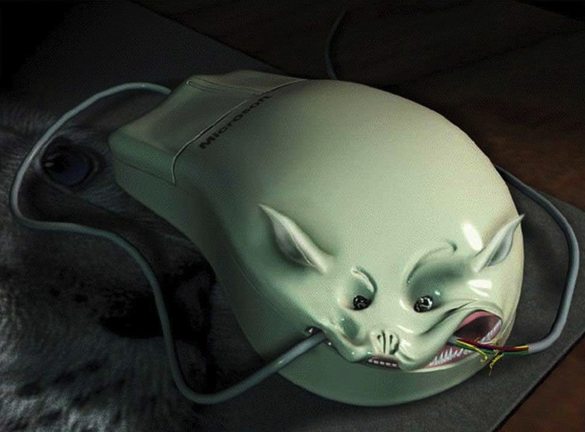
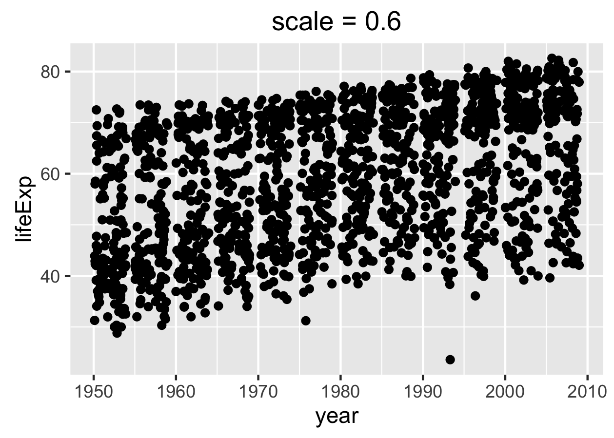
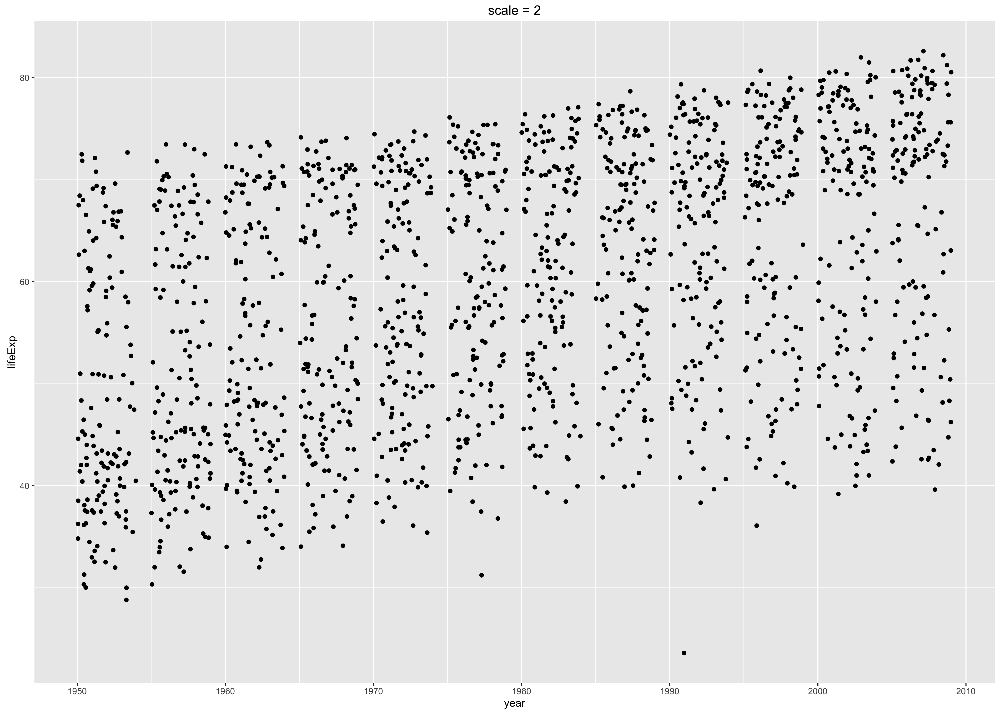
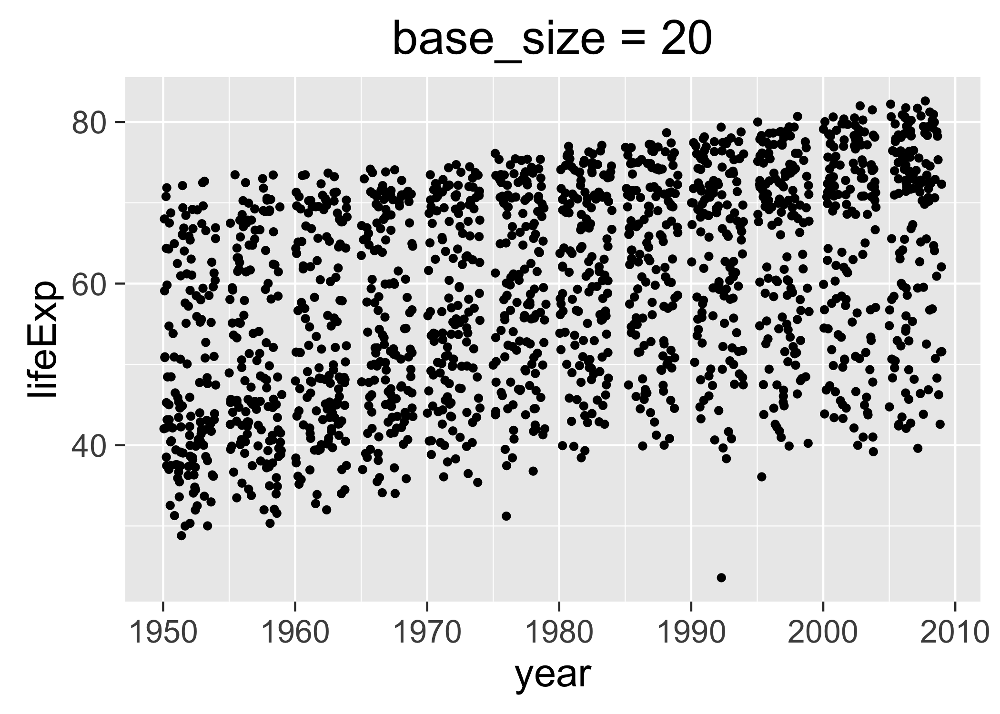
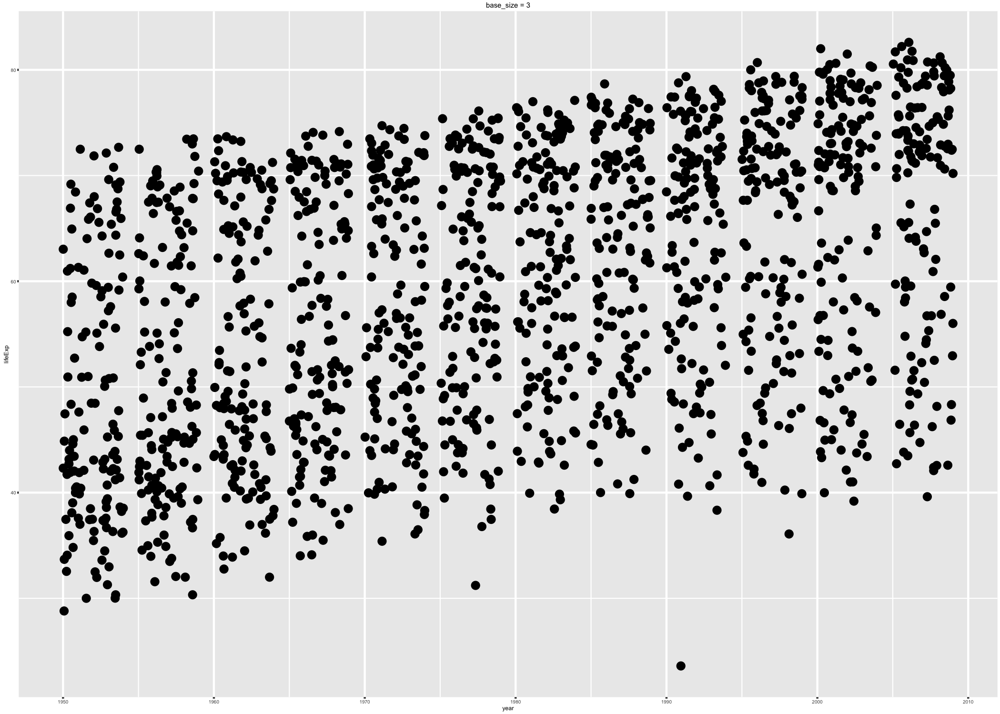
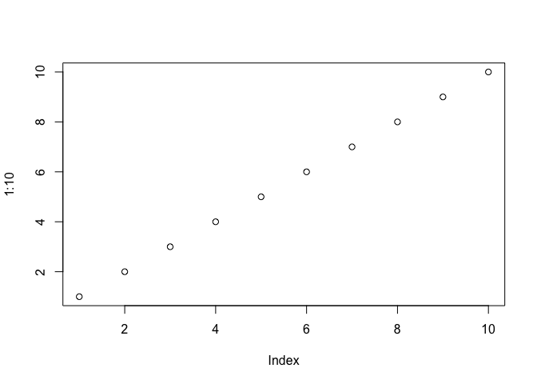

# Writing figures to file


It is not always appropriate or sufficient for figures to exist *only* inside a dynamic report, such as an R Markdown document. You should know how to write key figures to file for downstream use in a variety of settings. 

During development, you need the immediate feedback from seeing your figures appear in a screen device, such as the RStudio Plots pane. Once you're satisfied, make sure you have saved in an R script all of the commands to produce the figure. You want *everything*, nachos to cheesecake: data import, any manipulation that necessary, then plotting.

Now what? How to preserve the figure in a file?

### Step away from the mouse



_Do not_ succumb to the temptation of a mouse-based process. If might feel handy at the time, but you will regret it. This establishes no link between the source code and the figure product. So when -- not if -- you need to remake the figure with a different color scheme or aspect ratio or graphics device, you will struggle to dig up the proper source code. Use one of the methods below to avoid this predicament.

### Good names are like breadcrumbs

If you save figure-making code in a source file and you give figure files machine-readable, self-documenting names, your future self will be able to find its way back to this code.

Hypothetical: a [zombie project](http://imgur.com/ewmBeQG) comes back to life and your collaborator presents you with [a figure you made 18 months ago](https://twitter.com/JohnDCook/status/522377493417033728). Can you remake `fig08_scatterplot-lifeExp-vs-year.pdf` as a TIFF and with smooth regression? Fun times!

This filename offers several properties to help you find the code that produced it:

  * Human-readability: It's helpful to know you're searching for a scatterplot and maybe which variables are important. It gives important context for your personal archaeological dig.
  
  * Specificity: Note how specific and descriptive the name of this figure file is; we didn't settle for the generic `fig08.pdf` or `scatterplot.pdf`. This makes the name at least somewhat unique, which will help you search your home directory for files containing part or all of this filename.

* Machine-readability: Every modern OS provide a way to search your hard drive for a file with a specific name or containing a specific string. This will be easier if the name contains no spaces, punctuation, or other funny stuff. If you use conventional extensions, you can even narrow the search to files ending in `.R` or `.Rmd`.

All of these human practices will help you zero in on the R code you need, so you can modify, re-run, and reuse.

### Graphics devices

Read the [R help for `Devices`](http://www.rdocumentation.org/packages/grDevices/functions/Devices) to learn about graphics devices in general and which are available on your system (*obviously requires that you read your local help*).

It is very important to understand the difference between [vector graphics](http://en.wikipedia.org/wiki/Vector_graphics) and [raster](http://en.wikipedia.org/wiki/Raster_graphics). Vector graphics are represented in terms of shapes and lines, whereas raster graphics are pixel-based.

  * __vector__ examples: PDF, postscript, SVG
    - Pros: re-size gracefully, good for print. 
  * __raster__ examples: PNG, JPEG, BMP, GIF 
    - Cons: look awful "blown up" ... in fact, look awful quite frequently
    - Pros: play very nicely with Microsoft Office products and the web
  
Tough love: you will not be able to pick vector or raster or a single device and use it all the time. You must think about your downstream use cases and plan accordingly. It is entirely possible that you should save key figures __in more than one format__ for maximum flexibility in the future. Worst case, if you obey the rules given here, you can always remake the figure to save in a new format.

FWIW most of my figures exist as `pdf()`, `png()`, or both. Although it is not true yet, SVG will hopefully become the new standard, offering the resizability of vector graphics but with web-friendliness as well.

Here are two good posts from the Revolutions Analytics blog with tips for saving figures to file:

  * [10 tips for making your R graphics look their best](http://blog.revolutionanalytics.com/2009/01/10-tips-for-making-your-r-graphics-look-their-best.html) 
  * [High-quality R graphics on the Web with SVG](http://blog.revolutionanalytics.com/2011/07/r-svg-graphics.html)
  
### Write figures to file with `ggsave()`

If you are using `ggplot2`, write figures to file with [`ggsave()`](http://www.rdocumentation.org/packages/ggplot2/functions/ggsave).

If you are staring at a plot you just made on your screen, you can call `ggsave()`, specifying only a filename:

```r
ggsave("my-awesome-graph.png")
```

It makes a sensible decision about everything else. In particular, as long as you use a conventional extension, it will guess what type of graphics file you want. If you need control over, e.g., width, height, or dpi, roll up your sleeves and [use the arguments](http://www.rdocumentation.org/packages/ggplot2/functions/ggsave).

#### Passing a plot object to `ggsave()`

After the filename, the most common argument you will provide is `plot =`, which is the second argument by position. If you've been building up a plot with the typical `ggplot2` workflow, you will pass the resulting object to `ggsave()`. Example:


```r
p <- ggplot(gapminder, aes(x = year, y = lifeExp)) + geom_jitter()
# during development, you will uncomment next line to print p to screen
# p
ggsave("fig-io-practice.png", p)
```

See below for gotchas and FAQs when making figures in a non-interactive setting!

#### Scaling

Figures need to be prepared differently for a presentation versus a poster versus a manuscript. You need to fiddle with the size of text, such as the title and axis labels, relative to the entire plot area. There are at least two ways to do this, with slightly different effects and workflows.

__Via the `scale =` argument to `ggsave()`__: This actually changes the physical size of the plot, but as an interesting side effect, it changes the relative size of the title and axis labels. Therefore, tweaking this can be a quick-and-dirty way to get different versions of a figure appropriate for a presentation versus a poster versus a manuscript. You can still insert the figure downstream with a different physical size, though you may need to adjust the dpi accordingly on the front end. When `scale < 1`, various plot elements will be bigger relative to the plotting area; when `scale > 1`, these elements will be smaller. YMMV but `scale = 0.8` often works well for posters and slides. Below are two versions of a figure, with exaggerated values of `scale`, to illustrate its effect.

__Via the `base_size` of the active theme__: The `base_size` of the [theme](http://docs.ggplot2.org/dev/vignettes/themes.html) refers to the base font size. This is NOT a theme element that can be modified via `ggplot(...) + theme(...)`. Rather, it's an argument to various functions that set theme elements. Therefore, to get the desired effect you need to create a complete theme, specifying the desired `base_size`. By setting `base size < 12`, the default value, you shrink text elements and by setting `base_size > 12`, you make them larger. Below are two versions of a figure, with exaggerated values of `base_size`, to illustrate its effect. 


```r
suppressPackageStartupMessages(library(ggplot2))
library(gapminder)
p <- ggplot(gapminder, aes(x = year, y = lifeExp)) + geom_jitter()
p1 <- p + ggtitle("scale = 0.6")
p2 <- p + ggtitle("scale = 2")
p3 <- p + ggtitle("base_size = 20") + theme_grey(base_size = 20)
p4 <- p + ggtitle("base_size = 3") + theme_grey(base_size = 3)
ggsave("img/fig-io-practice-scale-0.3.png", p1, scale = 0.6)
## Saving 4.2 x 3 in image
ggsave("img/fig-io-practice-scale-2.png", p2, scale = 2)
## Saving 14 x 10 in image
ggsave("img/fig-io-practice-base-size-20.png", p3)
## Saving 7 x 5 in image
ggsave("img/fig-io-practice-base-size-3.png", p4)
## Saving 7 x 5 in image
```

<table width="800px" height="100%" border="1">
<tr><td></td>
<td></td></tr>
<tr><td></td>
<td></td></tr>
</table>

*Thanks to [Casey Shannon](https://twitter.com/ephonious) for tips about `scale =` and this [cheatsheet from Zev Ross](http://zevross.com/blog/2014/08/04/beautiful-plotting-in-r-a-ggplot2-cheatsheet-3/) for tips about `base_size`.*


### Write non-`ggplot2` figures to file

Recall that `ggsave()` is recommended if you're using `ggplot2`. But if you're using base graphics or `lattice`, here's generic advice for writing figures to file. To be clear, this *also* works for `ggplot2` graphs, but I can't think of any good reasons to NOT use `ggsave()`.

Edit your source code in the following way: Precede the figure-making code by opening a graphics device and follow it with a command that closes the device. Here's an example:


```r
pdf("test-fig-proper.pdf") # starts writing a PDF to file
plot(1:10)                    # makes the actual plot
dev.off()                     # closes the PDF file
## quartz_off_screen 
##                 2
```

You will see there's a new file in the working directory:


```r
list.files(pattern = "^test-fig*")
## [1] "test-fig-proper.pdf"
```

If you run this code interactively, don't be surprised when you don't see the figure appear in your screen device. While you're sending graphics output to, e.g., the `pdf()` device, you'll be "flying blind", which is why it's important to work out the graphics commands in advance. This is like using `sink()`, which diverts the output you'd normally see in R Console.

Read the [R help for `Devices`](http://www.rdocumentation.org/packages/grDevices/functions/Devices) to learn about graphics devices in general and which are available on your system (*obviously requires that you read your local help*). If you need control over, e.g., width, height, or dpi, roll up your sleeves and use the arguments to the graphics device function you are using. There are many.

If you are staring at a plot you just made on your screen, here's a handy short cut for writing a figure to file:


```r
plot(1:10)            # makes the actual plot
```

 

```r
dev.print(pdf,        # copies the plot to a the PDF file
          "test-fig-quick-dirty.pdf")             
## quartz_off_screen 
##                 2
```

You will see there's now another new file in the working directory:


```r
list.files(pattern = "^test-fig*")
## [1] "test-fig-proper.pdf"      "test-fig-quick-dirty.pdf"
```

The appeal of this method is that you will literally copy the figure in front of your eyeballs to file, which is pleasingly immediate. There's also less code to repeatedly (de-)comment as you run and re-run the script during development.

Why is this method improper? Various aspects of a figure -- such as font size -- are determined by the target graphics device and its physical size. Therefore, it is best practice to open your desired graphics device explicitly, using any necessary arguments to control height, width, fonts, etc. Make your plot. And close the device. But for lots of everyday plots the `dev.print()` method works just fine.

If you call up the help file for [`dev.off()`, `dev.print()`, and friends](http://www.rdocumentation.org/packages/grDevices/functions/dev), you can learn about many other functions for controlling graphics devices.

### Pre-emptive answers to some FAQs

#### Despair over non-existent or empty figures

Certain workflows are suited to interactive development and will break when played back non-interactively or at arm's length. Wake up and pay attention when you cross these lines:

  * You package graph-producing code into a function or put it inside a loop or other iterative machine.
  * You run an R script non-interactively, e.g. via `source()`, `Rscript`, or `R CMD batch`.

__Basic issue__: When working interactively, if you inspect the plot object `p` by entering `p` at the command line, the plot gets printed to screen. You're actually enjoying the result of `print(p)`, but it's easy to not realize this. To get the same result from code run non-interactively, you will need to call `print()` explicitly yourself.

Here I wrap plotting commands inside a function. The function on the left will fail to produce a PNG, whereas the function on the right will produce a good PNG. Both assume the Gapminder data is present as `gapminder` and that `ggplot2` has been loaded.

<table border = 1>
<tr>
<td valign="top">
```r
## implicit print --> no PNG
f_despair <- function() {
  png("test-fig-despair.png")
  p <- ggplot(gapminder,
     aes(x = year, y = lifeExp))
  p + geom_jitter()
  dev.off()    
}
f_despair()
```
</td>
<td valign="top">
```r
## explicit print --> good PNG
f_joy <- function() {
  png("test-fig-joy.png")
  p <- ggplot(gapminder,
     aes(x = year, y = lifeExp))
  p <- p + geom_jitter()
  print(p) ## <-- VERY IMPORTANT!!!
  dev.off()    
}
f_joy() 
```
</td>
</tr>
</table>

Other versions of this fiasco result in a figure file that is, frustratingly, empty. If you expect a figure, but it's missing or empty, __remember to print the plot explicitly.__

It is worth noting here that the `ggsave()` workflow is not vulnerable to this gotcha, which is yet another reason to prefer it when using `ggplot2`.

Some relevant threads on stackoverflow:

  * [Using png not working when called within a function](http://stackoverflow.com/questions/9206110/using-png-not-working-when-called-within-a-function)

  * [ggplot's qplot does not execute on sourcing](http://stackoverflow.com/questions/6675066/ggplots-qplot-does-not-execute-on-sourcing)

  * [Save ggplot within a function](http://stackoverflow.com/questions/7034647/save-ggplot-within-a-function)
  
#### Mysterious empty `Rplots.pdf` file

*2015-10-19 update: [This has been fixed](https://github.com/hadley/ggplot2/issues/1326) in the soon-to-be-released version of `ggplot2`. Hallelujah! I will leave this here for a while, since old versions of a package like `ggplot2` linger around for months and years.*

When creating and writing figures from R running non-interactively, you can inadvertently trigger a request to query the active graphics device. For example, `ggsave()` might try to ascertain the physical size of the current device. But when running non-interactively there is often no such device available, which can lead to the unexpected creation of `Rplots.pdf` so this request can be fulfilled.

I don't know of a reliable way to suppress this behavior uniformly and I just peacefully coexist with `Rplots.pdf` when this happens. That is, I just delete it.

Some relevant threads on stackoverflow:

  * [How to stop R from creating empty Rplots.pdf file when using ggsave and Rscript](http://stackoverflow.com/questions/17348359/how-to-stop-r-from-creating-empty-rplots-pdf-file-when-using-ggsave-and-rscript)

### Chunk name determines figure file name

Coming full circle, we return to the topic of figures produced via an R chunk in an R Markdown file. If you are [keeping the intermediate markdown](http://stat545-ubc.github.io/block007_first-use-rmarkdown.html#step-3-save-the-intermediate-markdown), via `keep_md: true` in the YAML frontmatter, your figures will also be saved to file. Rendering `foo.Rmd` will leave behind `foo.md`, `foo.html`, and a directory `foo_files`, containing any figures created in the document. By default, they will have meaningless names, like `unnamed-chunk-7.png`. This makes it difficult to find specific figures, i.e. for unplanned use in another setting. However, if you name an R chunk, this name will be baked into the figure file name.

<!-- the "live" version of the chunk I include verbatim below -->


Example: here's an R chunk called `scatterplot-lifeExp-vs-year`
 
    ```{r scatterplot-lifeExp-vs-year}
    p <- ggplot(gapminder, aes(x = year, y = lifeExp)) + geom_jitter()
    p
    ```

And it will lead to the creation of a suitably named figure file (you may see other figures produced in the document as well):


```r
list.files("block017_write-figure-to-file_files/", recursive = TRUE)
## [1] "figure-html/dev-print-demo-1.png"             
## [2] "figure-html/scatterplot-lifeExp-vs-year-1.png"
```

If you have concrete plans to use a figure elsewhere, you should probably write it to file using an explicit method described above. But the chunk-naming trick is a nice way to avoid that work, while maintaining flexibility for the future.

### Clean up

Let's delete the temp files we've created.


```r
file.remove(list.files(pattern = "^test-fig*"))
## [1] TRUE TRUE
```
