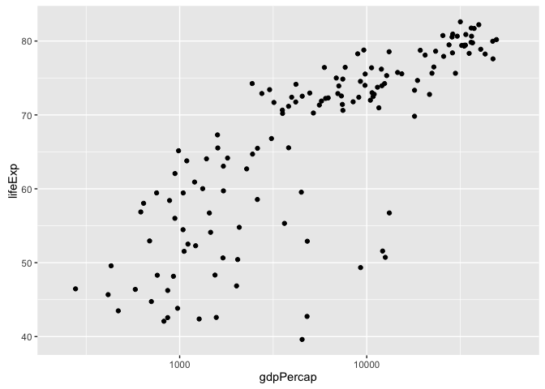
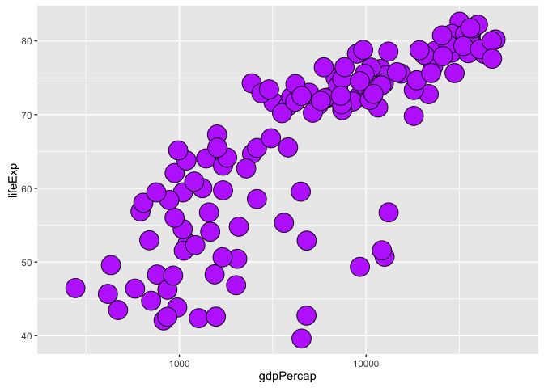
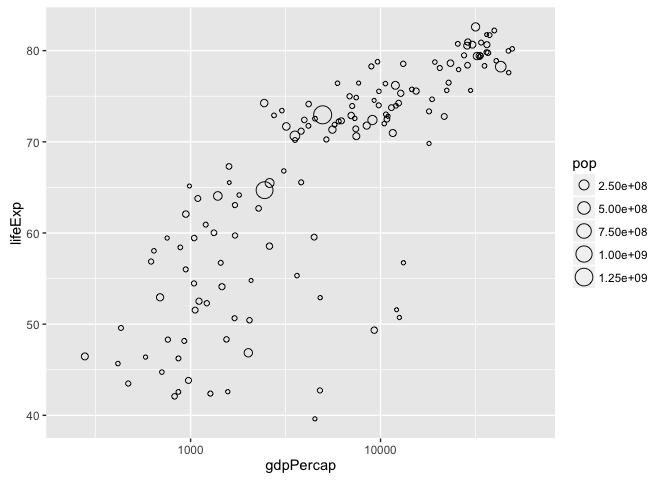
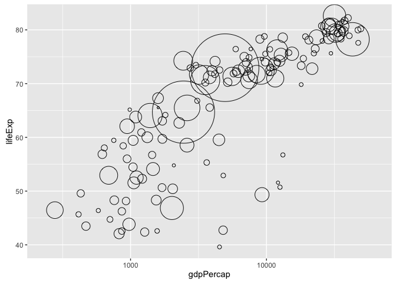
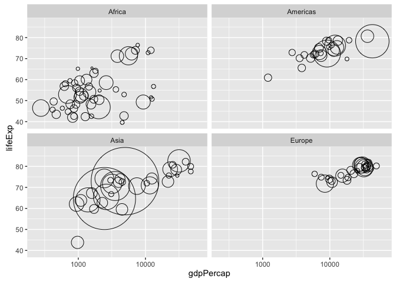
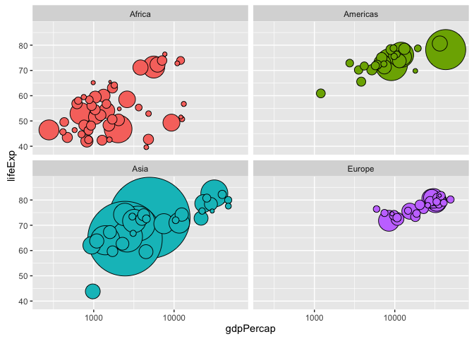
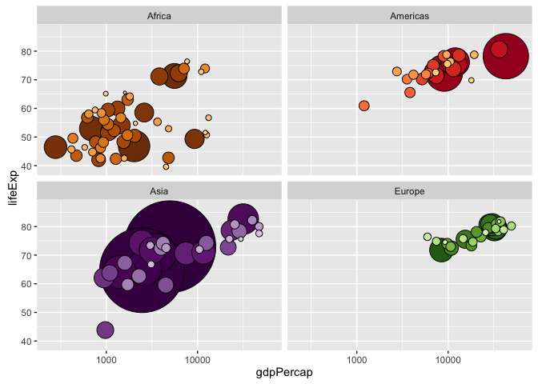

# Taking control of qualitative colors in ggplot2


### Load packages and prepare the Gapminder data

Bring in the usual Gapminder data but drop Oceania, which only has two countries.

We also sort the country factor based on population and then sort the data as well. Why? In the bubble plots below, we don't want large countries to hide small countries. This is a case where, sadly, the row order of the data truly affects the visual output.


```r
library(ggplot2)
library(gapminder)
suppressPackageStartupMessages(library(dplyr))
jdat <- gapminder %>% 
  filter(continent != "Oceania") %>% 
  droplevels() %>% 
  mutate(country = reorder(country, -1 * pop)) %>% 
  arrange(year, country)  
```

### Take control of the size and color of points

Let's use ggplot2 to move towards the classic Gapminder bubble chart. Crawl then walk then run.

First, make a simple scatterplot for a single year.


```r
j_year <- 2007
q <-
  jdat %>% 
  filter(year == j_year) %>% 
  ggplot(aes(x = gdpPercap, y = lifeExp)) +
  scale_x_log10(limits = c(230, 63000))
q + geom_point()
```

<!-- -->

Take control of the plotting symbol, its size, and its color. Use obnoxious settings so that success versus failure is completely obvious. Now is not the time for the delicate operation of inserting your fancy color scheme. Be bold!


```r
## do I have control of size and fill color? YES!
q + geom_point(pch = 21, size = 8, fill = I("darkorchid1"))
```

<!-- -->

### Circle area = population

We want the size of the circle to reflect population. I have two complaints with my first attempt: the circles are still too small for my taste and I don't want the size legend. So in my second attempt, I suppress the legend with `show.legend = FALSE` and I increase the range of sizes by explicitly setting the range for the scale that maps `pop` into circle size.


```r
q + geom_point(aes(size = pop), pch = 21)
(r <- q +
   geom_point(aes(size = pop), pch = 21, show.legend = FALSE) +
   scale_size_continuous(range = c(1,40)))
```



### Circle fill color determined by a factor

Now I use `aes()` to map a factor to color. For the moment, I settle for the `continent` factor and for the automatic color scheme. I also facet by continent. Why? Because it will be helpful below for checking my progress on using my custom color scheme. Since all the countries, say, in Europe, are some shade of green, if the continent facets have circles of many colors, I'll know something's wrong.


```r
(r <- r + facet_wrap(~ continent) + ylim(c(39, 87)))
r + aes(fill = continent)
```



### Get the color scheme for the countries

The gapminder package comes with color palettes for the continents and the individual countries. For example, here's the [country color scheme](https://github.com/jennybc/gapminder/blob/master/data-raw/gapminder-color-scheme-ggplot2.png).


```r
str(country_colors)
#>  Named chr [1:142] "#7F3B08" "#833D07" "#873F07" "#8B4107" ...
#>  - attr(*, "names")= chr [1:142] "Nigeria" "Egypt" "Ethiopia" "Congo, Dem. Rep." ...
head(country_colors)
#>          Nigeria            Egypt         Ethiopia Congo, Dem. Rep. 
#>        "#7F3B08"        "#833D07"        "#873F07"        "#8B4107" 
#>     South Africa            Sudan 
#>        "#8F4407"        "#934607"
```

`country_colors` is a named character vector, with one element per country, holding the RGB hex strings encoding the color scheme.

__Note:__ The order of `country_colors` is not alphabetical. The countries are actually sorted by size (in which particular year, I don't recall) within continent, reflecting the logic by which the scheme was created. No problem. Ideally, nothing in your analysis should depend on row order, although that's not always possible in reality.

### Prepare the color scheme for use with ggplot2

In the Grammar of Graphics, a __scale__ controls the mapping from a variable in the data to an aesthetic. So far we've let the coloring / filling scale be determined automatically by ggplot2. But to use our custom color scheme, we need to take control of the mapping of the `country` factor into fill color in `geom_point()`.

We will use `scale_fill_manual()`, a member of a family of functions for customization of the discrete scales. The main argument is `values =`, which is a vector of aesthetic values -- fill colors, in our case. If this vector has names, they will be consulted during the mapping. This is incredibly useful! This is why `country_colors` does **exactly that**. This saves us from any worry about the order of levels of the `country` factor, the row order of the data, or exactly which countries are being plotted.

### Make the ggplot2 bubble chart

This is deceptively simple at this point. Like many things, it looks really easy, once we figure everything out! The last two bits we add are to use `aes()` to specify that the country should be mapped to color and to use `scale_fill_manual()` to specify our custom color scheme.


```r
r + aes(fill = country) + scale_fill_manual(values = country_colors)
```

<!-- -->

### All together now

The complete code to make the plot.


```r
j_year <- 2007
jdat %>% 
  filter(year == j_year) %>% 
  ggplot(aes(x = gdpPercap, y = lifeExp, fill = country)) +
  scale_fill_manual(values = country_colors) +
  facet_wrap(~ continent) +
  geom_point(aes(size = pop), pch = 21, show.legend = FALSE) +
  scale_x_log10(limits = c(230, 63000)) +
  scale_size_continuous(range = c(1,40)) + ylim(c(39, 87))
```

<!-- -->
