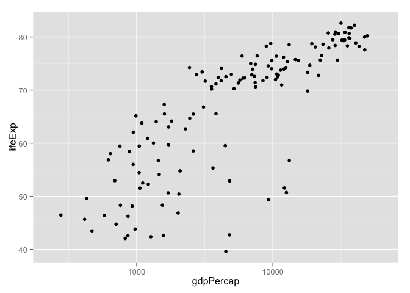
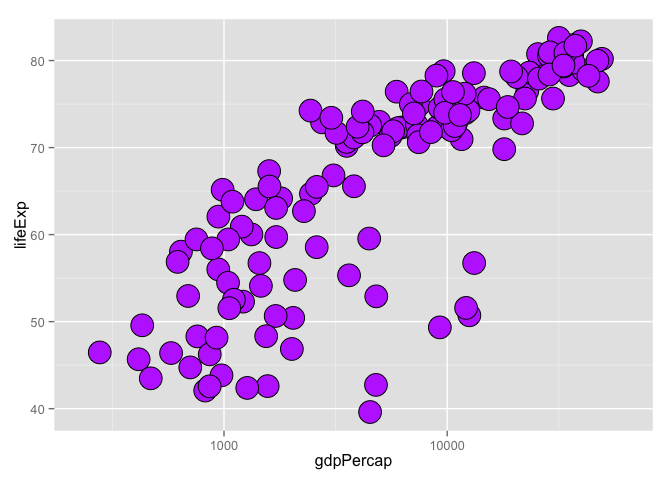
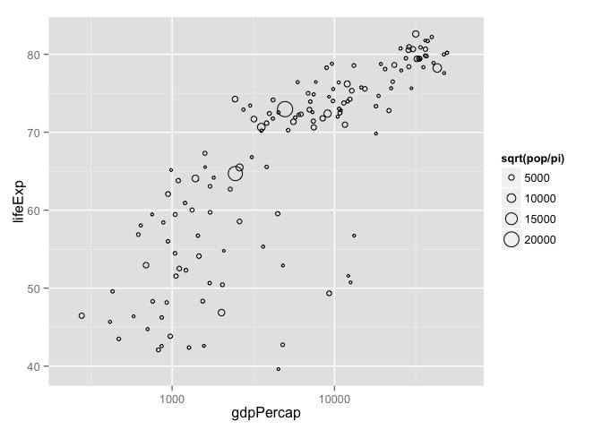
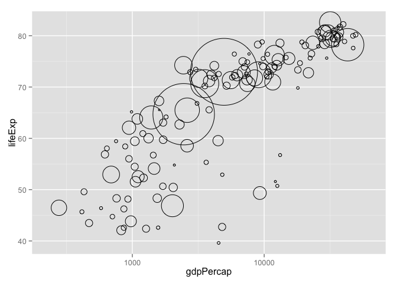
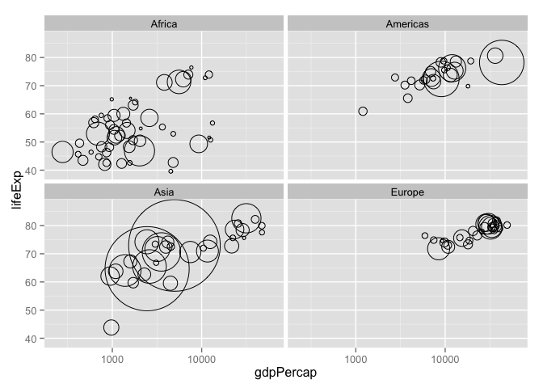
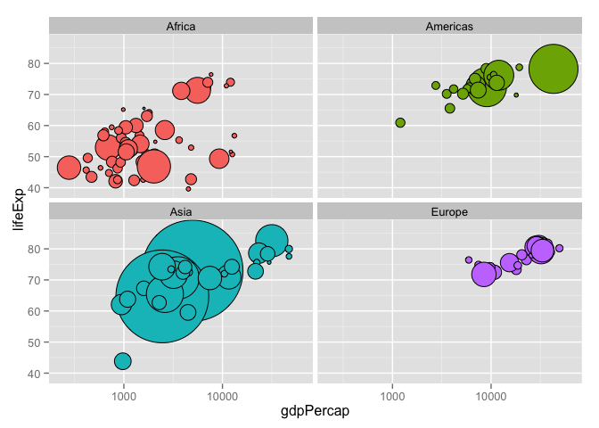
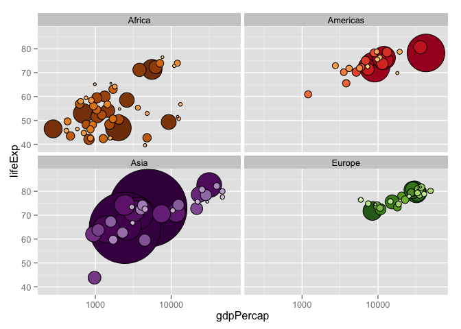

# Taking control of qualitative colors in ggplot2


### Load `ggplot2` and prepare the Gapminder data

Bring in the usual Gapminder data but drop Oceania, which only has two countries.


```r
library(ggplot2)
gDat <- read.delim("gapminderDataFiveYear.txt")
jDat <- droplevels(subset(gDat, continent != "Oceania"))
str(jDat)
## 'data.frame':	1680 obs. of  6 variables:
##  $ country  : Factor w/ 140 levels "Afghanistan",..: 1 1 1 1 1 1 1 1 1 1 ...
##  $ year     : int  1952 1957 1962 1967 1972 1977 1982 1987 1992 1997 ...
##  $ pop      : num  8425333 9240934 10267083 11537966 13079460 ...
##  $ continent: Factor w/ 4 levels "Africa","Americas",..: 3 3 3 3 3 3 3 3 3 3 ...
##  $ lifeExp  : num  28.8 30.3 32 34 36.1 ...
##  $ gdpPercap: num  779 821 853 836 740 ...
```

### Take control of the size and color of points

Let's use `ggplot2` to move towards the classic Gapminder bubble chart. Crawl then walk then run.

First, make a simple scatterplot for a single year.


```r
jYear <- 2007
q <-
  ggplot(subset(jDat, year == jYear), aes(x = gdpPercap, y = lifeExp)) +
  scale_x_log10(limits = c(230, 63000))
q + geom_point()
```

 

Take control of the plotting symbol, its size, and its color. Use obnoxious settings so that success versus failure is completely obvious. Now is not the time for the delicate operation of inserting your fancy color scheme. Be bold!


```r
## do I have control of size and fill color? YES!
q + geom_point(pch = 21, size = 8, fill = I("darkorchid1"))
```

 

### Circle area = population

We want the size of the circle to reflect population. Since we have direct control of the radius, we invert the relation $area = \pi r^2$ to determine the point size from the country's population. I have two complaints with my first attempt: the circles are still too small for my taste and I don't want the size legend. So in my second attempt, I suppress the legend with `show_guide = FALSE` and I increase the range of sizes by explicitly setting the range for the scale that maps $\sqrt(pop / \pi)$ into circle size.


```r
q + geom_point(aes(size = sqrt(pop/pi)), pch = 21)
(r <- q +
   geom_point(aes(size = sqrt(pop/pi)), pch = 21, show_guide = FALSE) +
   scale_size_continuous(range=c(1,40)))
```



### Circle fill color determined by a factor

Now I use `aes()` to map a factor to color. For the moment, I settle for the `continent` factor and for the automatic color scheme. I also facet by continent. Why? Because it will be helpful below for checking my progress on using my custom color scheme. Since all the countries, say, in Europe, are some shade of green, if the continent facets have circles of many colors, I'll know something's wrong.


```r
(r <- r + facet_wrap(~ continent) + ylim(c(39, 87)))
r + aes(fill = continent)
```



### Get the color scheme for the countries

Elsewhere, I devised a color scheme for the Gapminder countries. We will not discuss it's construction here, but will merely pull it off the web. You can view it in PDF form [here](http://www.stat.ubc.ca/~jenny/notOcto/STAT545A/examples/gapminder/figs/bryan-a01-colorScheme.pdf).


```r
## get the country color scheme
gdURL <- "http://www.stat.ubc.ca/~jenny/notOcto/STAT545A/examples/gapminder/data/gapminderCountryColors.txt"
countryColors <- read.delim(file = gdURL, as.is = 3) # protect color
str(countryColors)
## 'data.frame':	142 obs. of  3 variables:
##  $ continent: Factor w/ 5 levels "Africa","Americas",..: 1 1 1 1 1 1 1 1 1 1 ...
##  $ country  : Factor w/ 142 levels "Afghanistan",..: 95 39 43 28 118 121 127 69 86 3 ...
##  $ color    : chr  "#7F3B08" "#833D07" "#873F07" "#8B4107" ...
head(countryColors)
##   continent          country   color
## 1    Africa          Nigeria #7F3B08
## 2    Africa            Egypt #833D07
## 3    Africa         Ethiopia #873F07
## 4    Africa Congo, Dem. Rep. #8B4107
## 5    Africa     South Africa #8F4407
## 6    Africa            Sudan #934607
```

The data.frame `countryColors` has one row per country and three variables: country, continent, and color. The color variable holds the RGB hex strings encoding the color scheme.

__Note:__ The row order of `countryColors` is not alphabetical. The countries are actually sorted by size (in which particular year, I don't recall) within continent, reflecting the logic by which the scheme was created. No problem. Ideally, nothing in your analysis should depend on row order, although that's not always possible in reality.

### Prepare the color scheme for use with `ggplot2`

In the Grammar of Graphics, a __scale__ controls the mapping from a variable in the data to an aesthetic. So far we've let the coloring / filling scale be determined automatically by `ggplot2`. But to use our custom color scheme, we need to take control of the mapping of the `country` factor into fill color in `geom_point()`.

We will use `scale_fill_manual`, a member of a family of functions for customization of the discrete scales. The main argument is `values =`, which is a vector of aesthetic values -- fill colors, in our case. If this vector has names, they will be consulted during the mapping. This is incredibly useful! Below, we isolate the vector of hex strings providing the country colors and give this vector the country names as names. This saves us from any worry about the order of levels of the `country` factor, the row order of the data, or exactly which countries are being plotted.


```r
jColors <- countryColors$color
names(jColors) <- countryColors$country
head(jColors)
##          Nigeria            Egypt         Ethiopia Congo, Dem. Rep. 
##        "#7F3B08"        "#833D07"        "#873F07"        "#8B4107" 
##     South Africa            Sudan 
##        "#8F4407"        "#934607"
```

### Make the `ggplot2` bubble chart

This is deceptively simple at this point. Like many things, it looks really easy, once we figure everything out! The last two bits we add are to use `aes()` to specify that the country should be mapped to color and to use `scale_fill_manual()` to specify our custom color scheme.

```r
r + aes(fill = country) + scale_fill_manual(values = jColors)
```

 

### Epilogue: re-make the plot to reveal small countries

We know from earlier work that large countries can effectively hide the data from small countries, by covering them up. This is a case where, sadly, the row order of the data truly affects the visual output. `ggplot2` is no less vulnerable to this than `lattice` or base graphics. So, to get closure, we sort the data on year and then on population and remake the plot, revealing all the code.


```r
jDat <- jDat[with(jDat, order(year, -1 * pop)), ]
ggplot(subset(jDat, year == jYear),
       aes(x = gdpPercap, y = lifeExp)) +
  scale_x_log10(limits = c(230, 63000)) +
  geom_point(aes(size = sqrt(pop/pi)), pch = 21, show_guide = FALSE) +
  scale_size_continuous(range=c(1,40)) + ylim(c(39, 87)) +
  facet_wrap(~ continent) +
  aes(fill = country) + scale_fill_manual(values = jColors)
```

 
