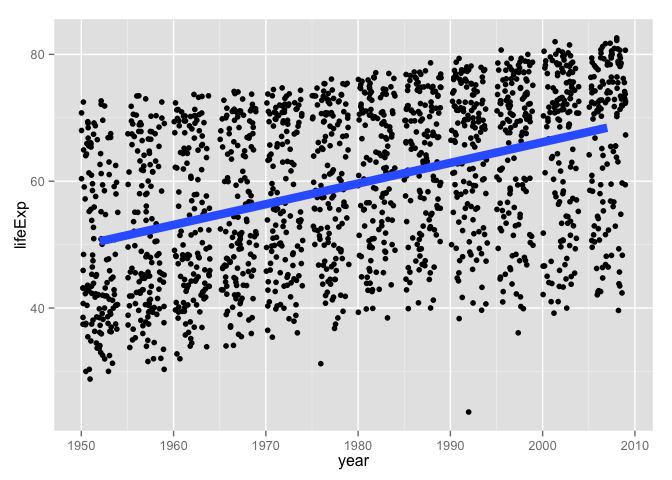
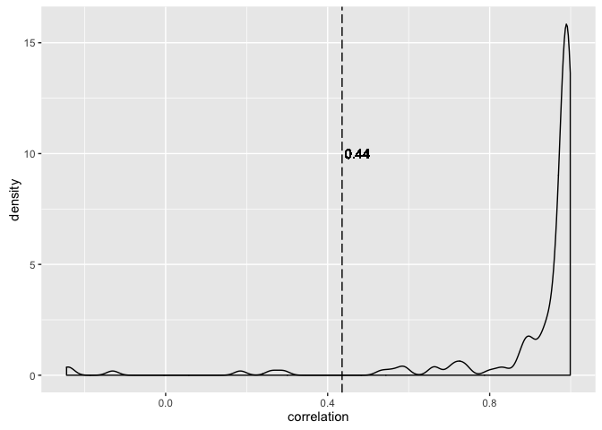
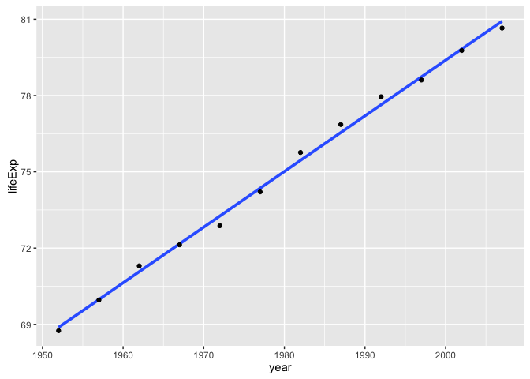
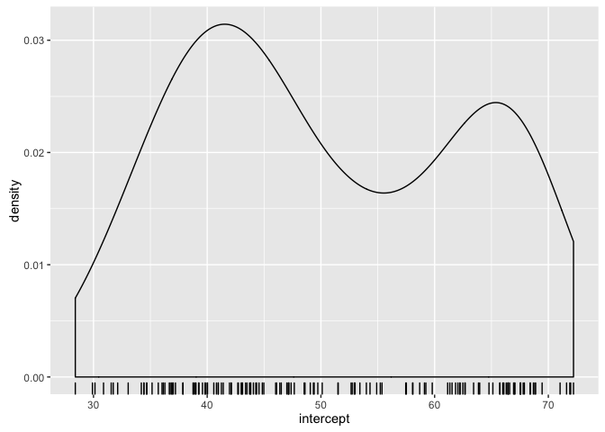
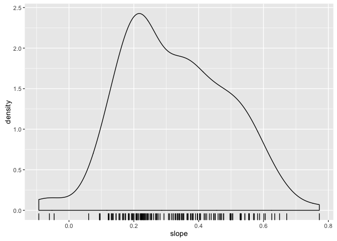
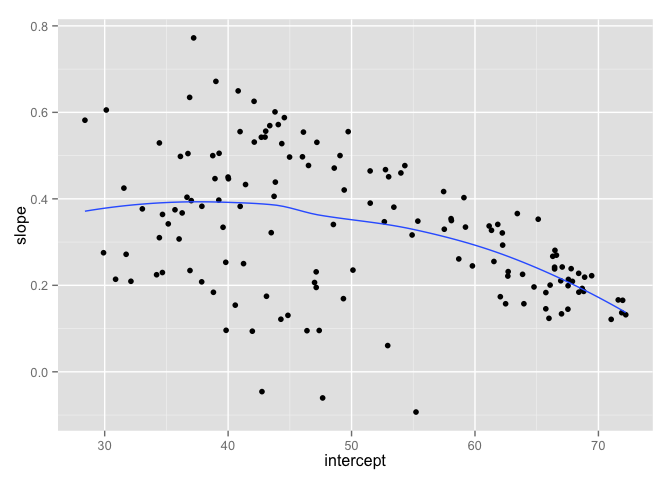

# Computing by groups within data.frames with dplyr and broom


*This material was last used in 2015. Since then, we've turned to different strategies for data aggregation. Specifically, using nested and possibly split data frames with `purrr::map()`, possibly inside `dplyr::mutate()`. But if you use `dplyr::do()`, maybe this is still useful.*

### Think before you create excerpts of your data ...

If you feel the urge to store a little snippet of your data:


```r
snippet <- subset(my_big_dataset, some_variable == some_value)
## or
snippet <- my_big_dataset %>%
  filter(some_variable == some_value)
```

Stop and ask yourself ...

> Do I want to create mini datasets for each level of some factor (or unique combination of several factors) ... in order to compute or graph something?  

If YES, __use proper data aggregation techniques__ or facetting in `ggplot2` plots or conditioning in `lattice` -- __don’t subset the data__. Or, more realistically, only subset the data as a temporary measure while you develop your elegant code for computing on or visualizing these data subsets.

If NO, then maybe you really do need to store a copy of a subset of the data. But seriously consider whether you can achieve your goals by simply using the `subset =` argument of, e.g., the `lm()` function, to limit computation to your excerpt of choice. Lots of functions offer a `subset =` argument! Or you can pipe filtered data into just about anything.

### Data aggregation landscape

*Note: [these slides](https://speakerdeck.com/jennybc/ubc-stat545-split-apply-combine-intro)  cover this material in a more visual way.*

There are three main options for data aggregation:

  * base R functions, often referred to as the `apply` family of functions
  * the [`plyr`](http://plyr.had.co.nz) add-on package
  * the [`dplyr`](http://cran.r-project.org/web/packages/dplyr/index.html) add-on package

I have a strong recommendation for `dplyr` and `plyr` over the base R functions, with some qualifications. Both of these packages are aimed squarely at __data analysis__, which they greatly accelerate. But even I do not use them exclusively when I am in more of a "programming mode", where I often revert to base R. Also, even a pure data analyst will benefit from a deeper understanding of the language.

I present `dplyr` here because that is our main package for data manipulation and there's a growing set of tools and materials around it. I still have a [soft spot for `plyr`](block013_plyr-ddply.html), because I think it might be easier for novices and I like it's unified treatment of diverse split-apply-combine tasks. I find both `dplyr` and `plyr` more immediately usable than the `apply` functions. But eventually you'll need to learn them all.

The main strengths of the `dplyr`/`plyr` mentality over the `apply` functions are:

  * interface is very consistent and clear around the issue of "what is the input? what is the output?"
  * return values are predictable and immediately useful for next steps
  
You'll notice I do not even mention another option that may occur to some: hand-coding `for` loops, perhaps, even (shudder) nested `for` loops! Don't do it. By the end of this tutorial you'll see things that are much faster and more fun. Yes, of course, tedious loops are required for data aggregation but when you can, let other developers write them for you, in efficient low level code. This is more about saving programmer time than compute time, BTW.

#### Load data and packages

Load `gapminder`, `dplyr` and also `magrittr` itself, since I want to use more than just the pipe operator `%>%` that `dplyr` re-exports. We'll eventually make some plots, so throw in `ggplot2`.


```r
suppressPackageStartupMessages(library(dplyr))
library(gapminder)
library(magrittr)
library(ggplot2)

gapminder %>%
  tbl_df() %>%
  glimpse()
#> Observations: 1,704
#> Variables: 6
#> $ country   <fctr> Afghanistan, Afghanistan, Afghanistan, Afghanistan,...
#> $ continent <fctr> Asia, Asia, Asia, Asia, Asia, Asia, Asia, Asia, Asi...
#> $ year      <int> 1952, 1957, 1962, 1967, 1972, 1977, 1982, 1987, 1992...
#> $ lifeExp   <dbl> 28.801, 30.332, 31.997, 34.020, 36.088, 38.438, 39.8...
#> $ pop       <int> 8425333, 9240934, 10267083, 11537966, 13079460, 1488...
#> $ gdpPercap <dbl> 779.4453, 820.8530, 853.1007, 836.1971, 739.9811, 78...
```

### Review: grouping and summarizing

Use `group_by()` to add grouping structure to a data.frame. `summarize()` can then be used to do "n-to-1" computations.


```r
gapminder %>%
  group_by(continent) %>%
  summarize(avg_lifeExp = mean(lifeExp))
#> # A tibble: 5 × 2
#>   continent avg_lifeExp
#>      <fctr>       <dbl>
#> 1    Africa    48.86533
#> 2  Americas    64.65874
#> 3      Asia    60.06490
#> 4    Europe    71.90369
#> 5   Oceania    74.32621
```

### Review: writing our own function

Our first custom function computes the difference between two quantiles. Here's one version of it.


```r
qdiff <- function(x, probs = c(0, 1), na.rm = TRUE) {
  the_quantiles <- quantile(x = x, probs = probs, na.rm = na.rm)
  return(max(the_quantiles) - min(the_quantiles))
}
qdiff(gapminder$lifeExp)
#> [1] 59.004
```

### Compute within groups with our own function

Just. Use. It.


```r
## on the whole dataset
gapminder %>%
  summarize(qdiff = qdiff(lifeExp))
#> # A tibble: 1 × 1
#>    qdiff
#>    <dbl>
#> 1 59.004
## on each continent
gapminder %>%
  group_by(continent) %>%
  summarize(qdiff = qdiff(lifeExp))
#> # A tibble: 5 × 2
#>   continent  qdiff
#>      <fctr>  <dbl>
#> 1    Africa 52.843
#> 2  Americas 43.074
#> 3      Asia 53.802
#> 4    Europe 38.172
#> 5   Oceania 12.115
## on each continent, specifying which quantiles
gapminder %>%
  group_by(continent) %>%
  summarize(qdiff = qdiff(lifeExp, probs = c(0.2, 0.8)))
#> # A tibble: 5 × 2
#>   continent   qdiff
#>      <fctr>   <dbl>
#> 1    Africa 15.1406
#> 2  Americas 15.7914
#> 3      Asia 22.3130
#> 4    Europe  7.3460
#> 5   Oceania  7.0360
```

Notice we can still provide probabilities, though common argument values are used across all groups.

### What if we want something other than 1 number back from each group?

What if we want to do "n-to-???" computation? Well, `summarize()` isn't going to cut it anymore.


```r
gapminder %>%
  group_by(continent) %>%
  summarize(range = range(lifeExp))
#> Error in eval(expr, envir, enclos): expecting a single value
```

Bummer.

### Meet "do"

`dplyr::do()` will compute just about anything and is conceived to use with `group_by()` to compute within groups. If the thing you compute is an unnamed data.frame, they get row-bound together, with the grouping variables retained. Let's get the first two rows from each continent in 2007.


```r
gapminder %>%
  filter(year == 2007) %>% 
  group_by(continent) %>%
  do(head(., 2))
#> Source: local data frame [10 x 6]
#> Groups: continent [5]
#> 
#>        country continent  year lifeExp      pop  gdpPercap
#>         <fctr>    <fctr> <int>   <dbl>    <int>      <dbl>
#> 1      Algeria    Africa  2007  72.301 33333216  6223.3675
#> 2       Angola    Africa  2007  42.731 12420476  4797.2313
#> 3    Argentina  Americas  2007  75.320 40301927 12779.3796
#> 4      Bolivia  Americas  2007  65.554  9119152  3822.1371
#> 5  Afghanistan      Asia  2007  43.828 31889923   974.5803
#> 6      Bahrain      Asia  2007  75.635   708573 29796.0483
#> 7      Albania    Europe  2007  76.423  3600523  5937.0295
#> 8      Austria    Europe  2007  79.829  8199783 36126.4927
#> 9    Australia   Oceania  2007  81.235 20434176 34435.3674
#> 10 New Zealand   Oceania  2007  80.204  4115771 25185.0091
```

We now explicitly use the `.` placeholder, which is `magrittr`-speak for "the thing we are computing on" or "the thing we have piped from the LHS". In this case it's one of the 5 continent-specific sub-data.frames of the Gapminder data.

I believe this is `dplyr::do()` at its very best. I'm about to show some other usage that returns unfriendlier objects, where I might approach the problem with different or additional tools.

Challenge: Modify the example above to get the 10th most populous country in 2002 for each continent


```r
gapminder %>% 
  filter(year == 2002) %>% 
  group_by(continent) %>% 
  arrange(desc(pop)) %>% 
  do(slice(., 10))
#> Source: local data frame [4 x 6]
#> Groups: continent [4]
#> 
#>    country continent  year lifeExp      pop gdpPercap
#>     <fctr>    <fctr> <int>   <dbl>    <int>     <dbl>
#> 1  Morocco    Africa  2002  69.615 31167783  3258.496
#> 2  Ecuador  Americas  2002  74.173 12921234  5773.045
#> 3 Thailand      Asia  2002  68.564 62806748  5913.188
#> 4   Greece    Europe  2002  78.256 10603863 22514.255
gapminder %>% 
  filter(year == 2002) %>% 
  group_by(continent) %>% 
  filter(min_rank(desc(pop)) == 10)
#> Source: local data frame [4 x 6]
#> Groups: continent [4]
#> 
#>    country continent  year lifeExp      pop gdpPercap
#>     <fctr>    <fctr> <int>   <dbl>    <int>     <dbl>
#> 1  Ecuador  Americas  2002  74.173 12921234  5773.045
#> 2   Greece    Europe  2002  78.256 10603863 22514.255
#> 3  Morocco    Africa  2002  69.615 31167783  3258.496
#> 4 Thailand      Asia  2002  68.564 62806748  5913.188
```

Oops, where did Oceania go? Why do we get the same answers in different row order with the alternative approach? Welcome to real world analysis, even with hyper clean data! Good thing we're just goofing around and nothing breaks when we suddenly lose a continent or row order changes.

What if thing(s) computed within `do()` are not data.frame? What if we name it?


```r
gapminder %>%
  group_by(continent) %>%
  do(range = range(.$lifeExp)) %T>% str
#> Classes 'rowwise_df', 'tbl_df', 'tbl' and 'data.frame':	5 obs. of  2 variables:
#>  $ continent: Factor w/ 5 levels "Africa","Americas",..: 1 2 3 4 5
#>  $ range    :List of 5
#>   ..$ : num  23.6 76.4
#>   ..$ : num  37.6 80.7
#>   ..$ : num  28.8 82.6
#>   ..$ : num  43.6 81.8
#>   ..$ : num  69.1 81.2
#>  - attr(*, "vars")=List of 1
#>   ..$ : symbol continent
#>  - attr(*, "drop")= logi TRUE
#> Source: local data frame [5 x 2]
#> Groups: <by row>
#> 
#> # A tibble: 5 × 2
#>   continent     range
#> *    <fctr>    <list>
#> 1    Africa <dbl [2]>
#> 2  Americas <dbl [2]>
#> 3      Asia <dbl [2]>
#> 4    Europe <dbl [2]>
#> 5   Oceania <dbl [2]>
```

We still get a data.frame back. But a weird data.frame in which the newly created `range` variable is a "list column". I have mixed feelings about this, especially for novice use.

Challenge: Create a data.frame with named 3 variables: `continent`, a variable for mean life expectancy, a list-column holding the typical five number summary of GDP per capita. Inspect an individual row, e.g. for Europe. Try to get at the mean life expectancy and the five number summary of GDP per capita.


```r
(chal01 <- gapminder %>%
   group_by(continent) %>%
   do(mean = mean(.$lifeExp),
      fivenum = summary(.$gdpPercap)))
#> Source: local data frame [5 x 3]
#> Groups: <by row>
#> 
#> # A tibble: 5 × 3
#>   continent      mean              fivenum
#> *    <fctr>    <list>               <list>
#> 1    Africa <dbl [1]> <S3: summaryDefault>
#> 2  Americas <dbl [1]> <S3: summaryDefault>
#> 3      Asia <dbl [1]> <S3: summaryDefault>
#> 4    Europe <dbl [1]> <S3: summaryDefault>
#> 5   Oceania <dbl [1]> <S3: summaryDefault>
chal01[4, ]
#> # A tibble: 1 × 3
#>   continent      mean              fivenum
#>      <fctr>    <list>               <list>
#> 1    Europe <dbl [1]> <S3: summaryDefault>
chal01[[4, "mean"]]
#> [1] 71.90369
chal01[[4, "fivenum"]]
#>    Min. 1st Qu.  Median    Mean 3rd Qu.    Max. 
#>   973.5  7213.0 12080.0 14470.0 20460.0 49360.0
```

Due to these list-columns, `do()` output will require further computation to prepare for downstream work. It will also require medium-to-high comfort level with R data structures and their manipulation.

So, whenever possible, I recommend computing an unnamed data.frame inside `do()`.

But `dplyr` teams up beautifully with some other packages ...

## Fit a linear regression within country

We'll start moving towards a well-worn STAT 545 example: linear regression of life expectancy on year. You are not allowed to fit a model without first making a plot, so let's do that.


```r
ggplot(gapminder, aes(x = year, y = lifeExp)) +
  geom_jitter() +
  geom_smooth(lwd = 3, se = FALSE, method = "lm")
```

<!-- -->

```r
(ov_cor <- gapminder %$%
  cor(year, lifeExp))
#> [1] 0.4356112
(gcor <- gapminder %>%
  group_by(country) %>%
  summarize(correlation = cor(year, lifeExp)))
#> # A tibble: 142 × 2
#>        country correlation
#>         <fctr>       <dbl>
#> 1  Afghanistan   0.9735051
#> 2      Albania   0.9542420
#> 3      Algeria   0.9925307
#> 4       Angola   0.9422392
#> 5    Argentina   0.9977816
#> 6    Australia   0.9897716
#> 7      Austria   0.9960592
#> 8      Bahrain   0.9832293
#> 9   Bangladesh   0.9946662
#> 10     Belgium   0.9972665
#> # ... with 132 more rows
ggplot(gcor, aes(x = correlation)) +
  geom_density() +
  geom_vline(xintercept = ov_cor, linetype = "longdash") +
  geom_text(data = NULL, x = ov_cor, y = 10, label = round(ov_cor, 2),
            hjust = -0.1)
```

<!-- -->

It is plausible that there's a linear relationship between life expectancy and year, marginally and perhaps within country. We see the correlation between life expectancy and year is much higher within countries than if you just compute correlation naively (which is arguably nonsensical).

How are we actually going to fit this model within country?

We recently learned how to write our own R functions ([Part 1](block011_write-your-own-function-01.html), [Part 2](block011_write-your-own-function-02.html), [Part 3](block011_write-your-own-function-03.html)). We then [wrote a function](block012_function-regress-lifeexp-on-year.html) to use on the Gapminder dataset. This function `le_lin_fit()` takes a data.frame and expects to find variables for life expectancy and year. It returns the estimated coefficients from a simple linear regression. We wrote it with the goal of applying it to the data from each country in Gapminder.


```r
le_lin_fit <- function(dat, offset = 1952) {
  the_fit <- lm(lifeExp ~ I(year - offset), dat)
  setNames(coef(the_fit), c("intercept", "slope"))
}
```

Let's try it out on the data for one country. Does the numeric result match the figure, at least eyeball-o-metrically.


```r
le_lin_fit(gapminder %>% filter(country == "Canada"))
#>  intercept      slope 
#> 68.8838462  0.2188692
ggplot(gapminder %>% filter(country == "Canada"),
       aes(x = year, y = lifeExp)) +
  geom_smooth(lwd = 1.3, se = FALSE, method = "lm") +
  geom_point()
```

<!-- -->

We have learned above that life will be sweeter if we return data.frame rather than a numeric vector. Let's tweak the function and test again.

```r
le_lin_fit <- function(dat, offset = 1952) {
  the_fit <- lm(lifeExp ~ I(year - offset), dat)
  setNames(data.frame(t(coef(the_fit))), c("intercept", "slope"))
}
le_lin_fit(gapminder %>% filter(country == "Canada"))
#>   intercept     slope
#> 1  68.88385 0.2188692
```

We are ready to scale up to __all countries__ by placing this function inside a `dplyr::do()` call.


```r
gfits_me <- gapminder %>%
  group_by(country) %>% 
  do(le_lin_fit(.))
gfits_me
#> Source: local data frame [142 x 3]
#> Groups: country [142]
#> 
#>        country intercept     slope
#>         <fctr>     <dbl>     <dbl>
#> 1  Afghanistan  29.90729 0.2753287
#> 2      Albania  59.22913 0.3346832
#> 3      Algeria  43.37497 0.5692797
#> 4       Angola  32.12665 0.2093399
#> 5    Argentina  62.68844 0.2317084
#> 6    Australia  68.40051 0.2277238
#> 7      Austria  66.44846 0.2419923
#> 8      Bahrain  52.74921 0.4675077
#> 9   Bangladesh  36.13549 0.4981308
#> 10     Belgium  67.89192 0.2090846
#> # ... with 132 more rows
```

We did it! Once we package the computation in a properly designed function and drop it into a split-apply-combine machine, this is No Big Deal. To review, here's the short script I would save from our work so far:


```r
library(dplyr)
library(gapminder)
le_lin_fit <- function(dat, offset = 1952) {
  the_fit <- lm(lifeExp ~ I(year - offset), dat)
  setNames(data.frame(t(coef(the_fit))), c("intercept", "slope"))
}
gfits_me <- gapminder %>%
  group_by(country, continent) %>% 
  do(le_lin_fit(.))
```

Deceptively simple, no? Let's at least reward outselves with some plots.

  * What do you expect to be true about the intercepts? What does the intercept mean? What min and max do you expect.
  * What do you expect to be true about the slopes? What sign are you expecting to see?
  * What relationship do you expect between intercept and slopes?


```r
ggplot(gfits_me, aes(x = intercept)) + geom_density() + geom_rug()
```

<!-- -->

```r
ggplot(gfits_me, aes(x = slope)) + geom_density() + geom_rug()
```

<!-- -->

```r
ggplot(gfits_me, aes(x = intercept, y = slope)) +
  geom_point() +
  geom_smooth(se = FALSE)
```

<!-- -->

## Meet the `broom` package

Install the `broom` package if you don't have it yet. We talk about it more elsewhere, in the context of *tidy data*. Here we just use it to help us produce nice data.frames inside of `dplyr::do()`. It has lots of built-in functions for tidying messy stuff, such as fitted linear models.


```r
## install.packages("broom")
library(broom)
```

Watch how easy it is to get fitted model results:


```r
gfits_broom <- gapminder %>%
  group_by(country, continent) %>% 
  do(tidy(lm(lifeExp ~ I(year - 1952), data = .)))
gfits_broom 
#> Source: local data frame [284 x 7]
#> Groups: country, continent [142]
#> 
#>        country continent           term   estimate   std.error  statistic
#>         <fctr>    <fctr>          <chr>      <dbl>       <dbl>      <dbl>
#> 1  Afghanistan      Asia    (Intercept) 29.9072949 0.663999539  45.041138
#> 2  Afghanistan      Asia I(year - 1952)  0.2753287 0.020450934  13.462890
#> 3      Albania    Europe    (Intercept) 59.2291282 1.076844032  55.002513
#> 4      Albania    Europe I(year - 1952)  0.3346832 0.033166387  10.091036
#> 5      Algeria    Africa    (Intercept) 43.3749744 0.718420236  60.375491
#> 6      Algeria    Africa I(year - 1952)  0.5692797 0.022127070  25.727749
#> 7       Angola    Africa    (Intercept) 32.1266538 0.764035493  42.048641
#> 8       Angola    Africa I(year - 1952)  0.2093399 0.023532003   8.895964
#> 9    Argentina  Americas    (Intercept) 62.6884359 0.158728938 394.940184
#> 10   Argentina  Americas I(year - 1952)  0.2317084 0.004888791  47.395847
#> # ... with 274 more rows, and 1 more variables: p.value <dbl>
```

The default tidier for `lm` objects produces a data.frame summary of estimated coefficients and results related to statistical inference, e.g., p-value. Note that we get two rows per country, versus the one row per country we produced above. It's a nice illustration of the meaning of *tidy data*. The `broom` treatment is more tidy and a better idea, in the long run.

If we want to use some other `broom` functions for working with models, it's convenient if we store the fits first.


```r
fits <- gapminder %>% 
  group_by(country, continent) %>%
  do(fit = lm(lifeExp ~ I(year - 1952), .))
fits
#> Source: local data frame [142 x 3]
#> Groups: <by row>
#> 
#> # A tibble: 142 × 3
#>        country continent      fit
#> *       <fctr>    <fctr>   <list>
#> 1  Afghanistan      Asia <S3: lm>
#> 2      Albania    Europe <S3: lm>
#> 3      Algeria    Africa <S3: lm>
#> 4       Angola    Africa <S3: lm>
#> 5    Argentina  Americas <S3: lm>
#> 6    Australia   Oceania <S3: lm>
#> 7      Austria    Europe <S3: lm>
#> 8      Bahrain      Asia <S3: lm>
#> 9   Bangladesh      Asia <S3: lm>
#> 10     Belgium    Europe <S3: lm>
#> # ... with 132 more rows
```

Now we have a data.frame that is grouped "by row" (vs. by some factor) with a `fit` list-column that holds one fitted linear model for each country. We can apply various functions from `broom` to get tidy results back out. As data.frames. Yay.


```r
## one row per country, overall model stuff
fits %>% 
  glance(fit)
#> Source: local data frame [142 x 13]
#> Groups: country, continent [142]
#> 
#>        country continent r.squared adj.r.squared     sigma  statistic
#>         <fctr>    <fctr>     <dbl>         <dbl>     <dbl>      <dbl>
#> 1  Afghanistan      Asia 0.9477123     0.9424835 1.2227880  181.24941
#> 2      Albania    Europe 0.9105778     0.9016355 1.9830615  101.82901
#> 3      Algeria    Africa 0.9851172     0.9836289 1.3230064  661.91709
#> 4       Angola    Africa 0.8878146     0.8765961 1.4070091   79.13818
#> 5    Argentina  Americas 0.9955681     0.9951249 0.2923072 2246.36635
#> 6    Australia   Oceania 0.9796477     0.9776125 0.6206086  481.34586
#> 7      Austria    Europe 0.9921340     0.9913474 0.4074094 1261.29629
#> 8      Bahrain      Asia 0.9667398     0.9634138 1.6395865  290.65974
#> 9   Bangladesh      Asia 0.9893609     0.9882970 0.9766908  929.92637
#> 10     Belgium    Europe 0.9945406     0.9939946 0.2929025 1821.68840
#> # ... with 132 more rows, and 7 more variables: p.value <dbl>, df <int>,
#> #   logLik <dbl>, AIC <dbl>, BIC <dbl>, deviance <dbl>, df.residual <int>
## one row per country per parameter estimate, statistical inference stuff
fits %>% 
  tidy(fit)
#> Source: local data frame [284 x 7]
#> Groups: country, continent [142]
#> 
#>        country continent           term   estimate   std.error  statistic
#>         <fctr>    <fctr>          <chr>      <dbl>       <dbl>      <dbl>
#> 1  Afghanistan      Asia    (Intercept) 29.9072949 0.663999539  45.041138
#> 2  Afghanistan      Asia I(year - 1952)  0.2753287 0.020450934  13.462890
#> 3      Albania    Europe    (Intercept) 59.2291282 1.076844032  55.002513
#> 4      Albania    Europe I(year - 1952)  0.3346832 0.033166387  10.091036
#> 5      Algeria    Africa    (Intercept) 43.3749744 0.718420236  60.375491
#> 6      Algeria    Africa I(year - 1952)  0.5692797 0.022127070  25.727749
#> 7       Angola    Africa    (Intercept) 32.1266538 0.764035493  42.048641
#> 8       Angola    Africa I(year - 1952)  0.2093399 0.023532003   8.895964
#> 9    Argentina  Americas    (Intercept) 62.6884359 0.158728938 394.940184
#> 10   Argentina  Americas I(year - 1952)  0.2317084 0.004888791  47.395847
#> # ... with 274 more rows, and 1 more variables: p.value <dbl>
## one row per original observation, giving fitted value, residual, etc.
fits %>% 
  augment(fit)
#> Source: local data frame [1,704 x 11]
#> Groups: country, continent [142]
#> 
#>        country continent lifeExp I.year...1952.  .fitted   .se.fit
#>         <fctr>    <fctr>   <dbl>          <dbl>    <dbl>     <dbl>
#> 1  Afghanistan      Asia  28.801              0 29.90729 0.6639995
#> 2  Afghanistan      Asia  30.332              5 31.28394 0.5799442
#> 3  Afghanistan      Asia  31.997             10 32.66058 0.5026799
#> 4  Afghanistan      Asia  34.020             15 34.03722 0.4358337
#> 5  Afghanistan      Asia  36.088             20 35.41387 0.3848726
#> 6  Afghanistan      Asia  38.438             25 36.79051 0.3566719
#> 7  Afghanistan      Asia  39.854             30 38.16716 0.3566719
#> 8  Afghanistan      Asia  40.822             35 39.54380 0.3848726
#> 9  Afghanistan      Asia  41.674             40 40.92044 0.4358337
#> 10 Afghanistan      Asia  41.763             45 42.29709 0.5026799
#> # ... with 1,694 more rows, and 5 more variables: .resid <dbl>,
#> #   .hat <dbl>, .sigma <dbl>, .cooksd <dbl>, .std.resid <dbl>
```
