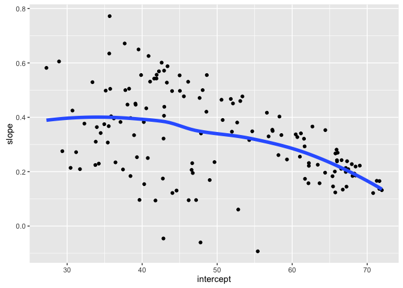

# Split-Apply-Combine

**WORK IN PROGRESS. Revamping for 2016 to use tidyverse and an approach based on nested data frames, list columns, `purrr::map()`, and `dplyr::mutate()`.**


## Think before you create excerpts of your data ...

If you feel the urge to store a little snippet of your data:


```r
snippet <- my_big_dataset %>%
  filter(some_variable == some_value)
## or
snippet <- subset(my_big_dataset, some_variable == some_value)
```

Stop and ask yourself ...

> Do I want to create mini datasets for each level of some factor (or unique combination of several factors) ... in order to compute or graph something?  
If YES, __use proper data aggregation techniques__ or facetting in `ggplot2` -- __don’t subset the data__. Or, more realistically, only subset the data as a temporary measure while you develop your elegant code for computing on or visualizing these data subsets.

If NO, then maybe you really do need to store a copy of a subset of the data. But seriously consider whether one of these strategies that subset at "compute time" will get the job done:

  * Pass an intact data frame and use the `subset =` argument of a command. Many functions have it!
    
    ```r
    ## regress life expectancy on year for Canada
    canada_fit <-
      lm(lifeExp ~ year, data = gapminder, subset = country == "Canada")
    ```
 * Pipe filtered data into a command. A very general solution.
    
    ```r
    ## compare gdpPercap in Australia vs New Zealand
    oceania_ttest <- gapminder %>%
      filter(continent == "Asia") %>% 
      t.test(gdpPercap ~ country, data = .)
    ```

Creating copies and excerpts of your data clutters up your workspace, script, and mind, often leading to confusion and mistakes. It can be useful during development, but try to eliminate this as you polish your analysis.

### Load dplyr, tidyr, purrr and gapminder

I choose to load the entire tidyverse. Also load gapminder.


```r
library(gapminder)
library(tidyverse)
#> Loading tidyverse: ggplot2
#> Loading tidyverse: tibble
#> Loading tidyverse: tidyr
#> Loading tidyverse: readr
#> Loading tidyverse: purrr
#> Loading tidyverse: dplyr
#> Conflicts with tidy packages ----------------------------------------------
#> filter(): dplyr, stats
#> lag():    dplyr, stats
```

### Split Apply Combine

A common analytical pattern is to

  * split data into pieces,
  * apply some function to each piece,
  * combine the results back together again.
  
R has specialized tools for this that are much nicer than whatever DIY approach you might be contemplating. Especially if it involves `for()` loops. There's nothing inherently wrong or evil about `for()` loops, but you will spend alot of time and characters on bookkeeping tasks. That can be a great way to pilot a computation, because it is so blessedly concrete. But consider revisiting your implementation with higher-level data aggregation tools once you've established proof-of-principle.

In base R, these are the "apply" functions, such as `apply()`, `aggregate()`, `tapply()`, and `by()`. We prefer to use similar tools from the tidyverse, due to a more consistent interface, analysis-friendly output, and a more concise way to describe what to compute. This article by Hadley Wickham -- [The split-apply-combine strategy for data analysis](http://www.jstatsoft.org/v40/i01/paper) -- provides a good high-level overview, but know that the tidyverse approaches outlined here now supercede the plyr package described there.

### Entry level: `dplyr::group_by()`

The most lightweight solution is given by `dplyr::group_by()`. `group_by()` adds some extra grouping structure to a data frame, based on levels of one or more categorical variables, but leaves the data frame intact. Then you can do group-wise computations using various functions in the tidyverse that automatically honor these groups.

The main function here is `summarize()`, which collapses each group into a single row in a new group-summarized data frame. This is described in detail in [dplyr functions for a single dataset](block010_dplyr-end-single-table.html), so we don't repeat that here.

When does this break down? If anything you want to compute for a group is more complicated than, say, a single number, you have outgrown `dplyr::summarize()`. Example: get the range of life expectancies seen for each continent.


```r
gapminder %>%
  group_by(continent) %>%
  summarize(range = range(lifeExp))
#> Error in eval(expr, envir, enclos): expecting a single value
```

Now, in this case, we could reframe this in a `summarize()`-friendly form, but that doesn't work in general.


```r
gapminder %>%
  group_by(continent) %>%
  summarize_each(funs(min, max), lifeExp)
#> # A tibble: 5 × 3
#>   continent    min    max
#>      <fctr>  <dbl>  <dbl>
#> 1    Africa 23.599 76.442
#> 2  Americas 37.579 80.653
#> 3      Asia 28.801 82.603
#> 4    Europe 43.585 81.757
#> 5   Oceania 69.120 81.235
```

### General approach: nesting

We use **nesting** as an extension of **grouping** in order to support more general group-wise computation. The collapse to a single row per group happens right away here, unlike the simple grouping above. When you nest data, the non-grouping variables are packaged into group-specific data frames that are held in a special variable called a list-column. You then apply your computation to the components of this list, i.e. the data frames. List-columns take a little getting used to, but the payoff is huge.

Let's get ready to fit a model for each country in the Gapminder dataset. First we group, as above, and then nest. We group by country and continent in order to keep those two variables "on the outside".


```r
(gap_nested <- gapminder %>% 
   group_by(continent, country) %>% 
   nest())
#> # A tibble: 142 × 3
#>    continent     country              data
#>       <fctr>      <fctr>            <list>
#> 1       Asia Afghanistan <tibble [12 × 4]>
#> 2     Europe     Albania <tibble [12 × 4]>
#> 3     Africa     Algeria <tibble [12 × 4]>
#> 4     Africa      Angola <tibble [12 × 4]>
#> 5   Americas   Argentina <tibble [12 × 4]>
#> 6    Oceania   Australia <tibble [12 × 4]>
#> 7     Europe     Austria <tibble [12 × 4]>
#> 8       Asia     Bahrain <tibble [12 × 4]>
#> 9       Asia  Bangladesh <tibble [12 × 4]>
#> 10    Europe     Belgium <tibble [12 × 4]>
#> # ... with 132 more rows
```

What do you notice?

  * The immediate collapse to 142 rows, one per country.
  * The familiar presence of `continent` and `country`.
  * The unfamiliar look of the new `data` variable, which is ... a list! It is a list-column of continent-specific tibbles.

How on earth do you inspect it?!? In RStudio, `gap_nested %>% View()` is often helpful (moderately so in this case). It's often nicer to inspect a single element like so:


```r
gap_nested[[1, "data"]]
#> # A tibble: 12 × 4
#>     year lifeExp      pop gdpPercap
#>    <int>   <dbl>    <int>     <dbl>
#> 1   1952  28.801  8425333  779.4453
#> 2   1957  30.332  9240934  820.8530
#> 3   1962  31.997 10267083  853.1007
#> 4   1967  34.020 11537966  836.1971
#> 5   1972  36.088 13079460  739.9811
#> 6   1977  38.438 14880372  786.1134
#> 7   1982  39.854 12881816  978.0114
#> 8   1987  40.822 13867957  852.3959
#> 9   1992  41.674 16317921  649.3414
#> 10  1997  41.763 22227415  635.3414
#> 11  2002  42.129 25268405  726.7341
#> 12  2007  43.828 31889923  974.5803
```

[Remember that](block004_basic-r-objects.html) double square brackets can only be used to extract a single element and they are simplifying. An equivalent call is `gap_nested[["data"]][[1]]` (which I find even more opaque) or `gap_nested$data[[1]]` (which is pretty nice). We're looking at the first of 142 country-specific data frames, which happens to be for Afghanistan.

The presence of list-columns is always a temporary, uncomfortable state.

### Apply a function `map()` and `mutate()`

How do we now iterate over the elements of `gap_nested$data`? It is a list, so we use general approaches for applying a function to each element of a list. In base R, this means `lapply()`, but we will use the tidyverse function `purrr::map()`, which has a few advantages [described elsewhere](https://speakerdeck.com/jennybc/purrr-tutorial-intro-very-rough-draft).

Walk before you run, i.e. do an example first!

Let's fit a model to the data from Afghanistan. The form of the right-hand side is so that our intercept has a nice interpretation.


```r
(fit <- lm(lifeExp ~ I(year - 1950), data = gap_nested[[1, "data"]]))
#> 
#> Call:
#> lm(formula = lifeExp ~ I(year - 1950), data = gap_nested[[1, 
#>     "data"]])
#> 
#> Coefficients:
#>    (Intercept)  I(year - 1950)  
#>        29.3566          0.2753
```

Let's capture that logic in a function and informally test that it returns the same results for Afghanistan.


```r
le_vs_yr <- function(df) {
  lm(lifeExp ~ I(year - 1950), data = df)
}
le_vs_yr(gap_nested[[1, "data"]])
#> 
#> Call:
#> lm(formula = lifeExp ~ I(year - 1950), data = df)
#> 
#> Coefficients:
#>    (Intercept)  I(year - 1950)  
#>        29.3566          0.2753
```

After you walk, jog before you run. Use `purrr::map()` to apply the fitting function `le_vs_yr()` to the first two elements of `gap_nested$data`.


```r
fits <- map(gap_nested$data[1:2], le_vs_yr)
fits
#> [[1]]
#> 
#> Call:
#> lm(formula = lifeExp ~ I(year - 1950), data = df)
#> 
#> Coefficients:
#>    (Intercept)  I(year - 1950)  
#>        29.3566          0.2753  
#> 
#> 
#> [[2]]
#> 
#> Call:
#> lm(formula = lifeExp ~ I(year - 1950), data = df)
#> 
#> Coefficients:
#>    (Intercept)  I(year - 1950)  
#>        58.5598          0.3347
```

So, how do we run, i.e. scale this up to all countries? And where do we put these fitted models? We'll use `map()` inside `mutate()`, meaning we store the models inside `gap_nested` in another list-column.


```r
(gap_nested <- gap_nested %>% 
   mutate(fit = map(data, le_vs_yr)))
#> # A tibble: 142 × 4
#>    continent     country              data      fit
#>       <fctr>      <fctr>            <list>   <list>
#> 1       Asia Afghanistan <tibble [12 × 4]> <S3: lm>
#> 2     Europe     Albania <tibble [12 × 4]> <S3: lm>
#> 3     Africa     Algeria <tibble [12 × 4]> <S3: lm>
#> 4     Africa      Angola <tibble [12 × 4]> <S3: lm>
#> 5   Americas   Argentina <tibble [12 × 4]> <S3: lm>
#> 6    Oceania   Australia <tibble [12 × 4]> <S3: lm>
#> 7     Europe     Austria <tibble [12 × 4]> <S3: lm>
#> 8       Asia     Bahrain <tibble [12 × 4]> <S3: lm>
#> 9       Asia  Bangladesh <tibble [12 × 4]> <S3: lm>
#> 10    Europe     Belgium <tibble [12 × 4]> <S3: lm>
#> # ... with 132 more rows
```

We have a new list-column `fit` that is even more intimidating than the previous, `data`. The `fit` variable holds 142 fitted linear models. What shall we do with that?

### Always have an exit strategy

The list-column state is an uncomfortable and temporary one. The goal is always to pull information out of these complicated objects and package as something simpler, usually a tibble. You always want a list-column exit strategy!

We are not afraid to fit linear models in this example because there is a fantastic package called [broom](https://github.com/dgrtwo/broom) from David Robinson that provides exactly this for `lm()` and many other functions.

broom provides three key functions that take a `lm()` fit as input and give a useful tibble back:

  * `tidy()`: a tidy version of `summary()`, e.g. a table with one row per parameter estimate
  * `augment()`: the original data, augmented with columns such as fitted values and residuals
  * `glance()`: a one-row model summary
  
All of these are much friendlier than a fitted `lm()` object and set us up for interesting downstream analyses and plots.

### Simplify and combine

Let's look at the result of `broom::tidy()` for a single model. Walk before you run.


```r
library(broom)
tidy(gap_nested$fit[[1]])
#>             term   estimate  std.error statistic      p.value
#> 1    (Intercept) 29.3566375 0.69898128  41.99918 1.404235e-12
#> 2 I(year - 1950)  0.2753287 0.02045093  13.46289 9.835213e-08
```

We get a two row data frame, one with results for the intercept and one for the slope. This is much more approachable than fitted `lm` objects!

Apply `tidy()` to the model for each country with the same `map()` inside `mutate()` strategy as above.


```r
(gap_nested <- gap_nested %>% 
  mutate(tidy = map(fit, tidy)))
#> # A tibble: 142 × 5
#>    continent     country              data      fit                 tidy
#>       <fctr>      <fctr>            <list>   <list>               <list>
#> 1       Asia Afghanistan <tibble [12 × 4]> <S3: lm> <data.frame [2 × 5]>
#> 2     Europe     Albania <tibble [12 × 4]> <S3: lm> <data.frame [2 × 5]>
#> 3     Africa     Algeria <tibble [12 × 4]> <S3: lm> <data.frame [2 × 5]>
#> 4     Africa      Angola <tibble [12 × 4]> <S3: lm> <data.frame [2 × 5]>
#> 5   Americas   Argentina <tibble [12 × 4]> <S3: lm> <data.frame [2 × 5]>
#> 6    Oceania   Australia <tibble [12 × 4]> <S3: lm> <data.frame [2 × 5]>
#> 7     Europe     Austria <tibble [12 × 4]> <S3: lm> <data.frame [2 × 5]>
#> 8       Asia     Bahrain <tibble [12 × 4]> <S3: lm> <data.frame [2 × 5]>
#> 9       Asia  Bangladesh <tibble [12 × 4]> <S3: lm> <data.frame [2 × 5]>
#> 10    Europe     Belgium <tibble [12 × 4]> <S3: lm> <data.frame [2 × 5]>
#> # ... with 132 more rows
```

The last step is now to simplify, preferably back to a normal tibble. We do this by retaining variables that are amenable to simplification and using `unnest()`, thus completing the circle.


```r
(gap_coefs <- gap_nested %>% 
   select(continent, country, tidy) %>% 
   unnest(tidy))
#> # A tibble: 284 × 7
#>    continent     country           term   estimate   std.error  statistic
#>       <fctr>      <fctr>          <chr>      <dbl>       <dbl>      <dbl>
#> 1       Asia Afghanistan    (Intercept) 29.3566375 0.698981278  41.999176
#> 2       Asia Afghanistan I(year - 1950)  0.2753287 0.020450934  13.462890
#> 3     Europe     Albania    (Intercept) 58.5597618 1.133575812  51.659325
#> 4     Europe     Albania I(year - 1950)  0.3346832 0.033166387  10.091036
#> 5     Africa     Algeria    (Intercept) 42.2364149 0.756269040  55.848399
#> 6     Africa     Algeria I(year - 1950)  0.5692797 0.022127070  25.727749
#> 7     Africa      Angola    (Intercept) 31.7079741 0.804287463  39.423683
#> 8     Africa      Angola I(year - 1950)  0.2093399 0.023532003   8.895964
#> 9   Americas   Argentina    (Intercept) 62.2250191 0.167091314 372.401279
#> 10  Americas   Argentina I(year - 1950)  0.2317084 0.004888791  47.395847
#> # ... with 274 more rows, and 1 more variables: p.value <dbl>
```

### Recap

The whole point of this was to get apply a computation to all the pieces of a dataset and glue the results back together. First, let's review all of our work so far in one place. It's remarkably compact.


```r
gap_nested <- gapminder %>% 
  group_by(continent, country) %>% 
  nest()

le_vs_yr <- function(df) {
  lm(lifeExp ~ I(year - 1950), data = df)
}

gap_coefs <- gap_nested %>% 
  mutate(fit = map(data, le_vs_yr),
         tidy = map(fit, tidy)) %>% 
  select(continent, country, tidy) %>% 
  unnest(tidy)
```

Reflect on how you would have obtained a data frame of country-specific intercepts and slopes from a regression of life expectancy on year. Did you know any approaches for solving this problem? If no, then rejoice that you now have one! If yes, does the approach outlined here seem simpler? 

List-columns take some getting used to, but they are a required component of the strategy laid out above for general-purpose split-apply-combine.

### Enjoy the payoff of your work

Let's celebrate by exploring the estimated slopes and intercepts a bit. First we recode the variable corresponding to "intercept" vs "slope".


```r
(gap_coefs <- gap_coefs %>%
   mutate(term = recode(term,
                        `(Intercept)` = "intercept",
                        `I(year - 1950)` = "slope")))
#> # A tibble: 284 × 7
#>    continent     country      term   estimate   std.error  statistic
#>       <fctr>      <fctr>     <chr>      <dbl>       <dbl>      <dbl>
#> 1       Asia Afghanistan intercept 29.3566375 0.698981278  41.999176
#> 2       Asia Afghanistan     slope  0.2753287 0.020450934  13.462890
#> 3     Europe     Albania intercept 58.5597618 1.133575812  51.659325
#> 4     Europe     Albania     slope  0.3346832 0.033166387  10.091036
#> 5     Africa     Algeria intercept 42.2364149 0.756269040  55.848399
#> 6     Africa     Algeria     slope  0.5692797 0.022127070  25.727749
#> 7     Africa      Angola intercept 31.7079741 0.804287463  39.423683
#> 8     Africa      Angola     slope  0.2093399 0.023532003   8.895964
#> 9   Americas   Argentina intercept 62.2250191 0.167091314 372.401279
#> 10  Americas   Argentina     slope  0.2317084 0.004888791  47.395847
#> # ... with 274 more rows, and 1 more variables: p.value <dbl>
```

Due to the way we parametrized the model, the intercepts correspond to expected life expectancy in 1950. These numbers should be plausible as human life expectancies. The slopes correspond to change in expected life expectancy from one year to the next. We expect positive numbers to dominate, but they'll probably less than one. A reshaped version of the estimates, `gap_ests`, is handy for numerical summarization and visualization.


```r
(gap_ests <- gap_coefs %>% 
   select(continent:estimate) %>% 
   spread(key = term, value = estimate))
#> # A tibble: 142 × 4
#>    continent                  country intercept      slope
#> *     <fctr>                   <fctr>     <dbl>      <dbl>
#> 1     Africa                  Algeria  42.23641 0.56927972
#> 2     Africa                   Angola  31.70797 0.20933986
#> 3     Africa                    Benin  38.92005 0.33423287
#> 4     Africa                 Botswana  52.80778 0.06066853
#> 5     Africa             Burkina Faso  33.95674 0.36397483
#> 6     Africa                  Burundi  40.27037 0.15413427
#> 7     Africa                 Cameroon  40.74917 0.25014685
#> 8     Africa Central African Republic  38.44170 0.18390559
#> 9     Africa                     Chad  39.30288 0.25324406
#> 10    Africa                  Comoros  39.09522 0.45039091
#> # ... with 132 more rows
gap_ests %>% 
  select(intercept, slope) %>% 
  summary()
#>    intercept         slope         
#>  Min.   :27.24   Min.   :-0.09302  
#>  1st Qu.:39.36   1st Qu.: 0.20832  
#>  Median :47.42   Median : 0.32145  
#>  Mean   :49.86   Mean   : 0.32590  
#>  3rd Qu.:62.05   3rd Qu.: 0.44948  
#>  Max.   :71.95   Max.   : 0.77218
```

The numerical summaries look reasonable. We conclude with a look at the full distribution.


```r
ggplot(gap_coefs, aes(x = estimate)) +
  geom_density() + geom_rug() + facet_wrap(~ term, scales = "free")
```

<!-- -->

```r
ggplot(gap_ests, aes(x = intercept, y = slope)) +
  geom_point() +
  geom_smooth(se = FALSE, lwd = 2)
```

<!-- -->

