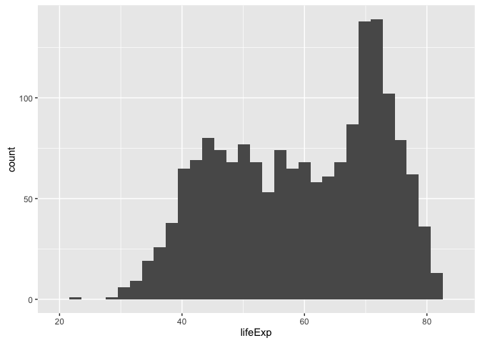
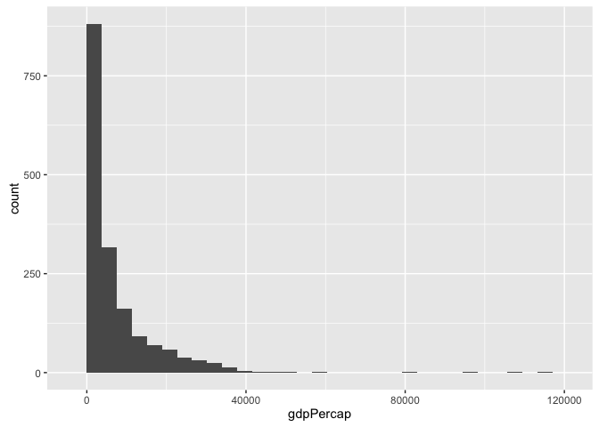
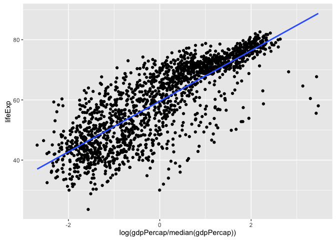

# Wrapping lm


Many students want a flexible wrapper around `lm()`, to drop into `dplyr::do()` for doing country-specific fits with the Gapminder data. What sort of flexibility? It would be nice to NOT hard-wire the response and predictor variables.

But it turns out the design of `lm()` makes this difficult. I'll provide a partial explanation and solution here. For a thorough treatment, I recommend you read the [Non-standard evaluation](http://adv-r.had.co.nz/Computing-on-the-language.html) chapter of Hadley Wickham's [Advanced R](http://adv-r.had.co.nz) book.

### Load data and packages


```r
library(gapminder)
library(ggplot2)
suppressPackageStartupMessages(library(dplyr))
library(broom)
suppressPackageStartupMessages(library(purrr))
library(tidyr)

gapminder %>%
  tbl_df() %>%
  glimpse()
#> Observations: 1,704
#> Variables: 6
#> $ country   (fctr) Afghanistan, Afghanistan, Afghanistan, Afghanistan,...
#> $ continent (fctr) Asia, Asia, Asia, Asia, Asia, Asia, Asia, Asia, Asi...
#> $ year      (dbl) 1952, 1957, 1962, 1967, 1972, 1977, 1982, 1987, 1992...
#> $ lifeExp   (dbl) 28.801, 30.332, 31.997, 34.020, 36.088, 38.438, 39.8...
#> $ pop       (dbl) 8425333, 9240934, 10267083, 11537966, 13079460, 1488...
#> $ gdpPercap (dbl) 779.4453, 820.8530, 853.1007, 836.1971, 739.9811, 78...
```

### Works but is unsatisyfing

We start with a function that meets an immediate need -- regressing life expectancy on year -- but isn't very general. The coefficient names are also terrible, but that's the least of our worries.


```r
yes_but <-
  function(df) lm(lifeExp ~ poly(I(year - 1952), degree = 2, raw = TRUE), df)
yes_but(gapminder)
#> 
#> Call:
#> lm(formula = lifeExp ~ poly(I(year - 1952), degree = 2, raw = TRUE), 
#>     data = df)
#> 
#> Coefficients:
#>                                   (Intercept)  
#>                                     48.916138  
#> poly(I(year - 1952), degree = 2, raw = TRUE)1  
#>                                      0.517417  
#> poly(I(year - 1952), degree = 2, raw = TRUE)2  
#>                                     -0.003482
```

We can apply `yes_but()` to one individual country and to all 142 countries.


```r
gapminder %>%
  filter(country == "Canada") %>% 
  yes_but()
#> 
#> Call:
#> lm(formula = lifeExp ~ poly(I(year - 1952), degree = 2, raw = TRUE), 
#>     data = df)
#> 
#> Coefficients:
#>                                   (Intercept)  
#>                                    68.7352885  
#> poly(I(year - 1952), degree = 2, raw = TRUE)1  
#>                                     0.2366962  
#> poly(I(year - 1952), degree = 2, raw = TRUE)2  
#>                                    -0.0003241
gapminder %>% 
  group_by(country) %>% 
  do(fit = yes_but(.))
#> Source: local data frame [142 x 2]
#> Groups: <by row>
#> 
#>        country     fit
#>         (fctr)  (list)
#> 1  Afghanistan <S3:lm>
#> 2      Albania <S3:lm>
#> 3      Algeria <S3:lm>
#> 4       Angola <S3:lm>
#> 5    Argentina <S3:lm>
#> 6    Australia <S3:lm>
#> 7      Austria <S3:lm>
#> 8      Bahrain <S3:lm>
#> 9   Bangladesh <S3:lm>
#> 10     Belgium <S3:lm>
#> ..         ...     ...
```

It's disappointing that `lifeExp` and `year` are hard-wired.

### What does NOT work

Doing the simplest thing -- making the `x` and `y` variables function arguments -- does not work.


```r
nope <- function(df, y_var, x_var) lm(y_var ~ x_var, data = df)
nope(gapminder, lifeExp, year)
#> Error in eval(expr, envir, enclos): object 'lifeExp' not found
nope(gapminder, "lifeExp", "year")
#> Warning in model.response(mf, "numeric"): NAs introduced by coercion
#> Error in `contrasts<-`(`*tmp*`, value = contr.funs[1 + isOF[nn]]): contrasts can be applied only to factors with 2 or more levels
```

`lm()` uses what's called *non-standard evaluation* (NSE): The variables in the formula argument are interpreted in the context of the data.frame passed via the `data =` argument (if supplied, which I highly recommend). This is really nice for interactive and top-level use, but it makes `lm()` hard to program around.

### Wishful thinking

Here are examples of NSE-using functions that have a *standard evaluation* (SE) companion function for use in programming.

Consider `aes()` for specifying aesthetics in `ggplot()`. It has companion functions `aes_string()`, `aes_()`, and `aes_q()`. We'll just demo `aes_string()`, where you can provide the variable name as a character string.


```r
jfun <- function(df, x) ggplot(df, aes_string(x)) + geom_histogram()
jfun(gapminder, "lifeExp")
#> `stat_bin()` using `bins = 30`. Pick better value with `binwidth`.
jfun(gapminder, "gdpPercap")
#> `stat_bin()` using `bins = 30`. Pick better value with `binwidth`.
```



Consider `arrange()` from `dplyr`, which orders rows of a `tbl`. It has companion function `arrange_()`, following a general pattern used for the `dplyr` verbs: The SE version has the same name but with `_` tacked on the end. This allows you to specify the variable in a couple ways, including via character string.


```r
jfun2 <- function(df, x, n = 2) head(arrange_(df, x), n)
jfun2(gapminder, "lifeExp")
#>       country continent year lifeExp     pop gdpPercap
#> 1      Rwanda    Africa 1992  23.599 7290203  737.0686
#> 2 Afghanistan      Asia 1952  28.801 8425333  779.4453
jfun2(gapminder, quote(gdpPercap))
#>            country continent year lifeExp      pop gdpPercap
#> 1 Congo, Dem. Rep.    Africa 2002  44.966 55379852  241.1659
#> 2 Congo, Dem. Rep.    Africa 2007  46.462 64606759  277.5519
gapminder %>% 
  group_by(continent) %>% 
  do(jfun2(., ~ pop))
#> Source: local data frame [10 x 6]
#> Groups: continent [5]
#> 
#>                  country continent  year lifeExp     pop  gdpPercap
#>                   (fctr)    (fctr) (dbl)   (dbl)   (dbl)      (dbl)
#> 1  Sao Tome and Principe    Africa  1952  46.471   60011   879.5836
#> 2  Sao Tome and Principe    Africa  1957  48.945   61325   860.7369
#> 3    Trinidad and Tobago  Americas  1952  59.100  662850  3023.2719
#> 4    Trinidad and Tobago  Americas  1957  61.800  764900  4100.3934
#> 5                Bahrain      Asia  1952  50.939  120447  9867.0848
#> 6                Bahrain      Asia  1957  53.832  138655 11635.7995
#> 7                Iceland    Europe  1952  72.490  147962  7267.6884
#> 8                Iceland    Europe  1957  73.470  165110  9244.0014
#> 9            New Zealand   Oceania  1952  69.390 1994794 10556.5757
#> 10           New Zealand   Oceania  1957  70.260 2229407 12247.3953
```

But sadly there is no `lm_()` for us to build around in our application.

### A solution: if you can't beat `em, join `em

I'm actually not providing an exact equivalent of `aes_string()` or `arrange_()` for `lm()`. Specifically, the function below still uses NSE. Why? Because we often use `year` as a predictor and usually want to shift it by its minimum, so that the intercept is more interpretable.

Here's a function that plays well with `dplyr::do()`, but with flexibility re: the response and predictor variables. `lm_poly_raw()` uses `lm()` to fit polynomial models of a chosen degree and with other arguments passed via `...`.


```r
lm_poly_raw <- function(df, y, x, degree = 1, ...) {
  lm_formula <-
    substitute(y ~ poly(x, degree, raw = TRUE),
               list(y = substitute(y), x = substitute(x), degree = degree))
  eval(lm(lm_formula, data = df, ...))
}
```

Use it on the full dataset and on one country:


```r
lm_poly_raw(gapminder, y = lifeExp, x = I(year - 1952))
#> 
#> Call:
#> lm(formula = lm_formula, data = df)
#> 
#> Coefficients:
#>                         (Intercept)  poly(I(year - 1952), 1, raw = TRUE)  
#>                             50.5121                               0.3259
gapminder %>% 
  filter(country == "Canada") %>% 
  lm_poly_raw(y = lifeExp, x = I(year - 1952))
#> 
#> Call:
#> lm(formula = lm_formula, data = df)
#> 
#> Coefficients:
#>                         (Intercept)  poly(I(year - 1952), 1, raw = TRUE)  
#>                             68.8838                               0.2189
```

Use it with different response and predictor variables (plot included, so you can sanity check estimated coefficients -- we haven't fit this model *ad nauseum*):


```r
gapminder %>% 
  lm_poly_raw(y = lifeExp, x = log(gdpPercap/median(gdpPercap)))
#> 
#> Call:
#> lm(formula = lm_formula, data = df)
#> 
#> Coefficients:
#>                                           (Intercept)  
#>                                                59.565  
#> poly(log(gdpPercap/median(gdpPercap)), 1, raw = TRUE)  
#>                                                 8.405
gapminder %>% 
  ggplot(aes(x = log(gdpPercap/median(gdpPercap)), y = lifeExp)) +
  geom_point() +
  geom_smooth(method = "lm", se = FALSE)
```

 

Prove that we can control other `lm()` arguments, such as `NA` handling. Here we request that `lm()` refuse to work in the presence of `NA`s and test with a suitably offensive dataset:


```r
belgium <- gapminder %>% filter(country == "Belgium")
lm_poly_raw(belgium, y = lifeExp, x = I(year - 1952))
#> 
#> Call:
#> lm(formula = lm_formula, data = df)
#> 
#> Coefficients:
#>                         (Intercept)  poly(I(year - 1952), 1, raw = TRUE)  
#>                             67.8919                               0.2091
belgium$year[3] <- NA
lm_poly_raw(belgium, y = lifeExp, x = I(year - 1952), na.action = na.fail)
#> Error in poly(I(year - 1952), 1, raw = TRUE): missing values are not allowed in 'poly'
```

To be clear, the last error is a confirmation that things are working.

One of the very next things I would in an analysis is to attack the terrible names of the estimated coefficients.

## Use our `lm` wrapper with `broom`

Don't forget: we're still fitting plain vanilla linear models, so you can still use `lm_poly_raw()` with the `broom` package.

Fit and tidy at once:


```r
g_ests <- gapminder %>%
  group_by(country, continent) %>% 
  do(tidy(lm_poly_raw(., lifeExp, I(year - 1952))))
g_ests
#> Source: local data frame [284 x 7]
#> Groups: country, continent [142]
#> 
#>        country continent                                term   estimate
#>         (fctr)    (fctr)                               (chr)      (dbl)
#> 1  Afghanistan      Asia                         (Intercept) 29.9072949
#> 2  Afghanistan      Asia poly(I(year - 1952), 1, raw = TRUE)  0.2753287
#> 3      Albania    Europe                         (Intercept) 59.2291282
#> 4      Albania    Europe poly(I(year - 1952), 1, raw = TRUE)  0.3346832
#> 5      Algeria    Africa                         (Intercept) 43.3749744
#> 6      Algeria    Africa poly(I(year - 1952), 1, raw = TRUE)  0.5692797
#> 7       Angola    Africa                         (Intercept) 32.1266538
#> 8       Angola    Africa poly(I(year - 1952), 1, raw = TRUE)  0.2093399
#> 9    Argentina  Americas                         (Intercept) 62.6884359
#> 10   Argentina  Americas poly(I(year - 1952), 1, raw = TRUE)  0.2317084
#> ..         ...       ...                                 ...        ...
#> Variables not shown: std.error (dbl), statistic (dbl), p.value (dbl)
```

Or store fits.


```r
fits <- gapminder %>%
  group_by(country, continent) %>%
  do(fit = lm_poly_raw(., lifeExp, I(year - 1952)))
fits
#> Source: local data frame [142 x 3]
#> Groups: <by row>
#> 
#>        country continent     fit
#>         (fctr)    (fctr)  (list)
#> 1  Afghanistan      Asia <S3:lm>
#> 2      Albania    Europe <S3:lm>
#> 3      Algeria    Africa <S3:lm>
#> 4       Angola    Africa <S3:lm>
#> 5    Argentina  Americas <S3:lm>
#> 6    Australia   Oceania <S3:lm>
#> 7      Austria    Europe <S3:lm>
#> 8      Bahrain      Asia <S3:lm>
#> 9   Bangladesh      Asia <S3:lm>
#> 10     Belgium    Europe <S3:lm>
#> ..         ...       ...     ...
```

Then go after tidy info on the fitted models (`glance.lm()`), estimated parameters (see above; `tidy.lm()`), or the observed data (`augment.lm()`).


```r
fits %>% 
  glance(fit)
#> Source: local data frame [142 x 13]
#> Groups: country, continent [142]
#> 
#>        country continent r.squared adj.r.squared     sigma  statistic
#>         (fctr)    (fctr)     (dbl)         (dbl)     (dbl)      (dbl)
#> 1  Afghanistan      Asia 0.9477123     0.9424835 1.2227880  181.24941
#> 2      Albania    Europe 0.9105778     0.9016355 1.9830615  101.82901
#> 3      Algeria    Africa 0.9851172     0.9836289 1.3230064  661.91709
#> 4       Angola    Africa 0.8878146     0.8765961 1.4070091   79.13818
#> 5    Argentina  Americas 0.9955681     0.9951249 0.2923072 2246.36635
#> 6    Australia   Oceania 0.9796477     0.9776125 0.6206086  481.34586
#> 7      Austria    Europe 0.9921340     0.9913474 0.4074094 1261.29629
#> 8      Bahrain      Asia 0.9667398     0.9634138 1.6395865  290.65974
#> 9   Bangladesh      Asia 0.9893609     0.9882970 0.9766908  929.92637
#> 10     Belgium    Europe 0.9945406     0.9939946 0.2929025 1821.68840
#> ..         ...       ...       ...           ...       ...        ...
#> Variables not shown: p.value (dbl), df (int), logLik (dbl), AIC (dbl), BIC
#>   (dbl), deviance (dbl), df.residual (int)
fits %>% 
  tidy(fit)
#> Source: local data frame [284 x 7]
#> Groups: country, continent [142]
#> 
#>        country continent                                term   estimate
#>         (fctr)    (fctr)                               (chr)      (dbl)
#> 1  Afghanistan      Asia                         (Intercept) 29.9072949
#> 2  Afghanistan      Asia poly(I(year - 1952), 1, raw = TRUE)  0.2753287
#> 3      Albania    Europe                         (Intercept) 59.2291282
#> 4      Albania    Europe poly(I(year - 1952), 1, raw = TRUE)  0.3346832
#> 5      Algeria    Africa                         (Intercept) 43.3749744
#> 6      Algeria    Africa poly(I(year - 1952), 1, raw = TRUE)  0.5692797
#> 7       Angola    Africa                         (Intercept) 32.1266538
#> 8       Angola    Africa poly(I(year - 1952), 1, raw = TRUE)  0.2093399
#> 9    Argentina  Americas                         (Intercept) 62.6884359
#> 10   Argentina  Americas poly(I(year - 1952), 1, raw = TRUE)  0.2317084
#> ..         ...       ...                                 ...        ...
#> Variables not shown: std.error (dbl), statistic (dbl), p.value (dbl)
fits %>% 
  augment(fit)
#> Source: local data frame [1,704 x 11]
#> Groups: country, continent [142]
#> 
#>        country continent lifeExp poly.I.year...1952...1..raw...TRUE.
#>         (fctr)    (fctr)   (dbl)                               (dbl)
#> 1  Afghanistan      Asia  28.801                                   0
#> 2  Afghanistan      Asia  30.332                                   5
#> 3  Afghanistan      Asia  31.997                                  10
#> 4  Afghanistan      Asia  34.020                                  15
#> 5  Afghanistan      Asia  36.088                                  20
#> 6  Afghanistan      Asia  38.438                                  25
#> 7  Afghanistan      Asia  39.854                                  30
#> 8  Afghanistan      Asia  40.822                                  35
#> 9  Afghanistan      Asia  41.674                                  40
#> 10 Afghanistan      Asia  41.763                                  45
#> ..         ...       ...     ...                                 ...
#> Variables not shown: .fitted (dbl), .se.fit (dbl), .resid (dbl), .hat
#>   (dbl), .sigma (dbl), .cooksd (dbl), .std.resid (dbl)
```
