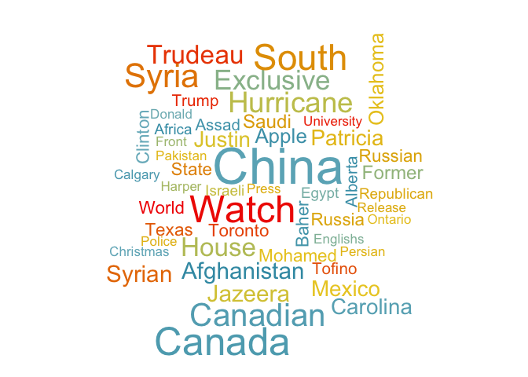
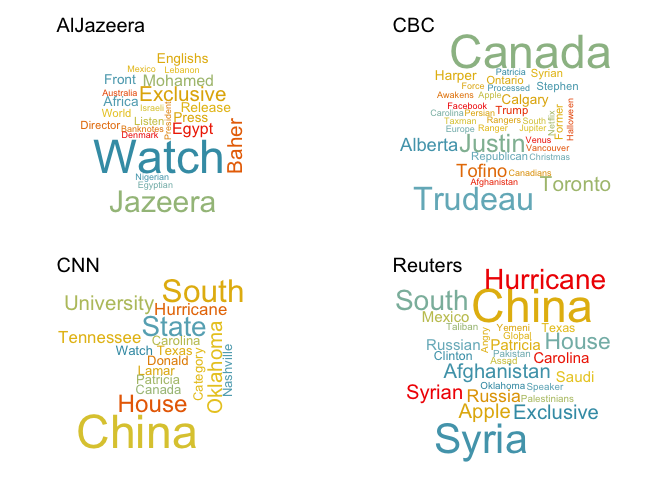

# Regular Expressions and Character Data
Kieran Samuk  
October 27, 2015  

Hopefully we now all have a nice grasp of regular expressions. Now, lets wield the mighty hammer of regex to wrangle some unruly text data in R!

### Set up

Install `stringr` if you don't have it already!


```r
#install.packages("stringr")
library("stringr")
library("dplyr")
library("ggplot2")
```

## Part 1: Basic string manipluation in R

### `nchar` - count the length of individual strings.


```r
test_str <- c("STAT545 is great!", "Wooooo!")
nchar(test_str)
```

```
## [1] 17  7
```

### `substr` - extract or replace substrings in a character vector.

Lets extract the 1st through 7th elements:

```r
substr(test_str, 1, 7)
```

```
## [1] "STAT545" "Wooooo!"
```
Now lets replace the 1st through 7th elements with SCIENCE:

```r
substr(test_str, 1, 7) <- "SCIENCE"
test_str
```

```
## [1] "SCIENCE is great!" "SCIENCE"
```

### `paste` - concatenate or combine strings

This is a weirdly complex function, so let's just touch on the common uses. The 'sep' parameter determines the separating character (defaults to a single space). 


```r
paste("abc", "efg")
```

```
## [1] "abc efg"
```

```r
paste("abc", "efg", sep = "")
```

```
## [1] "abcefg"
```

`paste0` is a shortcut for `paste(..., sep = "")`

```r
paste0("abc", "efg")
```

```
## [1] "abcefg"
```

If you want to combined many multi-value vectors, you need to also specify "collapse":

```r
paste(c("abc", "efg"), c("hij", "klm"), sep = "", collapse = "")
```

```
## [1] "abchijefgklm"
```

### `strsplit` - split a string into a list of substrings

For example, we can split a vector based on commas:

```r
x <- c("abc,cbe", "cb,gb,aaa")
strsplit(x, split = ",")
```

```
## [[1]]
## [1] "abc" "cbe"
## 
## [[2]]
## [1] "cb"  "gb"  "aaa"
```
Remember this returns a list, so treat it like one! Perhaps we want every second element:

```r
strsplit(x, split = ",") %>% lapply(function(x) x[2])
```

```
## [[1]]
## [1] "cbe"
## 
## [[2]]
## [1] "gb"
```

### Part 2: Regex in R

You now know the basics of wrangling character data in R! You are great. Now lets see how we can use these skills along with regex to do some very powerful manipulations.

#### Quick notes on Regex in R
1. The character classes **\\w**, **\\d**, **\\s**, can also be referred to using POSIX classes in R. They are identical in function, but some people consider these more readable. You can see all of them by typing `?regex`. Some examples:
* **\\w** = [[:alnum:]]
* **\\d** = [[:digit:]]
* **\\s** = [[:space:]]

2. When escaping special characters or using character classes, you often (always?) need to **double** escape them, e.g. **\\\\w** instead of **\\w**

### Load the `news_tweets`
For this exercise, lets load a data set of tweets in the last week from four news sources (CBC, CNN, Al Jazeera, Reuters). I gathered these using the R package `twitteR`, which interfaces with Twitter's REST API.


```r
news_tweets <- read.delim("https://www.dropbox.com/s/cbgcpkizun51wbk/news_tweets.txt?dl=1", header = TRUE, stringsAsFactors = FALSE, sep = "\t", quote = "", allowEscapes = TRUE)
glimpse(news_tweets)
```

```
## Observations: 858
## Variables: 4
## $ user_name (chr) "CBC", "CBC", "CBC", "CBC", "CBC", "CBC", "CBC", "CB...
## $ created   (chr) "2015-10-28 14:54:49", "2015-10-28 14:54:48", "2015-...
## $ retweets  (int) 30, 8, 10, 51, 10, 15, 17, 10, 24, 6, 16, 23, 13, 17...
## $ text      (chr) "Officer who flipped student in desk to be let go, r...
```

* `user_name` = twitter user name (shortened)
* `created` = date tweeted
* `retweets` = number of retweets to date
* `text` = the raw text of the tweet

### `grep` - find a pattern in a character vector

A very basic task you might want to do is search for a regular expression in a character vector. 

`grep` takes a regular expression and a character vector as input, and returns the *indexes* of the matches. 

Lets use a regular expression to find tweets in `news_tweets` that contain hashtags. A hash tag is a '#' followed by one or more alphanumeric character, e.g. #rstats, #Canada, etc. 


```r
# two identical ways of writing this regex:
hastag_pattern <- "#\\w+"
hastag_pattern <- "#[[:alnum:]]+"

grep(hastag_pattern, news_tweets$text)
```

```
##   [1]   5   7   9  11 175 206 260 269 274 276 277 279 282 287 292 305 308
##  [18] 309 310 311 321 327 333 338 340 343 348 349 351 358 360 362 364 366
##  [35] 367 369 371 386 387 388 397 404 405 407 408 411 422 425 434 435 437
##  [52] 439 440 441 442 453 455 457 459 460 464 467 469 471 487 500 502 503
##  [69] 505 507 508 510 512 513 514 515 516 517 518 520 521 522 523 530 531
##  [86] 532 535 536 537 540 541 542 543 544 545 546 548 549 550 551 552 553
## [103] 554 555 556 558 559 560 561 562 563 564 567 568 569 574 575 577 578
## [120] 579 580 581 582 583 584 585 586 588 589 591 592 593 594 596 597 598
## [137] 599 600 601 602 603 604 605 606 607 608 611 612 613 615 619 620 621
## [154] 622 623 625 634 639 640 641 642 644 646 647 648 649 650 656 657 658
## [171] 659 660 662 663 664 679 680 691 692 693 724 725 738 770 784 795 817
## [188] 818 819 826 829 830 831 832
```
Setting `value = TRUE` returns the *actual value* of the vector at those indexes:

```r
grep(hastag_pattern, news_tweets$text, value = TRUE) %>% head(n = 5)
```

```
## [1] "Alberta will try to spend its way out of a slump, but it also needs oil to recover https://t.co/x2h24rKI39 #abbudget https://t.co/ANkckdlb7m"
## [2] "Volkswagen posted 1st quarterly loss in 15 years, as costs from emissions scandal mount https://t.co/Z9WEkQ96km #VW https://t.co/VaDVd5Mw2D" 
## [3] "#Tesla's new Autopilot software means self-driving cars are already on Canadian roads https://t.co/3ksvzhVvEX https://t.co/WsM8s3T73R"       
## [4] "Canada Post's door-to-door delivery debate reignites as Liberals set to take office https://t.co/3pXZ1BHtCe #cdnpoli https://t.co/aM4UvkVzRe"
## [5] "On @CBCMorningShow: Teal Pumpkin Project helps B.C. kids with food allergies feel 'safe' on #Halloween https://t.co/vzVtMSinIh"
```
We can also invert the search using `invert = TRUE`:

```r
grep(hastag_pattern, news_tweets$text, value = TRUE, invert = TRUE) %>% head(n = 5)
```

```
## [1] "Officer who flipped student in desk to be let go, report says https://t.co/yRcQG35zXn https://t.co/LgXCbaDtjk"                         
## [2] "Apple Pay coming to Canada this year with American Express partnership https://t.co/Whc2g3lLzP https://t.co/xru2gnWdrg"                
## [3] "Renovation nation: Canadians may spend record $53 billion fixing their homes this year https://t.co/lNGZtIuuih https://t.co/KrCQ1rh8go"
## [4] "Cosmetic ear cropping banned by B.C. veterinarians https://t.co/wlsXmOmBFC https://t.co/E9hFezNJZe"                                    
## [5] "'I wouldn't mind to go back to school': No teacher, no students and a vicious cycle https://t.co/I62zrvwTlZ https://t.co/BlKtD9uGQx"
```

### `grepl` - logical pattern matching

`grepl` (grep logical) is similar to `grep`, but returns TRUE or FALSE for every element of the vector: 

```r
hastag_pattern <- "#[[:alnum:]]+"
grepl(hastag_pattern, news_tweets$text) %>% head(n = 10)
```

```
##  [1] FALSE FALSE FALSE FALSE  TRUE FALSE  TRUE FALSE  TRUE FALSE
```
You can use `grepl` with `filter` from `dplyr` to filter rows based on a regular expression. Lets filter for tweets that contain urls:

```r
# url regex
url_pattern <- "http[s]?://[^ ]+"

# filter news tweets using grepl
hashtag_tweets <- news_tweets %>%
	filter(grepl(url_pattern, news_tweets$text))

# print the first 6 rows of the resulting data frame
head(hashtag_tweets)
```

```
##   user_name             created retweets
## 1       CBC 2015-10-28 14:54:49       30
## 2       CBC 2015-10-28 14:54:48        8
## 3       CBC 2015-10-28 14:40:10       10
## 4       CBC 2015-10-28 14:40:08       51
## 5       CBC 2015-10-28 14:30:29       10
## 6       CBC 2015-10-28 14:25:18       15
##                                                                                                                                           text
## 1                                Officer who flipped student in desk to be let go, report says https://t.co/yRcQG35zXn https://t.co/LgXCbaDtjk
## 2                       Apple Pay coming to Canada this year with American Express partnership https://t.co/Whc2g3lLzP https://t.co/xru2gnWdrg
## 3       Renovation nation: Canadians may spend record $53 billion fixing their homes this year https://t.co/lNGZtIuuih https://t.co/KrCQ1rh8go
## 4                                           Cosmetic ear cropping banned by B.C. veterinarians https://t.co/wlsXmOmBFC https://t.co/E9hFezNJZe
## 5 Alberta will try to spend its way out of a slump, but it also needs oil to recover https://t.co/x2h24rKI39 #abbudget https://t.co/ANkckdlb7m
## 6          'I wouldn't mind to go back to school': No teacher, no students and a vicious cycle https://t.co/I62zrvwTlZ https://t.co/BlKtD9uGQx
```

### `gsub` - find and replace

Another basic task is matching a regular expression and replacing the matches with a specific string. 

`gsub` takes a regular expression, a replacement string, and a character vector. It returns a character vector with **all** instances of the regex replaced by the replacement string.

A common use of `gsub` is 'cleaning' text. For example, lets remove away all the urls from our tweets:


```r
# reminder of what a tweet looks like
news_tweets$text[20]
```

```
## [1] "Door-to-door mail delivery: Charge for it, scrap it or subsidize it?  https://t.co/4LYaSgFkd5 https://t.co/7EaA7jXWQW"
```

```r
# the url regex
url_pattern <- "http[s]?://[[:alnum:].\\/]+"

# replace all matches to the above regex with nothing ""
clean_tweets <- gsub(pattern = url_pattern, replacement = "", news_tweets$text)
clean_tweets[20]
```

```
## [1] "Door-to-door mail delivery: Charge for it, scrap it or subsidize it?   "
```
We can also used `gsub` to clean off extra or trailing white space:

```r
# regex for removing double OR trailing spaces
trailing_space <- "[ ]{2,}|[ ]+$"
clean_tweets <- gsub(pattern = trailing_space, replacement = "", clean_tweets)

# a clean tweet!
clean_tweets[20]
```

```
## [1] "Door-to-door mail delivery: Charge for it, scrap it or subsidize it?"
```
To conclude this section, lets replace all instances of words beginning with "polit" with "balloons".

First, the (cleaned) tweets that contain our pattern of interest:


```r
poli_pattern <- "[Pp]olit[[:alnum:]]+"
poli_pattern %>% grep(clean_tweets, value = TRUE)
```

```
##  [1] "Website that archives politicians' deleted tweets may return"                                                                    
##  [2] "Tom Mulcair says niqab position was a defining moment of his political career"                                                   
##  [3] "Tom Mulcair says niqab position was a defining moment of his political career"                                                   
##  [4] "Anaylsis: Triple deleted emails shed light on troubling political culture"                                                       
##  [5] ".@HillaryClinton to @StephenAtHome: I would let the big banks fail http://via @CNNPolitics"                                      
##  [6] "Celebrities and politicians wish @HillaryClinton a \"Happy Birthday\""                                                           
##  [7] ".@HillaryClinton's campaign is not yet carbon neutral, despite pledgevia @CNNPolitics"                                           
##  [8] "WATCH ONLINE: How leftist politics is challenging conventional news coverage@AJListeningPost"                                    
##  [9] "Meet @HenshawKate, Nollywood star turned politician on #AJMyNigeria#Nigeria"                                                     
## [10] "\"We should get to a point where politicians fear voters, rather than the other way round.\" @MmusiMaimane at #DMNandosGathering"
```

We now have the tools to make this way better:

```r
poli_pattern %>% gsub(replacement = "balloons", clean_tweets) %>% grep("balloons", ., value = TRUE) 
```

```
##  [1] "Website that archives balloons' deleted tweets may return"                                                                    
##  [2] "Tom Mulcair says niqab position was a defining moment of his balloons career"                                                 
##  [3] "Tom Mulcair says niqab position was a defining moment of his balloons career"                                                 
##  [4] "Anaylsis: Triple deleted emails shed light on troubling balloons culture"                                                     
##  [5] ".@HillaryClinton to @StephenAtHome: I would let the big banks fail http://via @CNNballoons"                                   
##  [6] "Celebrities and balloons wish @HillaryClinton a \"Happy Birthday\""                                                           
##  [7] ".@HillaryClinton's campaign is not yet carbon neutral, despite pledgevia @CNNballoons"                                        
##  [8] "WATCH ONLINE: How leftist balloons is challenging conventional news coverage@AJListeningPost"                                 
##  [9] "Meet @HenshawKate, Nollywood star turned balloons on #AJMyNigeria#Nigeria"                                                    
## [10] "\"We should get to a point where balloons fear voters, rather than the other way round.\" @MmusiMaimane at #DMNandosGathering"
```

### Part 3: The `stringr` package

Like all things in R, Hadley Wickham has tried to improve string handling. This is implemented in his package `stringr`. There are lots of functions that take the place of existing ones, but with nicer syntax. Lets use it along with `dplyr` to do a basic lexical analysis of our tweet-set!

For starters, lets clean out all the "non-word" text from the tweets. Lets clean out:

* URLs: `http[s]?://[[:alnum:].\\/]+`
* Twitter user names (@CNN, etc.): `@[\\w]*`
* Hashtags (#rstats): `#[\\w]*"` 
* Possessives ('s): `'s` 
* Weird Unicode stuff/html tags (e.g. <U008+>): `<.*>`

First, make regex for each thing we want to remove, then combined them together with "|"'s (remember, this means "or" in regex):

```r
stuff_to_remove <- c("http[s]?://[[:alnum:].\\/]+", "@[\\w]*", "#[\\w]*", "<.*>", "'s")
stuff_to_remove <-  paste(stuff_to_remove, sep = "|", collapse="|")
```

Next, lets use `str_replace_all` (like `gsub`) to scrub this puppy down:

```r
clean_tweets <- str_replace_all(news_tweets$text, stuff_to_remove, "")
clean_tweets[20:25]
```

```
## [1] "Door-to-door mail delivery: Charge for it, scrap it or subsidize it?   "
## [2] "Alberta budget: Can the province spend its way to prosperity?  "        
## [3] "Did 3rd-party groups sway voters during federal election?  "            
## [4] "Ready or not, self-driving cars are cruising on Canadian roads  "       
## [5] "How submarine cables became the latest Russia-U.S. issue  "             
## [6] "Top 10 Trending Halloween Costumes  "
```
Nice, but it has gross trailing white space! Luckily, `stringr` has a function specifically for this task. `str_trim` removes leading and trailing white space:


```r
clean_tweets <- str_trim(clean_tweets)
clean_tweets[20:25]
```

```
## [1] "Door-to-door mail delivery: Charge for it, scrap it or subsidize it?"
## [2] "Alberta budget: Can the province spend its way to prosperity?"       
## [3] "Did 3rd-party groups sway voters during federal election?"           
## [4] "Ready or not, self-driving cars are cruising on Canadian roads"      
## [5] "How submarine cables became the latest Russia-U.S. issue"            
## [6] "Top 10 Trending Halloween Costumes"
```

That feels good. Next, lets extract all the words from the whole data set using `str_extract_all` (like `grep(...,value = TRUE)`)

```r
tweet_words <- str_extract_all(clean_tweets, "[A-Za-z]+")
head(tweet_words)
```

```
## [[1]]
##  [1] "Officer" "who"     "flipped" "student" "in"      "desk"    "to"     
##  [8] "be"      "let"     "go"      "report"  "says"   
## 
## [[2]]
##  [1] "Apple"       "Pay"         "coming"      "to"          "Canada"     
##  [6] "this"        "year"        "with"        "American"    "Express"    
## [11] "partnership"
## 
## [[3]]
##  [1] "Renovation" "nation"     "Canadians"  "may"        "spend"     
##  [6] "record"     "billion"    "fixing"     "their"      "homes"     
## [11] "this"       "year"      
## 
## [[4]]
## [1] "Cosmetic"      "ear"           "cropping"      "banned"       
## [5] "by"            "B"             "C"             "veterinarians"
## 
## [[5]]
##  [1] "Alberta" "will"    "try"     "to"      "spend"   "its"     "way"    
##  [8] "out"     "of"      "a"       "slump"   "but"     "it"      "also"   
## [15] "needs"   "oil"     "to"      "recover"
## 
## [[6]]
##  [1] "I"        "wouldn"   "t"        "mind"     "to"       "go"      
##  [7] "back"     "to"       "school"   "No"       "teacher"  "no"      
## [13] "students" "and"      "a"        "vicious"  "cycle"
```

OK! So what are the top, say, fifteen words?

```r
word_counts <- unlist(tweet_words) %>% table %>% data.frame
names(word_counts) <- c("word", "count")
word_counts %>%
	arrange(count) %>%
	top_n(15) 
```

```
## Selecting by count
```

```
##     word count
## 1  after    45
## 2     as    45
## 3      U    45
## 4   from    48
## 5      S    48
## 6     is    52
## 7   says    54
## 8   with    54
## 9     at    71
## 10   and    74
## 11     a   105
## 12   for   115
## 13    on   124
## 14   the   161
## 15    of   165
## 16    in   221
## 17    to   303
```

Hmm. Those are kind of boring. Lets change the regex to catch words that start with a capital letter, and are at least 4 letters long.


```r
tweet_words <- str_extract_all(clean_tweets, "[A-Z][a-z]{4,}")

word_counts <- unlist(tweet_words) %>% table %>% data.frame
names(word_counts) <- c("word", "count")
word_counts %>%
	top_n(25)%>%
	arrange(count)
```

```
##           word count
## 1        Baher     8
## 2      Clinton     8
## 3      Mohamed     8
## 4       Russia     8
## 5      Russian     8
## 6        State     8
## 7        Texas     8
## 8      Toronto     8
## 9        World     8
## 10      Former     9
## 11       Saudi     9
## 12       Apple    10
## 13    Oklahoma    10
## 14    Carolina    11
## 15      Justin    11
## 16      Mexico    11
## 17    Patricia    11
## 18 Afghanistan    12
## 19     Jazeera    12
## 20      Syrian    12
## 21       House    14
## 22     Trudeau    14
## 23   Exclusive    15
## 24   Hurricane    16
## 25    Canadian    18
## 26       Syria    19
## 27       South    21
## 28       Watch    22
## 29      Canada    23
## 30       China    31
```

This feels like we are winning. Now for some fun: a word cloud.

```r
#install.packages("wordcloud")
#devtools::install_github("karthik/wesanderson")
library("wordcloud")
library("wesanderson")

pal <- wes_palette(name = "Zissou", 51, type ="continuous") %>% as.character()

word_counts %>%
	top_n(50) %>%
	with(wordcloud(word, count, ordered.colors = TRUE, color = pal, use.r.layout = TRUE))
```

 

We could also break it up by agency:


```r
news_clean_tweets <- news_tweets
news_clean_tweets$text <- clean_tweets

words_df <- news_clean_tweets %>%
	group_by(user_name) %>%
	do(words = str_extract_all(.$text, "[A-Z][a-z]{4,}"))

par(mfrow = c(2,2))

for (i in 1:4){
	
	word_counts <- unlist(words_df[i, 2]) %>% table %>% data.frame
	names(word_counts) <- c("word", "count")
	
	word_counts %>%
		top_n(50) %>%
		with(wordcloud(word, count, ordered.colors = TRUE, 
			color = wes_palette(name = "Zissou", nrow(.), type ="continuous"), 
			scale = c(3.5, 0.15)))
		text(0, 0.9, words_df$user_name[i], cex = 1.5, adj = c(0, 0))
	
}
```

 

### That's it!

You hopefully now have a grasp of regular expressions and the basic tools of text processing in R. There is much more to learn, but I hope this introduction gets you off on the right foot.

### Further Reading
* [The stringr vignette](https://cran.r-project.org/web/packages/stringr/vignettes/stringr.html)
* [Last year's lesson by Gloria Li](https://stat545-ubc.github.io/block022_regular-expression.html)
* [CRAN Task View: Natural Language Processing](https://cran.r-project.org/web/views/NaturalLanguageProcessing.html)
* [Regular expressions in R](https://www.youtube.com/watch?v=q8SzNKib5-4)
