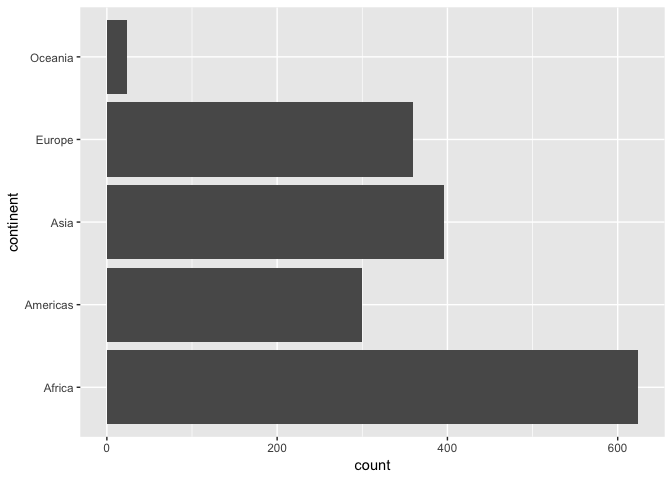
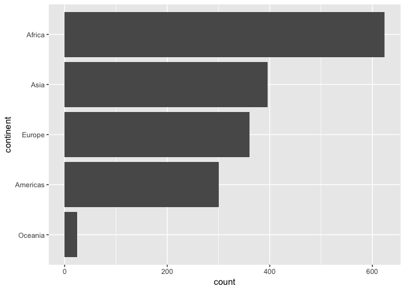

### Factors: where they fit in

We've spent alot of time working with big, beautiful data frames, like the Gapminder data. But we also need to manage the individual variables housed within.

Factors are the variable type that useRs love to hate. It is how we store truly categorical information in R. The values a factor can take on are called the **levels**. For example, the levels of the factor `continent` in Gapminder are are "Africa", "Americas", etc. and this is what's usually presented to your eyeballs by R. In general, the levels are friendly human-readable character strings, like "male/female" and "control/treated". But *never ever ever* forget that, under the hood, R is really storing integer codes 1, 2, 3, etc.

This [Janus](http://en.wikipedia.org/wiki/Janus)-like nature of factors means they are rich with booby traps for the unsuspecting but they are a necessary evil. I recommend you learn how to be the boss of your factors. The pros far outweigh the cons. Specifically in modelling and figure-making, factors are anticipated and accommodated by the functions and packages you will want to exploit.

**The worst kind of factor is the stealth factor.** The variable that you think of as character, but that is actually a factor (numeric!!). This is a classic R gotcha. Check your variable types explicitly when things seem weird. It happens to the best of us.

Where do stealth factors come from? Base R has a burning desire to turn character information into factor. The happens most commonly at data import via `read.table()` and friends. But `data.frame()` and other functions are also eager to convert character to factor. To shut this down, use `stringsAsFactors = FALSE` in `read.table()` and `data.frame()` or -- even better -- **use the tidyverse**! For data import, use `readr::read_csv()`, `readr::read_tsv()`, etc. For data frame creation, use `tibble::tibble()`. And so on.

Good articles about how the factor fiasco came to be:

  * [stringsAsFactors: An unauthorized biography](http://simplystatistics.org/2015/07/24/stringsasfactors-an-unauthorized-biography/) by Roger Peng
  * [stringsAsFactors = <sigh>](http://notstatschat.tumblr.com/post/124987394001/stringsasfactors-sigh) by Thomas Lumley

### The forcats package

forcats is a core package in the tidyverse. It is installed via `install.packages("tidyverse")` and attached via `library(tidyverse)`. You can always load it individually via `library(forcats)`. Main functions start with `fct_`. There really is no coherent family of base functions that forcats replaces -- that's why it's such a welcome addition.

### Load tidyverse, forcats, gapminder


```r
library(tidyverse)
#> ── Attaching packages ─────────────────────────────────────────────── tidyverse 1.2.1 ──
#> ✔ ggplot2 3.0.0           ✔ purrr   0.2.5      
#> ✔ tibble  1.4.99.9005     ✔ dplyr   0.7.7      
#> ✔ tidyr   0.8.1           ✔ stringr 1.3.1      
#> ✔ readr   1.1.1           ✔ forcats 0.3.0
#> ── Conflicts ────────────────────────────────────────────────── tidyverse_conflicts() ──
#> ✖ dplyr::filter() masks stats::filter()
#> ✖ dplyr::lag()    masks stats::lag()
library(forcats)
library(gapminder)
```

### Factor inspection

Get to know your factor before you start touching it! It's polite. Let's use `gapminder$continent` as our example.


```r
str(gapminder$continent)
#>  Factor w/ 5 levels "Africa","Americas",..: 3 3 3 3 3 3 3 3 3 3 ...
levels(gapminder$continent)
#> [1] "Africa"   "Americas" "Asia"     "Europe"   "Oceania"
nlevels(gapminder$continent)
#> [1] 5
class(gapminder$continent)
#> [1] "factor"
```

To get a frequency table as a tibble, from a tibble, use `dplyr::count()`. To get similar from a free-range factor, use `forcats::fct_count()`.


```r
gapminder %>% 
  count(continent)
#> # A tibble: 5 x 2
#>   continent     n
#>   <fct>     <int>
#> 1 Africa      624
#> 2 Americas    300
#> 3 Asia        396
#> 4 Europe      360
#> 5 Oceania      24
fct_count(gapminder$continent)
#> # A tibble: 5 x 2
#>   f            n
#>   <fct>    <int>
#> 1 Africa     624
#> 2 Americas   300
#> 3 Asia       396
#> 4 Europe     360
#> 5 Oceania     24
```

### Dropping unused levels

Just because you drop all the rows corresponding to a specific factor level, the levels of the factor itself do not change. Sometimes all these unused levels can come back to haunt you later, e.g., in figure legends.

Watch what happens to the levels of `country` (= nothing) when we filter Gapminder to a handful of countries.


```r
nlevels(gapminder$country)
#> [1] 142
h_countries <- c("Egypt", "Haiti", "Romania", "Thailand", "Venezuela")
h_gap <- gapminder %>%
  filter(country %in% h_countries)
nlevels(h_gap$country)
#> [1] 142
```

Even though `h_gap` only has data for a handful of countries, we are still schlepping around all 142 levels from the original `gapminder` tibble.

How can you get rid of them? The base function `droplevels()` operates on all the factors in a data frame or on a single factor. The function `forcats::fct_drop()` operates on a factor.


```r
h_gap_dropped <- h_gap %>% 
  droplevels()
nlevels(h_gap_dropped$country)
#> [1] 5

## use forcats::fct_drop() on a free-range factor
h_gap$country %>%
  fct_drop() %>%
  levels()
#> [1] "Egypt"     "Haiti"     "Romania"   "Thailand"  "Venezuela"
```

Exercise: Filter the gapminder data down to rows where population is less than a quarter of a million, i.e. 250,000. Get rid of the unused factor levels for `country` and `continent` in different ways, such as:

  * `droplevels()`
  * `fct_drop()` inside `mutate()`
  * `fct_drop()` with `mutate_at()` or `mutate_if()`


### Change order of the levels, principled

By default, factor levels are ordered alphabetically. Which might as well be random, when you think about it! It is preferable to order the levels according to some principle:

  * Frequency. Make the most common level the first and so on.
  * Another variable. Order factor levels according to a summary statistic for another variable. Example: order Gapminder countries by life expectancy.

First, let's order continent by frequency, forwards and backwards. This is often a great idea for tables and figures, esp. frequency barplots.


```r
## default order is alphabetical
gapminder$continent %>%
  levels()
#> [1] "Africa"   "Americas" "Asia"     "Europe"   "Oceania"

## order by frequency
gapminder$continent %>% 
  fct_infreq() %>%
  levels()
#> [1] "Africa"   "Asia"     "Europe"   "Americas" "Oceania"

## backwards!
gapminder$continent %>% 
  fct_infreq() %>%
  fct_rev() %>% 
  levels()
#> [1] "Oceania"  "Americas" "Europe"   "Asia"     "Africa"
```

These two barcharts of frequency by continent differ only in the order of the continents. Which do you prefer?



Now we order `country` by another variable, forwards and backwards. This other variable is usually quantitative and you will order the factor accoding to a grouped summary. The factor is the grouping variable and the default summarizing function is `median()` but you can specify something else.


```r
## order countries by median life expectancy
fct_reorder(gapminder$country, gapminder$lifeExp) %>% 
  levels() %>% head()
#> [1] "Sierra Leone"  "Guinea-Bissau" "Afghanistan"   "Angola"       
#> [5] "Somalia"       "Guinea"

## order accoring to minimum life exp instead of median
fct_reorder(gapminder$country, gapminder$lifeExp, min) %>% 
  levels() %>% head()
#> [1] "Rwanda"       "Afghanistan"  "Gambia"       "Angola"      
#> [5] "Sierra Leone" "Cambodia"

## backwards!
fct_reorder(gapminder$country, gapminder$lifeExp, .desc = TRUE) %>% 
  levels() %>% head()
#> [1] "Iceland"     "Japan"       "Sweden"      "Switzerland" "Netherlands"
#> [6] "Norway"
```

Example of why we reorder factor levels: often makes plots much better! When a factor is mapped to x or y, it should almost always be reordered by the quantitative variable you are mapping to the other one.


Compare the interpretability of these two plots of life expectancy in Asian countries in 2007. The *only difference* is the order of the `country` factor. Which one do you find easier to learn from?


```r
gap_asia_2007 <- gapminder %>% filter(year == 2007, continent == "Asia")
ggplot(gap_asia_2007, aes(x = lifeExp, y = country)) + geom_point()
ggplot(gap_asia_2007, aes(x = lifeExp, y = fct_reorder(country, lifeExp))) +
  geom_point()
```


Use `fct_reorder2()` when you have a line chart of a quantitative x against another quantitative y and your factor provides the color. This way the legend appears in some order as the data! Contrast the legend on the left with the one on the right.


```r
h_countries <- c("Egypt", "Haiti", "Romania", "Thailand", "Venezuela")
h_gap <- gapminder %>%
  filter(country %in% h_countries) %>% 
  droplevels()
ggplot(h_gap, aes(x = year, y = lifeExp, color = country)) +
  geom_line()
ggplot(h_gap, aes(x = year, y = lifeExp,
                  color = fct_reorder2(country, year, lifeExp))) +
  geom_line() +
  labs(color = "country")
```


### Change order of the levels, "because I said so"

Sometimes you just want to hoist one or more levels to the front. Why? Because I said so. This resembles what we do when we move variables to the front with `dplyr::select(special_var, everything())`.


```r
h_gap$country %>% levels()
#> [1] "Egypt"     "Haiti"     "Romania"   "Thailand"  "Venezuela"
h_gap$country %>% fct_relevel("Romania", "Haiti") %>% levels()
#> [1] "Romania"   "Haiti"     "Egypt"     "Thailand"  "Venezuela"
```

This might be useful if you are preparing a report for, say, the Romanian government. The reason for always putting Romania first has nothing to do with the *data*, it is important for external reasons and you need a way to express this.

### Recode the levels

Sometimes you have better ideas about what certain levels should be. This is called recoding.


```r
i_gap <- gapminder %>% 
  filter(country %in% c("United States", "Sweden", "Australia")) %>% 
  droplevels()
i_gap$country %>% levels()
#> [1] "Australia"     "Sweden"        "United States"
i_gap$country %>%
  fct_recode("USA" = "United States", "Oz" = "Australia") %>% levels()
#> [1] "Oz"     "Sweden" "USA"
```

Exercise: Isolate the data for `"Australia"`, `"Korea, Dem. Rep."`, and `"Korea, Rep."` in the 2000x. Revalue the country factor levels to `"Oz"`, `"North Korea"`, and `"South Korea"`.

### Grow a factor

Let's create two data frames, each with data from two countries, dropping unused factor levels.


```r
df1 <- gapminder %>%
  filter(country %in% c("United States", "Mexico"), year > 2000) %>%
  droplevels()
df2 <- gapminder %>%
  filter(country %in% c("France", "Germany"), year > 2000) %>%
  droplevels()
```

The `country` factors in `df1` and `df2` have different levels.


```r
levels(df1$country)
#> [1] "Mexico"        "United States"
levels(df2$country)
#> [1] "France"  "Germany"
```

Can you just catenate them?


```r
c(df1$country, df2$country)
#> [1] 1 1 2 2 1 1 2 2
```

Umm, no. That is wrong on many levels! Use `fct_c()` to do this.


```r
fct_c(df1$country, df2$country)
#> [1] Mexico        Mexico        United States United States France       
#> [6] France        Germany       Germany      
#> Levels: Mexico United States France Germany
```

Exercise: Explore how different forms of row binding work behave here, in terms of the `country` variable in the result.


```r
bind_rows(df1, df2)
#> Warning in bind_rows_(x, .id): Unequal factor levels: coercing to character
#> Warning in bind_rows_(x, .id): binding character and factor vector,
#> coercing into character vector

#> Warning in bind_rows_(x, .id): binding character and factor vector,
#> coercing into character vector
#> Warning in bind_rows_(x, .id): Unequal factor levels: coercing to character
#> Warning in bind_rows_(x, .id): binding character and factor vector,
#> coercing into character vector

#> Warning in bind_rows_(x, .id): binding character and factor vector,
#> coercing into character vector
#> # A tibble: 8 x 6
#>   country       continent  year lifeExp       pop gdpPercap
#>   <chr>         <chr>     <int>   <dbl>     <int>     <dbl>
#> 1 Mexico        Americas   2002    74.9 102479927    10742.
#> 2 Mexico        Americas   2007    76.2 108700891    11978.
#> 3 United States Americas   2002    77.3 287675526    39097.
#> 4 United States Americas   2007    78.2 301139947    42952.
#> 5 France        Europe     2002    79.6  59925035    28926.
#> 6 France        Europe     2007    80.7  61083916    30470.
#> 7 Germany       Europe     2002    78.7  82350671    30036.
#> 8 Germany       Europe     2007    79.4  82400996    32170.
rbind(df1, df2)
#> # A tibble: 8 x 6
#>   country       continent  year lifeExp       pop gdpPercap
#>   <fct>         <fct>     <int>   <dbl>     <int>     <dbl>
#> 1 Mexico        Americas   2002    74.9 102479927    10742.
#> 2 Mexico        Americas   2007    76.2 108700891    11978.
#> 3 United States Americas   2002    77.3 287675526    39097.
#> 4 United States Americas   2007    78.2 301139947    42952.
#> 5 France        Europe     2002    79.6  59925035    28926.
#> 6 France        Europe     2007    80.7  61083916    30470.
#> 7 Germany       Europe     2002    78.7  82350671    30036.
#> 8 Germany       Europe     2007    79.4  82400996    32170.
```
