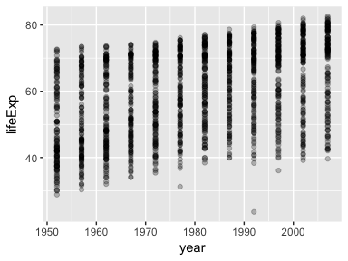
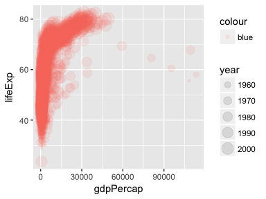

# cm006 Notes and Exercises: Intro to ggplot2
2017-09-21  


```r
suppressPackageStartupMessages(library(tidyverse))  # The tidyverse contains ggplot2!
suppressPackageStartupMessages(library(gapminder))
knitr::opts_chunk$set(fig.width=4, fig.height=3)
```


## Plotting in R

There are three main ways you can produce graphics in R. In order of inception, they are

- base R
- `lattice` (an R package)
- `ggplot2` (an R package)

Base R is tedious and unwieldly. Lattice is a nice option, but I find it requires setting up a plot to then just override everything.

`ggplot2` is a very powerful plotting system that...

- creates graphics by adding layers.
- is based off of the [grammar of graphics](http://www.springer.com/gp/book/9780387245447) (book by Leland Wilkinson) -- hence "gg".
- comes with the `tidyverse` meta-package.
- has a steep learning curve, but pays dividends.

Stackoverflow was my main source of learning. Google what you're trying to do, and persevere. You can do it.

## `ggplot2` framework

First, there are two ways you can make a plot wth `ggplot2`.

1. The `qplot` function: limited functionality. "quick plot"
    - We won't be focussing on this. No training wheels!
2. The `ggplot` function: full functionality.

Let's go through the basic syntax using the `gapminder` dataset.

#### Basic scatterplot

Let's try to make a basic scatterplot of `year` vs. `lifeExp`. 

Quick ways:
    - `plot(gapminder$year, gapminder$lifeExp)` -- base R
    - `qplot(year, lifeExp, data=gapminder)` -- `ggplot2`'s "quick plot".

Let's just see the syntax right off the bat.


```r
ggplot(gapminder, aes(x=year, y=lifeExp)) +
    geom_point()
```

<!-- -->

The first line initiates the plot. The second one _adds a layer_ of points. 

Let's see the components of each of these. 

Two of the most important aspects of a ggplot are the __geometric objects__ and the __scales__ (part of the grammar of graphics). 

- __geometric objects__ are things that you can draw to represent data.
    - Examples: points, lines, polygons, bars, boxplots, histograms
    - Indicated as new layers with `geom_*` where `*` is `point`, `line`, ...
- __scales__ are aspects of a geometric object that correspond to a numeric scale.
    - Examples:
        - horizontal (x) position can indicate one variable.
        - vertical (y) position can indicate another variable.
        - size of a point
        - shape of a point
        - transparency
    - __aesthetic mappings__ link variables to scales through the function `aes`.

Every geometric object has _required_ and _optional_ aesthetic mappings. Check the documentation of the `geom_` to see what's required (in bold). Examples:
    - _points_ require a horizontal (x) and vertical (y) position.
    - line _segments_ require starting and ending x and y

Let's revisit the above plot. The first line outputs an empty plot because there are no `geom`'s (geometric objects):


```r
p <- ggplot(gapminder, aes(x=year, y=lifeExp))
p
```

<!-- -->

(Yes, we can assign ggplots to variables in R)

Contains:
    1. the data frame, `gapminder`, and
    2. an indication of which variables in the data frame go with which scale.
    
Next, we can add a _layer_ with the `+` symbol. We add the "point" geometry to "execute" the setup and display points, to obtain the original plot.

This plot would benefit with some _alpha transparency_ -- another type of scale. Let's put in 25% transparency:


```r
p + geom_point(alpha=0.25)
```

<!-- -->

Notes:
    - This scale is _outside of an aesthetic mapping_, meaning that ggplot will not associate it with a variable.
    - Scales can be indicated in the `geom` call. Scales within `aes` that appear in the `ggplot` function apply "globally" to the plot. 

__Exercises__:

1. Make a scatterplot of `gdpPercap` vs `lifeExp`. Store ~it~ the output of the `ggplot` function in a variable called `p2`.


```r
p2 <- ggplot(gapminder, 
             aes(x=gdpPercap,
                 y=lifeExp))
p2 + geom_point()
```

<!-- -->


2. To `p2`, make the size of the points indicate the `year`, choose a level of alpha transparency that you're happy with, and make the points your favourite colour.


```r
p2 + geom_point(aes(size=year),
                colour="blue", 
                alpha=0.1)
```

<!-- -->

```r
## This *doesn't* work: (why not?)
p2 + geom_point(aes(size=year, colour="blue"), 
                alpha=0.1)
```

<!-- -->


3. To `p2`, colour the points by `continent`, ~~but this time~~ with year being represented by the size of the points, like we did in the previous exercise.

4. To `p2`, add another layer called `scale_x_log10()` _in addition to the original `geom_point()` layer_. Make a second plot by redoing the plot in (1), but replacing `gdpPercap` with `log10(gdpPercap)`. What do you notice?

----Stuff that used to be here has been moved to [cm007's notes and exercises](cm007-notes_and_exercises.html)----
