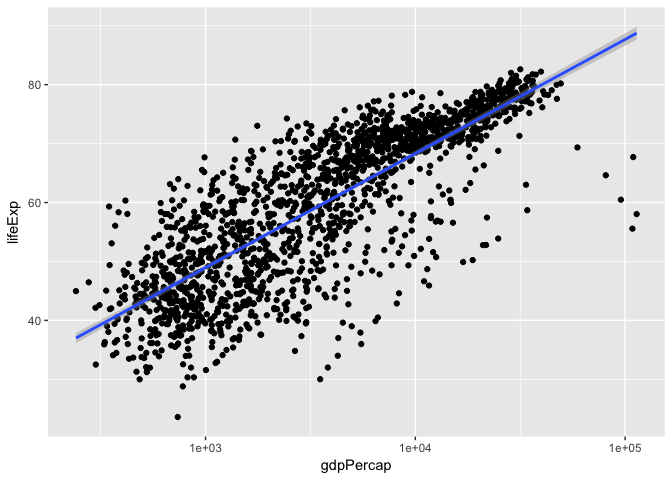
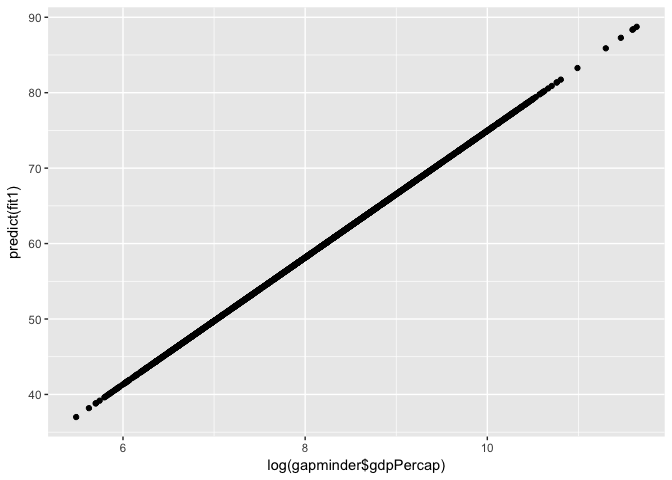
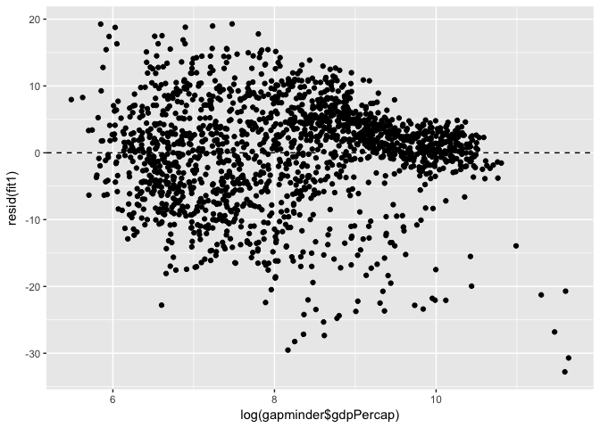
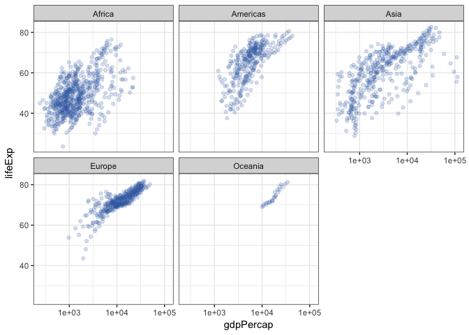
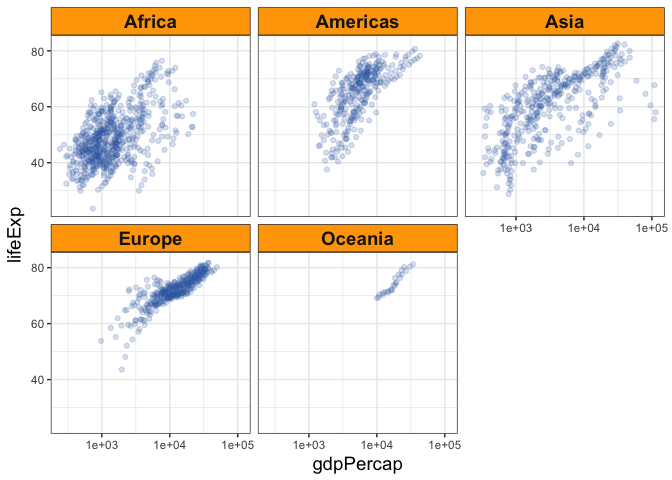
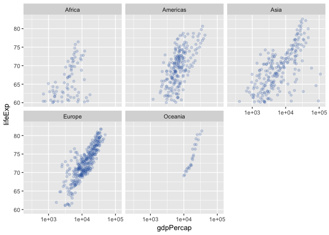

# cm008: Notes and Exercises
2017-09-28  


```r
suppressPackageStartupMessages(library(tidyverse))
suppressPackageStartupMessages(library(gapminder))
```

We're ahead of schedule! As a result, I'll talk about a variety of things first, then we'll do some exercises. 


## 1. Statistical Modelling in R

We'll look at typical data analyses using R.

**Note**: 

- You aren't expected to apply this is in your assignments! It's new to the course because we're ahead of schedule.
- It's OK if you've never heard of these statistical analyses. The point is that many model fitting procedures in R are similar.

Many statistical analyses in R follow a similar syntax.

### 1.1 Linear Regression

#### Model Fitting

You can run a linear regression in R with the `lm` function. Syntax:

```
lm(y ~ x1 + x2 + ... + xp, data=your_data_frame)
```

The first argument is a "formula" object in R. It's typically used in modelling to separate Y and X values. (In fact, you've seen this already in `ggplot`'s  `facet_wrap` and `facet_grid`)

Let's fit the regression curve that we see in this plot, using `lm`:


```r
ggplot(gapminder, aes(gdpPercap, lifeExp)) +
    geom_point() +
    geom_smooth(method="lm") +
    scale_x_log10()
```

<!-- -->

Here's the code:


```r
fit1 <- lm(lifeExp ~ log(gdpPercap), data=gapminder)
```

What does this `fit1` object look like?


```r
fit1
```

```
## 
## Call:
## lm(formula = lifeExp ~ log(gdpPercap), data = gapminder)
## 
## Coefficients:
##    (Intercept)  log(gdpPercap)  
##         -9.101           8.405
```

That's odd... what kind of R object is that??


```r
typeof(fit1)
```

```
## [1] "list"
```

It's a list, but R isn't presenting it that way. It just looks like a bunch of text, but it's not. Let's use the `lapply` function to uncover its true nature -- a list.

- NOTE: 
    - `lapply` loops over each component of a vector or list (_first argument_), applies a function to it (that you specify in the _second argument_), and outputs the function output in a list.
    - Let's do this for an `lm` fit to `head(gapminder)`, so that the output doesn't take up a lot of space. 


```r
fit1_small <- lm(lifeExp ~ log(gdpPercap), data=head(gapminder))
lapply(fit1_small, identity) 
```

```
## $coefficients
##    (Intercept) log(gdpPercap) 
##      187.61570      -23.08098 
## 
## $residuals
##          1          2          3          4          5          6 
## -5.1280595 -2.4023520  0.1520397  1.7131151  0.9597015  4.7055553 
## 
## $effects
##    (Intercept) log(gdpPercap)                                              
##     -81.517386       2.710390       2.070161       3.508404       2.004734 
##                
##       6.121766 
## 
## $rank
## [1] 2
## 
## $fitted.values
##        1        2        3        4        5        6 
## 33.92906 32.73435 31.84496 32.30688 35.12830 33.73244 
## 
## $assign
## [1] 0 1
## 
## $qr
## $qr
##   (Intercept) log(gdpPercap)
## 1  -2.4494897    -16.3790824
## 2   0.4082483     -0.1174296
## 3   0.4082483      0.5987063
## 4   0.4082483      0.4282789
## 5   0.4082483     -0.6126834
## 6   0.4082483     -0.0976823
## attr(,"assign")
## [1] 0 1
## 
## $qraux
## [1] 1.408248 1.270565
## 
## $pivot
## [1] 1 2
## 
## $tol
## [1] 1e-07
## 
## $rank
## [1] 2
## 
## attr(,"class")
## [1] "qr"
## 
## $df.residual
## [1] 4
## 
## $xlevels
## named list()
## 
## $call
## lm(formula = lifeExp ~ log(gdpPercap), data = head(gapminder))
## 
## $terms
## lifeExp ~ log(gdpPercap)
## attr(,"variables")
## list(lifeExp, log(gdpPercap))
## attr(,"factors")
##                log(gdpPercap)
## lifeExp                     0
## log(gdpPercap)              1
## attr(,"term.labels")
## [1] "log(gdpPercap)"
## attr(,"order")
## [1] 1
## attr(,"intercept")
## [1] 1
## attr(,"response")
## [1] 1
## attr(,".Environment")
## <environment: R_GlobalEnv>
## attr(,"predvars")
## list(lifeExp, log(gdpPercap))
## attr(,"dataClasses")
##        lifeExp log(gdpPercap) 
##      "numeric"      "numeric" 
## 
## $model
##   lifeExp log(gdpPercap)
## 1  28.801       6.658583
## 2  30.332       6.710344
## 3  31.997       6.748878
## 4  34.020       6.728864
## 5  36.088       6.606625
## 6  38.438       6.667101
```

Why isn't R printing out the list, then? Because it's a special type of list -- it's of class `"lm"`, something that the makers of the `lm` function decided. Whenever R encounters this object, it also has a special way of printing it to screen. 

This is the idea of the "object oriented" part of R -- something covered more in STAT 547 in the "R packages" section. 

#### Making predictions from the model

The `predict` function works on `"lm"` objects to make predictions. If you don't specify new data, it will make predictions using the existing X values. Let's look at the first six:


```r
predict(fit1) %>% head
```

```
##        1        2        3        4        5        6 
## 46.86506 47.30012 47.62400 47.45579 46.42835 46.93666
```

How about plotted against the original X values? (Which was log gdpPercap)


```r
qplot(log(gapminder$gdpPercap), predict(fit1))
```

<!-- -->

For fun... let's put this overtop of the scatterplot:


```r
ggplot(gapminder, aes(gdpPercap, lifeExp)) +
    geom_point(alpha=0.1) +
    geom_point(y=predict(fit1), colour="red") +
    scale_x_log10()
```

<!-- -->

You can predict with new data, too, as long as the data frame you enter has the same column names as your X values. 


```r
(my_newdata <- data.frame(gdpPercap=c(100, 547, 289)))
```

```
##   gdpPercap
## 1       100
## 2       547
## 3       289
```

```r
predict(fit1, newdata=my_newdata)
```

```
##        1        2        3 
## 29.60596 43.88854 38.52591
```

```r
predict(fit1, newdata=filter(gapminder, country=="Canada"))
```

```
##        1        2        3        4        5        6        7        8 
## 69.38986 70.18158 70.81182 72.30336 73.69461 74.97451 75.27641 76.54409 
##        9       10       11       12 
## 76.45408 77.24871 78.43120 79.15337
```


#### Extracting model characteristics

We can extract a bunch of things from the `lm` output.

- Regression coefficients? They're stored in the `$coefficients` part of the list. Or, use the `coeff` function.


```r
fit1$coefficients
```

```
##    (Intercept) log(gdpPercap) 
##      -9.100889       8.405085
```

```r
coef(fit1)
```

```
##    (Intercept) log(gdpPercap) 
##      -9.100889       8.405085
```

- Residuals? They're stored in the `$residuals` part of the list. Or, use the `resid` function. (Let's only display the first six... but plot all of them!)


```r
fit1$residuals %>% head
```

```
##          1          2          3          4          5          6 
## -18.064063 -16.968123 -15.627000 -13.435788 -10.340352  -8.498661
```

```r
resid(fit1) %>% head
```

```
##          1          2          3          4          5          6 
## -18.064063 -16.968123 -15.627000 -13.435788 -10.340352  -8.498661
```

```r
qplot(log(gapminder$gdpPercap), resid(fit1)) +
    geom_hline(yintercept=0,
               linetype="dashed")
```

<!-- -->

`lm` is kind of annoying in that not everything you might want is there. You can access more things using the `summary` function. What's printed to screen after `summary`, though, _is_ quite nice!


```r
(summ_fit1 <- summary(fit1))
```

```
## 
## Call:
## lm(formula = lifeExp ~ log(gdpPercap), data = gapminder)
## 
## Residuals:
##     Min      1Q  Median      3Q     Max 
## -32.778  -4.204   1.212   4.658  19.285 
## 
## Coefficients:
##                Estimate Std. Error t value Pr(>|t|)    
## (Intercept)     -9.1009     1.2277  -7.413 1.93e-13 ***
## log(gdpPercap)   8.4051     0.1488  56.500  < 2e-16 ***
## ---
## Signif. codes:  0 '***' 0.001 '**' 0.01 '*' 0.05 '.' 0.1 ' ' 1
## 
## Residual standard error: 7.62 on 1702 degrees of freedom
## Multiple R-squared:  0.6522,	Adjusted R-squared:  0.652 
## F-statistic:  3192 on 1 and 1702 DF,  p-value: < 2.2e-16
```

You can see all sorts of things, like p-values, $R^2$ (and adjusted $R^2$ values), and standard errors. 

As before, this looks nice and all... but what the heck is this new object? Again, it's a list. Let's see its components (again, with the smaller fit, so that we don't take over all the space on the screen).


```r
summ_fit1_small <- summary(fit1_small)
typeof(summ_fit1_small)
```

```
## [1] "list"
```

```r
lapply(summ_fit1_small, identity)  # Pry it open!!
```

```
## $call
## lm(formula = lifeExp ~ log(gdpPercap), data = head(gapminder))
## 
## $terms
## lifeExp ~ log(gdpPercap)
## attr(,"variables")
## list(lifeExp, log(gdpPercap))
## attr(,"factors")
##                log(gdpPercap)
## lifeExp                     0
## log(gdpPercap)              1
## attr(,"term.labels")
## [1] "log(gdpPercap)"
## attr(,"order")
## [1] 1
## attr(,"intercept")
## [1] 1
## attr(,"response")
## [1] 1
## attr(,".Environment")
## <environment: R_GlobalEnv>
## attr(,"predvars")
## list(lifeExp, log(gdpPercap))
## attr(,"dataClasses")
##        lifeExp log(gdpPercap) 
##      "numeric"      "numeric" 
## 
## $residuals
##          1          2          3          4          5          6 
## -5.1280595 -2.4023520  0.1520397  1.7131151  0.9597015  4.7055553 
## 
## $coefficients
##                 Estimate Std. Error    t value  Pr(>|t|)
## (Intercept)    187.61570  217.00328  0.8645754 0.4360391
## log(gdpPercap) -23.08098   32.45198 -0.7112350 0.5162158
## 
## $aliased
##    (Intercept) log(gdpPercap) 
##          FALSE          FALSE 
## 
## $sigma
## [1] 3.810822
## 
## $df
## [1] 2 4 2
## 
## $r.squared
## [1] 0.1122662
## 
## $adj.r.squared
## [1] -0.1096672
## 
## $fstatistic
##     value     numdf     dendf 
## 0.5058553 1.0000000 4.0000000 
## 
## $cov.unscaled
##                (Intercept) log(gdpPercap)
## (Intercept)      3242.6148     -484.90771
## log(gdpPercap)   -484.9077       72.51789
```

There we have it. Now, what would you like to extract?:

- R-squared? R-squared adjusted? Okay:


```r
summ_fit1$r.squared
```

```
## [1] 0.6522466
```

```r
summ_fit1$adj.r.squared
```

```
## [1] 0.6520423
```

- Estimated standard devaition of the random error term? Okay:


```r
summ_fit1$sigma
```

```
## [1] 7.619535
```

Where can we find the documentation for the components of _this_ list, though, if it's not in the documentation for `lm`? Look at the documentation of `summary.lm`. 

But wait! Why not just look at the documentation for `summary`? It's because `summary` is a generic function, and depends on the _class_ of object it's being applied to. If it's of class `"lm"`, then `summary.lm` is what's actually secretly run. Running `summary` on an object of class `"glm"`? R will secretly run `summary.glm` instead. 

PS: The `broom` package makes a lot of this easier and less cryptic. We won't go over it here. Check out [its vignette](https://cran.r-project.org/web/packages/broom/vignettes/broom.html).

### 1.2 Generalized Linear Models (like Logistic Regression)

We won't go over this in as much detail, because it's quite similar to `lm`. But if you want to run a Generalized Linear Model (GLM) -- such as logistic/binomial regression, or Poission regression -- just use the `glm` function.

Probably the biggest noteworthy difference is the `family` argument, specifying what type of regression you want to do. Syntax:

```
## Poisson regression:
glm(y ~ x1 + x2 + ... + xp, family=poisson, data=your_data_frame)
## Logistic (aka Binomial) regression:
glm(y ~ x1 + x2 + ... + xp, family=binomial, data=your_data_frame)
```

Its output looks similar to `lm`. It's also a list disguised as text. It also shows more when you use the `summary` function. It also works with the `predict` function. It also becomes tidier when used in conjunction with the `broom` package.

### 1.3 Others...

Here are some other packages/functions you might find useful to fit models:

- (Generalized) Mixed Effects Models
    - Two R packages are available: `lme4` and `nlme`. 
        - Check out [this](http://stats.stackexchange.com/questions/5344/how-to-choose-nlme-or-lme4-r-library-for-mixed-effects-models) discussion on Cross Validated for a comparison of the two packages.
    - I've found the function `glmer` in the `lme4` package to be fruitful.
- Kernel smoothing (i.e. fitting a "smoother"): check out the `loess` function.
- Generalized Additive Models: The `gam` function in _either_ the `gam` package or `mgcv` package.
- Robust linear regression: The `rlm` function in the `MASS` package is your friend.
- Regularized regression (GLM) (lasso, elastic net, or ridge regression): Use the `glmnet` function in the `glmnet` package.
    - PS: I _highly_ recommend this if you have more predictors/covariates/features than you know what to do with... this will weed out the unnecessary ones, _and_ produce a model with good prediction accuracy at the same time.


## 2. More `dplyr`

There's one more important thing with `dplyr` that you ought to know: applying `mutate` to a grouped tibble.

Remember applying `summarize` to a grouped tibble?


```r
gapminder %>%
    group_by(continent) %>% 
    summarize(mean_gdpPercap = mean(gdpPercap),
              n_countries    = length(gdpPercap))
```

```
## # A tibble: 5 × 3
##   continent mean_gdpPercap n_countries
##      <fctr>          <dbl>       <int>
## 1    Africa       2193.755         624
## 2  Americas       7136.110         300
## 3      Asia       7902.150         396
## 4    Europe      14469.476         360
## 5   Oceania      18621.609          24
```

Well, we can also apply `mutate` to each group, too. For example, let's calculate the growth in population since the first year on record _for each country_:


```r
gapminder %>% 
    group_by(country) %>% 
    mutate(pop_growth = pop - pop[1])
```

```
## Source: local data frame [1,704 x 7]
## Groups: country [142]
## 
##        country continent  year lifeExp      pop gdpPercap pop_growth
##         <fctr>    <fctr> <int>   <dbl>    <int>     <dbl>      <int>
## 1  Afghanistan      Asia  1952  28.801  8425333  779.4453          0
## 2  Afghanistan      Asia  1957  30.332  9240934  820.8530     815601
## 3  Afghanistan      Asia  1962  31.997 10267083  853.1007    1841750
## 4  Afghanistan      Asia  1967  34.020 11537966  836.1971    3112633
## 5  Afghanistan      Asia  1972  36.088 13079460  739.9811    4654127
## 6  Afghanistan      Asia  1977  38.438 14880372  786.1134    6455039
## 7  Afghanistan      Asia  1982  39.854 12881816  978.0114    4456483
## 8  Afghanistan      Asia  1987  40.822 13867957  852.3959    5442624
## 9  Afghanistan      Asia  1992  41.674 16317921  649.3414    7892588
## 10 Afghanistan      Asia  1997  41.763 22227415  635.3414   13802082
## # ... with 1,694 more rows
```

Notice that `dplyr` has retained the original grouping -- it hasn't pealed back one level of grouping. That's because there's still more than one row for each group!

How about growth compared to `1972`?


```r
gapminder %>% 
    group_by(country) %>% 
    mutate(pop_growth = pop - pop[year==1972])
```

```
## Source: local data frame [1,704 x 7]
## Groups: country [142]
## 
##        country continent  year lifeExp      pop gdpPercap pop_growth
##         <fctr>    <fctr> <int>   <dbl>    <int>     <dbl>      <int>
## 1  Afghanistan      Asia  1952  28.801  8425333  779.4453   -4654127
## 2  Afghanistan      Asia  1957  30.332  9240934  820.8530   -3838526
## 3  Afghanistan      Asia  1962  31.997 10267083  853.1007   -2812377
## 4  Afghanistan      Asia  1967  34.020 11537966  836.1971   -1541494
## 5  Afghanistan      Asia  1972  36.088 13079460  739.9811          0
## 6  Afghanistan      Asia  1977  38.438 14880372  786.1134    1800912
## 7  Afghanistan      Asia  1982  39.854 12881816  978.0114    -197644
## 8  Afghanistan      Asia  1987  40.822 13867957  852.3959     788497
## 9  Afghanistan      Asia  1992  41.674 16317921  649.3414    3238461
## 10 Afghanistan      Asia  1997  41.763 22227415  635.3414    9147955
## # ... with 1,694 more rows
```

In general, this type of "grouped mutation" is useful for _window functions_. What's that? Well, let's see other types of functions in R:

- __Vectorized Functions__: These take a vector, and operate on each component independently to return a vector of the same length. In other words, they work element-wise. 
    - Examples are `cos`, `sin`, `log`, `exp`, `round`. 
    - We don't need to `group_by` in order to `mutate` with these. 
- __Aggregate Functions__: These take a vector, and return a vector of length 1 -- as if "aggregating" the values in the vector into a single value.
    - Examples are `mean`, `sd`, `length`, `typeof`.
    - We use these in dplyr's `summarise` function.
- __Window Functions__: these take a vector, and return a vector of the same length _that depends on other values in the vector_. 
    - Examples are `lag`, `rank`, `cumsum`. 
    - See the [window-functions](https://cran.r-project.org/web/packages/dplyr/vignettes/window-functions.html) vignette for the `dplyr` package. 

## 3. More `ggplot`

(Have you seen the [ggplot2 cheatsheet](https://www.rstudio.com/wp-content/uploads/2015/03/ggplot2-cheatsheet.pdf)? It contains __a lot__ of useful information on two pages!)

### 3.1 `theme` layers

You can change the look of a plot by adding a `theme` layer to your ggplot layers. This function does __not__ actually change the "nature" of the plot itself -- only the look! i.e., the so-called "non-data" type displays. 

Examples:
    - font
    - justification of titles
    - rotation of labels
    - background colour
    - line thickness
    - etc...

There are ["complete themes"](http://ggplot2.tidyverse.org/reference/ggtheme.html) that come with `ggplot2`, my favourite being `theme_bw` (I've grown tired of the default gray background, so `theme_bw` is refreshing).

Let's see an example:


```r
p1 <- ggplot(gapminder, aes(gdpPercap, lifeExp)) +
    facet_wrap(~ continent) +
    geom_point(colour="#386CB0", alpha=0.2) +
    scale_x_log10()
p1 + theme_bw()
```

<!-- -->

The general `theme` function gives you vast functionality... just check its documentation to see what things you can change. The arguments of `theme` follow a naming convention: `general.to.specific`

For example,
    - `axis.title` will allow you to change the font of the axis titles.
    - `axis.title.x` does the same, but focusses on the `x` axis.

__Note__: You _can't_ change the actual words this way! That's changing the nature of the plot, and not the _look_ of the plot. 

Once we've chosen an argument name, we need to specify its value. This is almost always the output of one of the following functions:

- `element_blank` (basically means replace with "nothing")
- `element_rect`: allows us to specify features of a _rectangle_.
- `element_line`: allows us to specify features of a _line_.
- `element_text`: allows us to specify font. 

Check out their documentation to see exactly how each feature is modified.

- __Example__: To `p1` above, do all of the following....
    - change the background strip colour to orange, 
    - change the axis titles' font sizes to 14, and 
    - change the panel titles' font sizes to 14 and bolded.


```r
p1 +
    theme(strip.background = element_rect(fill="orange"),
          axis.title = element_text(size=14),
          strip.text = element_text(size=14, face="bold"))
```

<!-- -->

__Another example__: do the same, but in conjunction with the `theme_bw` (notice the order)


```r
## Correct:
p1 +
    theme_bw() +
    theme(strip.background = element_rect(fill="orange"),
          axis.title = element_text(size=14),
          strip.text = element_text(size=14, face="bold"))
```

<!-- -->

```r
## Incorrect:
p1 +
    theme(strip.background = element_rect(fill="orange"),
          axis.title = element_text(size=14),
          strip.text = element_text(size=14, face="bold")) +
    theme_bw()  # Overrides the previous `theme` call!
```

<!-- -->


### 3.2 Modifying scales

Recall that we use some _scale_ to represent the _range of values that a variable takes_ in our data. `ggplot` chooses defaults for this scale, but we can change those.

Check out [this tutorial by Hadley Wickham](https://github.com/hadley/ggplot2-book/blob/master/scales.rmd) for scales. 

We can modify scales using a suite of functions that have the following naming convention: `scale_a_b`, where:

- `a` is the scale you want to change. Is it `colour`? `size`? `x` position?
- `b` typically speaks to the nature of the variable. `continuous` is your variable is continuous; `discrete` if discrete. But, could be other things in certain cases, like `log10`, or `date` if your variable consists of dates. `manual` is an option too.

__Examples__: `scale_x_continuous`, `scale_colour_discrete`, `scale_y_sqrt`.

As usual in ggplot, these functions are added as a layer. 

#### Useful arguments

There are many useful arguments here. Some are more self-explanatory than others. 

- `name`. The first argument. Indicate the name of the scale/legend here.
    - You can also use the `labs` function for X and Y axes, and even plot title.


```r
p1 + scale_y_continuous("Life Expectancy")
```

<!-- -->

```r
p1 + labs(x="GDP per capita", 
          y="Life Expectancy",
          title="My Plot")
```

<!-- -->

```r
ggplot(gapminder, aes(gdpPercap, lifeExp)) +
    geom_point(aes(colour=continent),
               alpha=0.2) +
    scale_colour_discrete("Continents of\n the World")
```

<!-- -->

- `breaks` (Typically of a continuous scale). Here, you get to specify _where_ along the scale you'd like to display a value. 
    - Numbers are on the scale of the data (such as population), not the geometric scale (such as a hex colour code, or number of pixels over in a plot). 


```r
## Log lines:
p1 + scale_x_log10(breaks=c((1:10)*1000,
                            (1:10)*10000))
```

```
## Scale for 'x' is already present. Adding another scale for 'x', which
## will replace the existing scale.
```

<!-- -->

```r
p2 <- ggplot(gapminder, aes(gdpPercap, lifeExp)) +
    geom_point(aes(colour=pop/10^9),
               alpha=0.2)
## Default breaks
p2 + scale_colour_continuous("Population\nin billions")
```

<!-- -->

```r
## New breaks
p2 + scale_colour_continuous("Population\nin billions",
                             breaks=seq(0,2,by=0.2))
```

<!-- -->

- `labels`. Text to replace the data value labels. Most useful for discrete data.


```r
## Not a good idea:
p2 + scale_colour_continuous("My odd\npopulation\nscale",
                             breaks=c(0.2, 0.7, 1.2),
                             labels=c("small", "bigger", "big"))
```

<!-- -->

```r
## Discrete scale:
ggplot(gapminder, aes(gdpPercap, lifeExp)) +
    geom_point(aes(colour=continent),
               alpha=0.2) +
    scale_colour_discrete(labels=c("Af", "Am", "As", "Eu", "Oc"))
```

<!-- -->

- `limits`. Lower and upper bounds of the data that you'd like displayed. Leave one as `NA` if you want to use the default.


```r
p1 + scale_y_continuous(limits=c(60,NA))
```

```
## Warning: Removed 827 rows containing missing values (geom_point).
```

<!-- -->

- `position`. Position of the scale. Also controllable using `theme` for the legend.


```r
p1 + scale_y_continuous(position="right")
```

<!-- -->

```r
p2 + theme(legend.position = "bottom")
```

<!-- -->

## 4. Exercises. 

Practice these concepts in the following exercises.

__Exercise 1__: Suppose we want to calculate some quantity for each country in the `gapminder` data set. For each of the following quantities, indicate whether the function is _vectorized_, _aggregate_, or _window_, and use `dplyr` functions to calculate the specified variable.

- The change in population from 1962 to 1972.
- The population, in billions.
- The lagged gdpPercap
    - i.e., the value that appears for 1962 would be the gdpPercap in 1957 (the previous entry).
    - Hint: use the `lag` function, then filter out the `NA`'s created with the `is.na` function.


__Exercise 2__: For the `gapminder` dataset, make a spaghetti plot showing the population trend (in millions) over time for each country, facetted by continent. Make as many of the following modifications as you can:

- Colour each line by the log maximum gdpPercap experienced by the country.
- Rotate the x-axis labels to be vertical.
- Remove the x-axis title.
- Give the legend an appropriate title.
- Put the y-axis on a log-scale. 
- Rename the y-axis title.
- Add more numbers along the y-axis.
- Give the plot a title, and center the title. 
- Only label the x axis with years 1950, 1975, and 2000.
- Move the colour scale to the bottom.
- Rename the colour legend
