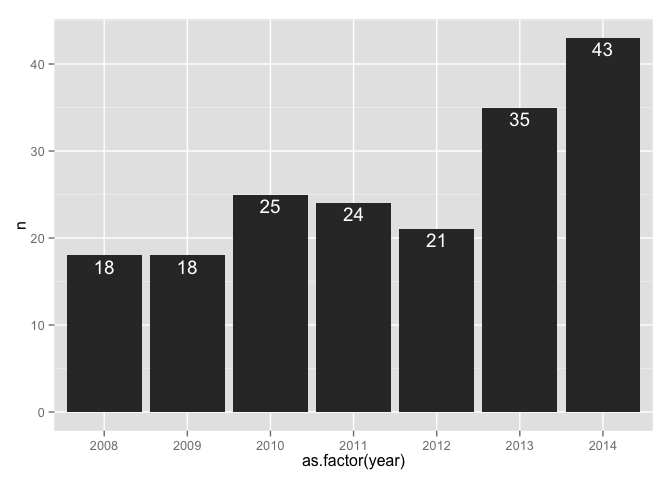
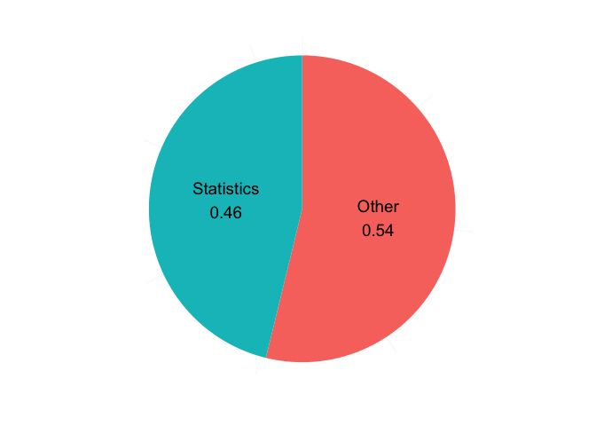
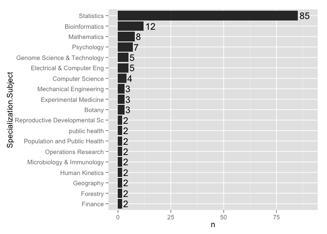

# STAT 545 enrollment over time
Jenny Bryan  
21 October, 2014  

STAT 545 Exploratory Data Analysis can be offered from 1 to 3 credits. From 2008 to 2013, I know we have offered it as a 1.5 credit course from start of class in September until mid-October with 3 contact hours per week. In 2014 we are piloting an expansion to a 3 credit course, structured as the usual 1.5 credit STAT545A followed by 1.5 credits of a topics course STAT547M, occupying the same time slot and classroom. The department and I regard this is a transitional measure towards offering STAT 545A as a full 3 credit course. Full stop.

Here is the webpage for the current run of the course:

<http://stat545-ubc.github.io>

I have taught STAT 545 every year since 2008, at least.

From 2008 to September 2014, cumulative enrollment is 184. This includes a small cohort of 15 unofficial auditors, typically post-docs and staff. I include them because we treat them just the same as registered students, in terms of course communication and assessment.

Enrollment has been growing over time. Enrollment in 2014 is more than twice that of 2008.

 

It is a very diverse group of students, with Statistics being the most frequent specialization yet accounting for less than half of cumulative enrollments. Note also that students from outside Statistics now dominate enrollment, both in an absolute and relative sense. I believe this reflects the growing importance of data skills in all disciplines and the increasing quality and relevance of STAT 545 content.

We've had students from at least 48 different specializations, with 19 represented by at least two students (see barchart above). Here are the remaining specializations, from which we've had exactly one student each:

-------------------------------------------------  ---------------------------
actuarial science                                  Lib, Arch and Info Stud    
biochemistry                                       Management Info Systems    
Biochemistry & Molecular Biol                      Mathematics And Statistics 
Biomedical Physiology and Kinesiology              Medical Genetics           
Chemical Engineering                               Neuroscience               
Chemistry                                          Occupational Hygiene       
Civil Engineering                                  Oceanography               
Computer Science And Microbiology and Immunology   Pharmaceutical Science     
Education                                          Physics                    
Environmental Science                              Political Science          
Epidemiology                                       Resource Mgmt/Envirn Stud  
Health Services Management                         Sociology                  
Int Stds In Land & Food Syst                       Transportation & Logistics 
Kinesiology                                        Zoology                    
-------------------------------------------------  ---------------------------

__TA support__: As a very large graduate course, STAT 545 absolutely needs substantial TA support. The unusual nature of the course means that students' coursework must be evaluated for technical accomplishment (does the code work? does it embody sound programming practices?) and for content (does the analysis make sense? is it communicated in an accurate and compelling way?). The need to teach and assess on both these dimensions makes it hard to find enough qualified TA support. For example in 2014, I cannot find anyone qualified and willing to be a full TA for all of the semester. Luckily I've been able to assemble a [group of excellent TAs](http://stat545-ubc.github.io/people.html) willing to contribute a certain number of hours. This year's TAs come from a variety of grad programs: MSc in Bioinformatics, PhD in Earth and Ocean Sciences, PhD in Bioinformatics, PhD in Applied Mathematics, PhD in Genome Science and Technology, PhD Zoology. This speaks to the exciting fact that Statistics can provide a *focal point* for data science and, at the same time, benefit from and develop capabilities in other units. But the mix also shows the challenges of staffing any initiatives in Data Science.  This difficulty and a UBC budget model that doesn't support funding of TAs for a large graduate course are serious concerns for STAT 545.
