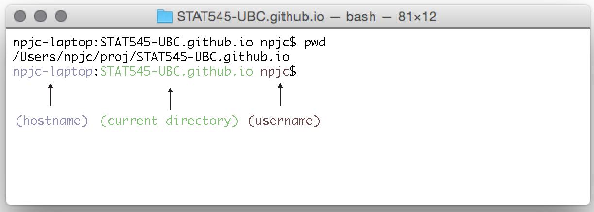

# The Shell


### What is the Shell?

A [`shell`](https://en.wikipedia.org/wiki/Shell_(computing)) is an application; just like Microsoft Word or Google Chrome. All of them provide you with services. Word provides services to explore and interact with documents. Chrome provides services to explore and interact with others computers via the internet. Shell applications also provide these services (among many others). In Word and Chrome you interact with these services through a graphical user interface (GUI). By contrast, in a shell you tend to interact with services through a command line interface (CLI).

The relevant `shell` applications for us are `Terminal` on Mac, `GitBash` on Windows.

Think of the `shell` as a program on your computer who's job is to run other programs. It is a very old program and in a time before the mouse this was the only way to interact with a computer (other than rewiring). It is still extremely popular among programmers because it is very powerful, fast, and can easily be set up to automate repetitive tasks.

Next, get started with a first exposure working in the shell.


### Getting Started

In RStudio, go to `Tools -> Shell`; this opens a shell application in your current directory. Type `pwd` at the command line and press enter. Compare this to the output of `getwd()` in RStudio. Can you tell what the `pwd` command stands for? By default, RStudio opens the shell in your current working directory.



> The command line has information about the hostname, the current directory and the username. You type _commands_ at the _prompt_. Some commands require _arguments_. Most commands have options.

Now It's time for a story about football. I like football and so every year when the Super Bowl comes around I watch it with friends. This used to be very stressful. It's the roman numerals. I just can never seem to read them right. So every year I'd google say "roman numeral XLVIII" to decipher it. But then I learned more terminal and all my worries were solved:


```r
npjc-laptop:STAT545-UBC.github.io npjc$ say "Super Bowl XLVIII"
```

> Here give the `say` _command_ the argument (in the form of a quoted string): "Super Bowl XLVIII" and press enter to execute and voila! If you have a Mac try this for yourself to see what happens! Type `man say` to see the manual, what else can you do? If you don't have a Mac find a friend and learn together!

Next explore other commands beyond `say` and `pwd` (for print working directory) to navigate the file system.

### Navigate the file system

Execute the following commands in the order provided. The `$` is there as a reminder that we are at the shell command line and should be omitted!


```r
$ ls                       # list directory contents
$ mkdir tmp                # make directories
$ cd tmp                   # change directories
$ ls
$ touch file.txt           # touch sets the last modified date or creates a file if it doesn't exist.
$ ls
$ rm file.txt              # what does the rm command do? what's its argument here?
$ ls
$ cd ..
$ ls
```

Now try this:

```r
$ rm tmp                   # if we try to remove a directory
rm: tmp2: is a directory   # does not work! check by executing `ls`
```

To remove the directory named `tmp` we need to provide the `rm` command with an option (also called a flag). Set the option we need with `-d`:

```r
$ rm -d tmp                # we need to provide the additional `-d` option or flag
$ ls                       # success!
```

### A few tips

* You can drag and drop a file or folder into the shell to the path to that file or folder.
* press <kbd>tab</kbd> for auto-completion. What happens when you do it twice in succession?
* press <kbd>ctrl</kbd>+<kbd>c</kbd> to abort a command and return to the prompt.
* use the arrow keys to navigate your execution history.
* <kbd>ctrl</kbd>+<kbd>a</kbd> to move cursor to the start of a line. What does <kbd>ctrl</kbd>+<kbd>e</kbd> do?


### Now go explore the `git` suite:

Take a look at the commands below, What's the command, option and argument for each?


```r
$ git config --global user.name "YOUR_FULL_NAME"
$ git config --global user.email "YOUR_EMAIL_ADDRESS"
```

> git is actually a suite of commands. The git command takes, as an argument, the name of a command within the suite. You always first type "git[space]command". 

You can see the most common git commands with:


```r
$ git --help
```


git command   description                                                        
------------  -------------------------------------------------------------------
add           Add file contents to the index                                     
bisect        Find by binary search the change that introduced a bug             
branch        List, create, or delete branches                                   
checkout      Checkout a branch or paths to the working tree                     
clone         Clone a repository into a new directory                            
commit        Record changes to the repository                                   
diff          Show changes between commits, commit and working tree, etc         
fetch         Download objects and refs from another repository                  
grep          Print lines matching a pattern                                     
init          Create an empty Git repository or reinitialize an existing one     
log           Show commit logs                                                   
merge         Join two or more development histories together                    
mv            Move or rename a file, a directory, or a symlink                   
pull          Fetch from and integrate with another repository or a local branch 
push          Update remote refs along with associated objects                   
rebase        Forward-port local commits to the updated upstream head            
reset         Reset current HEAD to the specified state                          
rm            Remove files from the working tree and from the index              
show          Show various types of objects                                      
status        Show the working tree status                                       
tag           Create, list, delete or verify a tag object signed with GPG        

### Useful reference:

* [Basic Git command line for windows users](http://www.codeproject.com/Articles/457305/Basic-Git-Command-Line-Reference-for-Windows-Users)


### want more shell?

* See [Appendix 3](http://practicalcomputing.org/files/PCfB_Appendices.pdf) from the practical computing for biologists book.
* [A-Z index of bash command line for linux](http://ss64.com/bash/)
