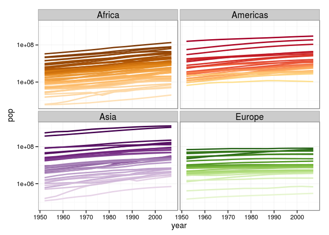

# Data from the Web - Homework
Andrew MacDonald and Jenny Bryan  
`r Sys.Date()`  

## Big picture

We learned three ways of collecting data from the internet:

  * Accessing data using ROpenSci packages that wrap APIs
  * Running (basic) API queries "by hand"
  * Web scraping

For the homework, we want you to either

  * combine two existing datasets in a novel (and reproducible!) way; at least one must come from the web
  * create a new dataset by web scraping

## Please just tell me what to do! 

### Combine [gapminder](https://github.com/jennybc/gapminder) and data from [geonames](http://www.geonames.org/)

Install the `geonames` package [from ROpenSci](https://github.com/ropensci/geonames), and install [gapminder from github](https://github.com/jennybc/gapminder). Use data from `geonames` and `gapminder` to investigate either of these questions:

  * What is the relationship between per-capita GDP and the proportion of the population which lives in urban centers?
  * Consider the following graph of population against time (a modification of Jenny's [gapminder demo](https://github.com/jennybc/gapminder)):
    

```r
library("ggplot2")
library("gapminder")

ggplot(subset(gapminder, continent != "Oceania"),
       aes(x = year, y = pop, group = country, color = country)) +
  geom_line(lwd = 1, show_guide = FALSE) + facet_wrap(~ continent) +
  scale_color_manual(values = country_colors) +
  theme_bw() + theme(strip.text = element_text(size = rel(1.1))) + scale_y_log10()
```

 

Replace population with *population density*. To do this, look up the country codes in `geonames()`, obtain the area of each country and compute density as population divided by area.

Write and render an RMarkdown document with a narrative of what you've done and why and the code that does it. What was most difficult? What are you most excited about re: your future in getting data from the web?

Your procedure for obtaining and remixing data should be reproducible and, ideally, portable to your peer's system (no more `setwd()`!).  If your process involves obtaining some records (countries, species) at random, provide either the list of things chosen (id numbers, country codes etc.) OR use `set.seed()` so that your peer can produce the same random sample. 
Remember to protect your API key!

## Combine two datasets

We took cursory looks at two other ROpenSci packages: [rebird](https://github.com/ropensci/rebird) and [rplos](https://github.com/ropensci/rplos). Both packages are on CRAN; see the instructions on their github repo READMEs. Here are three suggested ways in which they could be combined.

  * `rplos` and `rebird` -- how many articles are published on a bird species? 
  * `rplos` and `geonames` -- Choose a some subset of countries. How many papers have been published by people from that country? In that country? how does that relate to GDP (will require expert-level regex skills)
  * `rebird` and `geonames` -- Do countries with more bird species also have more languages?
  
For each of these tasks, produce an Rmarkdown report that illustrates how you obtained the data, how you processed it and sucessfully merged the two datasets. If you are downloading lots of data (or if you are worried about over-using an API) consider automating the process using `make`. 

## I want to aim higher!

* Go look through the RopenSci [packages list](http://ropensci.org/packages/) and/or the Ropensci [Web Services in R](https://github.com/ropensci/webservices), find some existing resources, and remix those instead.

## even HIGHER

* Consult [programmable web](http://www.programmableweb.com/), discover an API which is NOT wrapped by Ropensci (yet!) and write a function to query it.

## I am a leaf on the wind. See how I SOAR

  * Find an interesting website which is (a) __not__ already wrapped by Ropensci __nor__ (b) has a published API. Scrape it into a lovely dataset for us, and publish this as a data package a la Gapminder .

### Due date

Your homework is due Friday 05 December 2014.

## Rubric

Ideally you will actually *run* your peer's code and get the same results! Again, you're welcome to abandon the effort after 30 mins and provide feedback.

Recall the [general homework rubric](http://stat545-ubc.github.io/peer-review01_marking-rubric.html).

