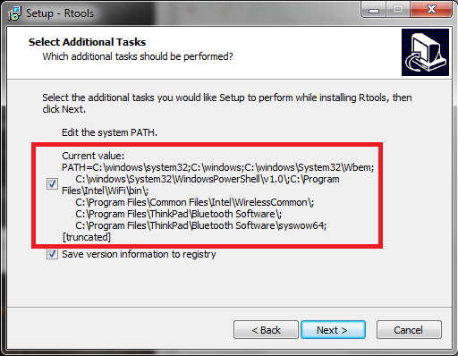

Although we'll build a very simple package, we're still going to use the most modern and powerful tools for R package development. In theory, this could eventually involve compiling C/C++ code, which means you need what's called a *build environment*.

back to [All the package things](packages00_index.html)

### Update R and RStudio

Embarking on your career as an R package developer is an important milestone. Why not celebrate by updating R and RStudio? This is something we recommended early and we recommend doing it often. [Go back to Day 0 of the course](block000_r-rstudio-install.html#r-and-rstudio) for reminders on the process. **DO IT NOW. We are not very interested in solving problems that stem from running outdated versions of R and RStudio.**

*2015-11 FYI: Jenny is running R version 3.2.2 Fire Safety, RStudio 0.99.447, and `devtools 1.9.1.9000` ([89e7bfd](https://github.com/hadley/devtools/commit/89e7bfd1d5ee19868c6f50712007ed5dc38d349e) from GitHub) at the time of writing.*

### Special considerations for Windows

Sorry folks! Yes here we are again, installing software together while the Mac people sit there looking smug.

*Warning: we are still weighing various recommendations for what Windows users should do. You can probably get by for quite a while without installing `Rtools` as described below, but it will eventually become necessary and the `devtools` package will alert you to this. For example, once your package development/building activities involve compiling code, you will need `Rtools`.*

You need to install `Rtools`. This is __NOT an R package__ but is rather "a collection of resources for building packages for R under Microsoft Windows, or for building R itself". Go here and do what it says:

<http://cran.r-project.org/bin/windows/Rtools/>

Note the repeated advice to stay current: "We recommend that users use the latest release of `Rtools` with the latest release of R."

During `Rtools` installation you will get to a window asking you to "Select Additional Tasks". It is important that you make sure to select the box for "Edit the system PATH".



After installing `Rtools`, restart RStudio and run `devtools::find_rtools()`. Hopefully you will simply see a message saying `TRUE` (indicating that `Rtools` is properly installed), but if there was a problem you will see a longer message instructing you on what to do.

### R packages to help you build yet more R packages

Install the following packages. If you already have them, update them.

  * `devtools` 1.9.1
  * `roxygen2` 5.0.0
  * `testthat` 0.11.0
  * `knitr` 1.11

Example of how to check which version of a package you've got installed:

```r
`packageVersion("devtools")`
```
        
Example of how to install a package and all it's dependencies:

```r
`install.packages("devtools", dependencies = TRUE)`
```

See how profound your problem with out-of-date packages is:

```r
`old.packages()`
```
        
Just update everything:

```r
`update.packages(ask = FALSE)`
```
        
__CAVEAT:__ The above examples will only consult your default library and default CRAN mirror. If you want to target a non-default library, use function arguments to say so. Packages that you have installed from GitHub? You'll need to check the current-ness of your version and perform upgrades yourself.

back to [All the package things](packages00_index.html)
