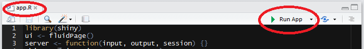
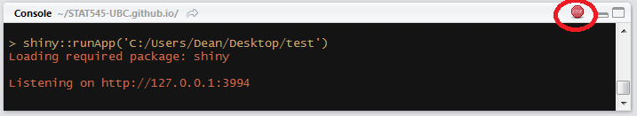
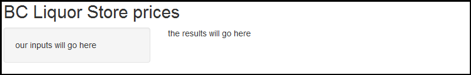
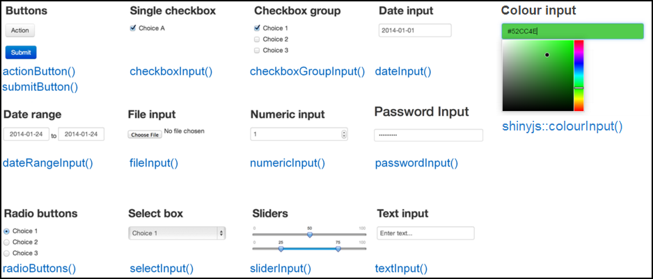
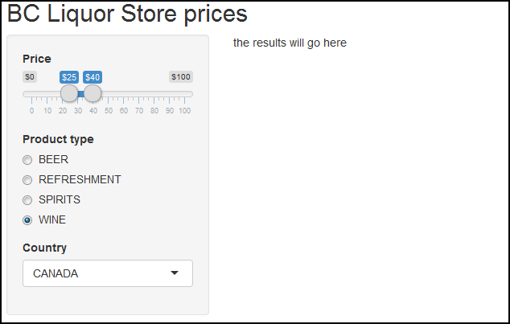
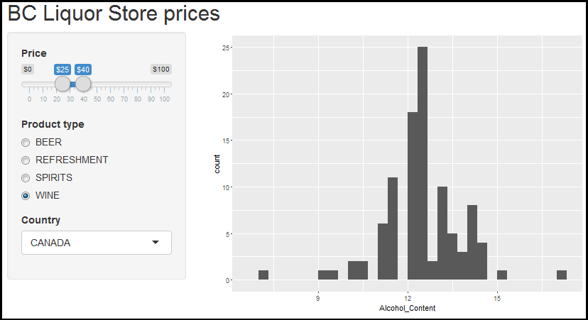
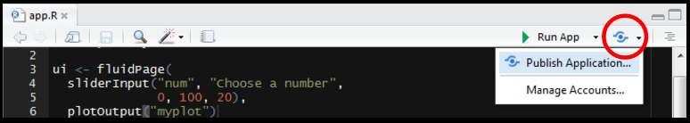

# Building Shiny apps
Dean Attali  
November 2015  


# Overview

Shiny is a package from RStudio that can be used to build interactive web pages with R. While that may sound scary because of the words "web pages", it's geared to R users who have 0 experience with web development, and you do not need to know any HTML/CSS/JavaScript.

You can do quite a lot with Shiny: think of it as an easy way to make an interactive web page, and that web page can seamlessly interact with R and display R objects (plots, tables, of anything else you do in R). To get a sense of the wide range of things you can do with Shiny, you can visit [ShowMeShiny.com](http://www.showmeshiny.com/), which is a gallery of user-submitted Shiny apps. 

This tutorial is a hands-on activity complement to a set of [presentation slides](https://docs.google.com/presentation/d/1dXhqqsD7dPOOdcC5Y7RW--dEU7UfU52qlb0YD3kKeLw/edit?usp=sharing) for learning how to build Shiny apps. In this activity, we'll walk through all the steps of building a Shiny app using a dataset that lets you explore the products available at the BC Liquor Store. The final version of the app, including a few extra features that are left as exercises for the reader, [can be seen here](http://daattali.com/shiny/bcl/). Any activity deemed as an exercise throughout this tutorial is not mandatory for building our app, but they are good for getting more practice with Shiny.

As an added tutorial, I highly recommend the [official Shiny tutorial](http://shiny.rstudio.com/tutorial/). RStudio also provides a [handy cheatsheet](https://www.rstudio.com/resources/cheatsheets/) to remember all the little details after you already learned the basics.

**Exercise:** Visit [ShowMeShiny.com](http://www.showmeshiny.com/) and click through some of the showcased apps. Get a feel for the wide range of things you can do with Shiny.

# Before we begin

You'll need to have the `shiny` package, so install it.


```r
install.packages("shiny")
```

To ensure you successfully installed Shiny, try running one of the demo apps.


```r
library(shiny)
runExample("01_hello")
```

If the example app is running, press *Escape* to close the app, and you are ready to build your first Shiny app!

# Shiny app basics 

Every Shiny app is composed of a two parts: a web page that shows the app to the user, and a computer that powers the app. The computer that runs the app can either be your own laptop (such as when you're running an app from RStudio) or a server somewhere else. You, as the Shiny app developer, need to write these two parts (you're not going to write a computer, but rather the code that powers the app). In Shiny terminology, they are called *UI* (user interface) and *server*. UI is just a web document that the user gets to see, it's HTML that you write using Shiny's functions. Server is responsible for the logic of the app; it's the set of instructions that tell the web page what to show when the user interacts with the page.

# Create an empty Shiny app

All Shiny apps follow the same template:


```r
library(shiny)
ui <- fluidPage()
server <- function(input, output, session) {}
shinyApp(ui = ui, server = server)
```

This template is by itself a working minimal Shiny app that doesn't do much. It initializes an empty UI and an empty server, and runs an app using these empty parts. Copy this template into a new file named `app.R` in a new folder. It is **very important** that the name of the file is `app.R`, otherwise it would not be recognized as a Shiny app. It is also **very important** that you place this app in its own folder, and not in a folder that already has other R scripts or files, unless those other files are used by your app.

After saving the file, RStudio should recognize that this is a Shiny app, and you should see the usual *Run* button at the top change to *Run App*.



If you don't see the *Run App* button, it means you either have a very old version of RStudio, don't have Shiny installed, or didn't follow the file naming conventions.

Click the *Run App* button, and now your app should run. You won't see much because it's an empty app, but you should see that the console has some text printed in the form of `Listening on http://127.0.0.1:5274` and that a little stop sign appeared at the top of the console.  You'll also notice that you can't run any commands in the console. This is because R is busy--your R session is currently powering a Shiny app and listening for user interaction (which won't happen because the app has nothing in it yet).

Click the stop button to stop the app, or press the *Escape* key.



You may have noticed that when you click the *Run App* button, all it's doing is just running the function `shiny::runApp()` in the console. You can run that command instead of clicking the button if you prefer.

**Exercise:** Try running the empty app using the `runApp()` function instead of using the *Run App* button.

## Alternate way to create app template: using RStudio

FYI: You can also create a new Shiny app using RStudio's menu by selecting *File > New Project > New Directory > Shiny Web Application*.  If you do this, RStudio will create a new folder and initialize a simple Shiny app in it.  However, this Shiny app will not have an `app.R` file and instead will have two files: `ui.R` and `server.R`. This is another way to define Shiny apps, with one file for the UI and one file for the server code.  This is the preferable way to write Shiny apps when the app is complex and involves more code, but in this tutorial we'll stick to the simple single file.  If you want to break up your app into these two files, you simple put all code that is assigned to the `ui` variable in `ui.R` and all the code assigned to the `server` function in `server.R`. When RStudio sees these two files in the same folder, it will know you're writing a Shiny app.

**Exercise:** Try creating a new Shiny app using RStudio's menu. Make sure that app runs. Next, try making a new Shiny app by manually creating the two files `ui.R` and `server.R`. Rememeber that they have to be in the same folder. Also remember to put them in a *new, isolated* folder.

# Load the dataset

The dataset we'll be using contains information about all the products sold by BC Liquor Store and is provided by [OpenDataBC](https://www.opendatabc.ca/dataset/bc-liquor-store-product-price-list-current-prices). They provide a direct link to download a *csv* version of the data, and this data has the rare quality that it is immediately clean and useful. You can view the [raw data](http://pub.data.gov.bc.ca/datasets/176284/BC_Liquor_Store_Product_Price_List.csv) they provide, but I have taken a few steps to simplify the dataset to make it more useful for our app. I removed some columns, renamed other columns, and dropped a few rare factor levels.

The processed dataset we'll be using in this app is available [here](http://deanattali.com/files/bcl-data.csv) - download it now.  Put this file in the same folder that has your Shiny app.

Add a line in your app to load the data into a variable called `bcl`. It should look something like this


```r
bcl <- read.csv("bcl-data.csv", stringsAsFactors = FALSE)
```

Place this line in your app as the second line, just after `library(shiny)`.  Make sure the file path and file name are correct, otherwise your app won't run. Try to run the app to make sure the file can be loaded without errors.

If you want to verify that the app can successfully read the data, you can add a `print()` statement inside the server. This won't make anything happen in your Shiny app, but you will see a summary of the dataset printed in the console, which should let you know that the dataset was indeed loaded correctly. Replace the `server` function with the following:


```r
server <- function(input, output, session) {
  print(str(bcl))
} 
```

> In case you're curious, the code I used to process the raw data into the data we'll be using is available [as a gist](https://gist.github.com/daattali/56b9fa8f3e99174fba63).

**Exercise:** Load the data file into R and get a feel for what's in it. How big is it, what variables are there, what are the normal price ranges, etc.

# Build the UI

Let's start populating our app with some elements visually. This is usually the first thing you do when writing a Shiny app - add elements to the UI.

## Add plain text to the UI

You can place R strings inside `fluidPage()` to render text.


```r
fluidPage("BC Liquor Store", "prices")
```

Replace the line in your app that assigns an empty `fluidPage()` into `ui` with the one above, and run the app.

The entire UI will be built by passing comma-separated arguments into the `fluidPage()` function. By passing regular text, the web page will just render boring unformatted text.

**Exercise:** Add several more strings to `fluidPage()` and run the app. Nothing too exciting is happening yet, but you should just see all the text appear in one contiguous block.

## Add formatted text and other HTML elements

If we want our text to be formatted nicer, Shiny has many functions that are wrappers around HTML tags that format text. We can use the `h1()` function for a top-level header (`<h1>` in HTML), `h2()` for a secondary header (`<h2>` in HTML), `strong()` to make text bold (`<strong>` in HTML), `em()` to make text italicized (`<em>` in HTML), and many more.

There are also functions that are wrappers to other HTML tags, such as `br()` for a line break, `img()` for an image, `a()` for a hyperlink, and others.

All of these functions are actually just wrappers to HTML tags with the equivalent name. You can add any arbitrary HTML tag using the `tags` object, which you can learn more about by reading the help file on `tags`.

Just as a demonstration, try replacing the `fluidPage()` function in your UI with


```r
fluidPage(
  h1("My app"),
  "BC",
  "Liquor",
  br(),
  "Store",
  strong("prices")
)
```

Run the app with this code as the UI. Notice the formatting of the text and understand why it is rendered that way.

> For people who know basic HTML: any named argument you pass to an HTML function becomes an attribute of the HTML element, and any unnamed argument will be a child of the element. That means that you can, for example, create blue text with `div("this is blue", style = "color: blue;")`.

**Exercise:** Experiment with different HTML-wrapper functions inside `fluidPage()`. Run the `fluidPage(...)` function in the console and see the HTML that it creates.

## Add a title

We could add a title to the app with `h1()`, but Shiny also has a special function `titlePanel()`. Using `titlePanel()` not only adds a visible big title-like text to the top of the page, but it also sets the "official" title of the web page. This means that when you look at the name of the tab in the browser, you'll see this title.

Overwrite the `fluidPage()` that you experimented with so far, and replace it with the simple one below, that simply has a title and nothing else.


```r
fluidPage(
  titlePanel("BC Liquor Store prices")
)
```

**Exercise:** Look at the documentation for the `titlePanel()` function and notice it has another argument. Use that argument and see if you can see what it does.

## Add a layout

You may have noticed that so far, by just adding text and HTML tags, everything is unstructured and the elements simply stack up one below the other in one column. We'll use `sidebarLayout()` to add a simple structure. It provides a simple two-column layout with a smaller sidebar and a larger main panel. We'll build our app such that all the inputs that the user can manipulate will be in the sidebar, and the results will be shown in the main panel on the right.

Add the following code after the `titlePanel()`


```r
sidebarLayout(
  sidebarPanel("our inputs will go here"),
  mainPanel("the results will go here")
)
```

Remember that all the arguments inside `fluidPage()` need to be separated by commas.

So far our complete app looks like this (hopefully this isn't a surprise to you)


```r
library(shiny)
bcl <- read.csv("bcl-data.csv", stringsAsFactors = FALSE)

ui <- fluidPage(
  titlePanel("BC Liquor Store prices"),
  sidebarLayout(
    sidebarPanel("our inputs will go here"),
    mainPanel("the results will go here")
  )
)

server <- function(input, output, session) {}

shinyApp(ui = ui, server = server)
```



> If you want to be a lot more flexible with the design, you can have much more fine control over where things go by using a grid layout. We won't cover that here, but if you're interested, look at the documentation for `?column` and `?fluidRow`.

**Exercise:** Add some UI into each of the two panels (sidebar panel and main panel) and see how your app now has two columns.

## All UI functions are simply HTML wrappers

This was already mentioned, but it's important to remember: the enire UI is just HTML, and Shiny simply gives you easy tools to write it without having to know HTML. To convince yourself of this, look at the output when printing the contents of the `ui` variable.


```r
print(ui)
```

```
## <div class="container-fluid">
##   <h2>BC Liquor Store prices</h2>
##   <div class="row">
##     <div class="col-sm-4">
##       <form class="well">our inputs will go here</form>
##     </div>
##     <div class="col-sm-8">the results will go here</div>
##   </div>
## </div>
```

This should make you appreciate Shiny for not making you write horrendous HTML by hand.

## Add inputs

Inputs are what gives users a way to interact with a Shiny app. Shiny provides many input functions to support many kinds of interactions that the user could have with an app. For example, `textInput()` is used to let the user enter text, `numericInput()` lets the user select a number, `dateInput()` is for selecting a date, `selectInput()` is for creating a select box (aka a dropdown menu).



All input functions have the same first two arguments: `inputId` and `label`. The `inputId` will be the name that Shiny will use to refer to this input when you want to retrieve its current value. It is important to note that every input must have a unique `inputId`. If you give more than one input the same id, Shiny will unfortunately not give you an explicit error, but your app won't work correctly. The `label` argument specifies the text in the display label that goes along with the input widget. Every input can also have multiple other arguments specific to that input type. The only way to find out what arguments you can use with a specific input function is to look at its help file.

**Exercise:** Read the documentation of `?numericInput` and try adding a numeric input to the UI. Experiment with the different arguments. Run the app and see how you can interact with this input. Then try different inputs types.

### Input for price

The first input we want to have is for specifying a price range (minimum and maximum price). The most sensible types of input for this are either `numericInput()` or `sliderInput()` since they are both used for selecting numbers. If we use `numericInput()`, we'd have to use two inputs, one for the minimum value and one for the maximum. Looking at the documentation for `sliderInput()`, you'll see that by supplying a vector of length two as the `value` argument, it can be used to specify a range rather than a single number. This sounds like what we want in this case, so we'll use `sliderInput()`. 

To create a slider input, a maximum value needs to be provided. We could use the maximum price in the dataset, which is $30,250, but I doubt I'd ever buy something that expensive. I think $100 is a more reasonable max price for me, and about 85% of the products in this dataset are below $100, so let's use that as our max.

By looking at the documentation for the slider input function, the following piece of code can be constructed.


```r
sliderInput("priceInput", "Price", min = 0, max = 100,
            value = c(25, 40), pre = "$")
```

Place the code for the slider input inside `sidebarPanel()` (replace the text we wrote earlier with this input).

### Input for product type

Usually when going to the liquor store you know whether you're looking for beer or wine, and you don't want to waste your time in the wrong section.  The same is true in our app, we should be able to choose what type of product we want.

For this we want some kind of a text input. But allowing the user to enter text freely isn't the right solution because we want to restrict the user to only a few choices.  We could either use radio buttons or a select box for our purpose. Let's use radio buttons for now since there are only a few options, so take a look at the documentation for `radioButtons()` and come up with a reasonable input function code.  It should look like this:


```r
radioButtons("typeInput", "Product type",
            choices = c("BEER", "REFRESHMENT", "SPIRITS", "WINE"),
            selected = "WINE")
```

Add this input code inside `sidebarPanel()`, after the previous input (separate them with a comma).

> If you look at that input function and think "what if there were 100 types, listing htem by hand would not be fun, there's got to be a better way!", then you're right.  This is where [`uiOutput()`](#using-uioutput-to-create-ui-elements-dynamically) comes in handy, but we'll talk about that later.

### Input for country

Sometimes I like to feel fancy and only look for wines imported from France. We should add one last input, to select a country. The most appropriate input type in this case is probably the select box. Look at the documentation for `selectInput()` and create an input function. For now let's only have CANADA, FRANCE, ITALY as options, and later we'll see how to include all countries. 


```r
selectInput("countryInput", "Country",
            choices = c("CANADA", "FRANCE", "ITALY"))
```

Add this function as well to your app.  If you followed along, your entire app should have this code:


```r
library(shiny)
bcl <- read.csv("bcl-data.csv", stringsAsFactors = FALSE)

ui <- fluidPage(
  titlePanel("BC Liquor Store prices"),
  sidebarLayout(
    sidebarPanel(
      sliderInput("priceInput", "Price", 0, 100, c(25, 40), pre = "$"),
      radioButtons("typeInput", "Product type",
                  choices = c("BEER", "REFRESHMENT", "SPIRITS", "WINE"),
                  selected = "WINE"),
      selectInput("countryInput", "Country",
                  choices = c("CANADA", "FRANCE", "ITALY"))
    ),
    mainPanel("the results will go here")
  )
)

server <- function(input, output, session) {}

shinyApp(ui = ui, server = server)
```



## Add placeholders for outputs

After creating all the inputs, we should add elements to the UI to display the outputs. Outputs can be any object that R creates and that we want to display in our app - such as a plot, a table, or text. We're still only building the UI, so at this point we can only add *placeholders* for the outputs that will determine where an output will be and what its ID is, but it won't actually show anything. Each output needs to be constructed in the server code later.

Shiny provides several output functions, one for each type of output. Similarly to the input functions, all the ouput functions have a `outputId` argument that is used to identify each output, and this argument must be unique for each output.

### Output for a plot of the results

At the top of the main panel we'll have a plot showing some visualization of the results. Since we want a plot, the function we use is `plotOutput()`.

Add the following code into the `mainPanel()` (replace the existing text):


```r
plotOutput("coolplot")
```

This will add a placeholder in the UI for a plot named *coolplot*.

**Exercise:** To remind yourself that we are still merely constructing HTML and not creating actual plots yet, run the above `plotOutput()` function in the console to see that all it does is create some HTML.

### Output for a table summary of the results

Below the plot, we will have a table that shows all the results.  To get a table, we use the `tableOutput()` function.

Here is a simple way to create a UI element that will hold a table output:


```r
tableOutput("results")
```

Add this output to the `mainPanel()` as well. Maybe add a couple `br()` in between the two outputs, just as a space buffer so that they aren't too close to each other.

# Checkpoint: what our app looks like after implementing the UI

If you've followed along, your app should now have this code:


```r
library(shiny)
bcl <- read.csv("bcl-data.csv", stringsAsFactors = FALSE)

ui <- fluidPage(
  titlePanel("BC Liquor Store prices"),
  sidebarLayout(
    sidebarPanel(
      sliderInput("priceInput", "Price", 0, 100, c(25, 40), pre = "$"),
      radioButtons("typeInput", "Product type",
                  choices = c("BEER", "REFRESHMENT", "SPIRITS", "WINE"),
                  selected = "WINE"),
      selectInput("countryInput", "Country",
                  choices = c("CANADA", "FRANCE", "ITALY"))
    ),
    mainPanel(
      plotOutput("coolplot"),
      br(), br(),
      tableOutput("results")
    )
  )
)

server <- function(input, output, session) {}

shinyApp(ui = ui, server = server)
```

# Implement server logic to create outputs

So far we only wrote code inside that was assigned to the `ui` variable (or code that was written in `ui.R`). That's usually the easier part of a Shiny app. Now we have to write the `server` function, which will be responsible for listening to changes to the inputs and creating outputs to show in the app.

## Building an output

Recall that we created two output placeholders: *coolplot* (a plot) and *results* (a table). We need to write code in R that will tell Shiny what kind of plot or table to display. There are three rules to build an output in Shiny. 

1. Save the output object into the `output` list (remember the app template - every server function has an `output` argument)  
2. Build the object with a `render*` function, where `*` is the type of output
3. Access input values using the `input` list (every server function has an `input` argument)

The third rule is only required if you want your output to depend on some input, so let's first see how to build a very basic output using only the first two rules. We'll create a plot and send it to the *coolplot* output. 


```r
output$coolplot <- renderPlot({
  plot(rnorm(100))
})
```

This simple code shows the first two rules: we're creating a plot inside the `renderPlot()` function, and assigning it to *coolplot* in the `output` list. Remember that every output creatd in the UI must have a unique ID, now we see why. In order to attach an R object to an output with ID *x*, we assign the R object to `output$x`.

Since *coolplot* was defined as a `plotOutput`, we must use the `renderPlot` function, and we must create a plot inside the `renderPlot` function.

If you add the code above inside the server function, you should see a plot with 100 random points in the app.

**Exercise:** The code inside `renderPlot()` doesn't have to be only one line, it can be as long as you'd like as long as it returns a plot. Try making a more complex plot using `ggplot2`. The plot doesn't have to use our dataset, it could be anything, just to make sure you can use `renderPlot()`.

## Making an output react to an input

Now we'll take the plot one step further. Instead of always plotting the same plot (100 random numbers), let's use the minimum price selected as the number of points to show. It doesn't make too much sense, but it's just to learn how to make an output depend on an input.


```r
output$coolplot <- renderPlot({
  plot(rnorm(input$priceInput[1]))
})
```

Replace the previous code in your server function with this code, and run the app. Whenever you choose a new minimum price range, the plot will update with a new number of points. Notice that the only thing different in the code is that instead of using the number `100` we are using `input$priceInput[1]`. 

What does this mean? Just like the variable `output` contains a list of all the outputs (and we need to assign code into them), the variable `input` contains a list of all the inputs that are defined in the UI. `input$priceInput` return a vector of length 2 containing the miminimum and maximum price. Whenever the user manipulates the slider in the app, these values are updated, and whatever code relies on it gets re-evaluated. This is a concept known as [**reactivity**](#reactivity-101).

## Building the plot output

Now we have all the knowledge required to build a plot visualizing some aspect of the data. We'll create a simple histogram of the alcohol content of the products. 

First we need to make sure `ggplot2` is loaded, so add a `library(ggplot2)` at the top.

Next we'll return a histogram of alcohol content from `renderPlot()`. Let's start with just a histogram of the whole data, unfiltered.


```r
output$coolplot <- renderPlot({
  ggplot(bcl, aes(Alcohol_Content)) +
    geom_histogram()
})
```

If you run the app with this code inside your server, you sohuld see a histogram in the app.  But if you change the input values, nothing happens yet, so the next step is to actually filter the dataset based on the inputs.

Recall that we have 3 inputs: `priceInput`, `typeInput`, and `countryInput`. We can filter the data based on the values of these three inputs. We'll use `dplyr` functions to filter the data, so be sure to include `dplyr` at the top. Then we'll plot the filtered data instead of the original data.


```r
output$coolplot <- renderPlot({
  filtered <-
    bcl %>%
    filter(Price >= input$priceInput[1],
           Price <= input$priceInput[2],
           Type == input$typeInput,
           Country == input$countryInput
    )
  ggplot(filtered, aes(Alcohol_Content)) +
    geom_histogram()
})
```

Place this code in your server function and run the app. If you change any input, you should see the histogram update. The way I know the histogram is correct is by noticing that the alcohol content is about 5% when I selecte beer, 40% for spirits, and 13% for wine. That sounds right.

Read this code and understand it. You've successfully created an interactive app - the plot is changing according to the user's selection.

To make sure we're on the same page, here is what your code should look like at this point:


```r
library(shiny)
library(ggplot2)
library(dplyr)

bcl <- read.csv("bcl-data.csv", stringsAsFactors = FALSE)

ui <- fluidPage(
  titlePanel("BC Liquor Store prices"),
  sidebarLayout(
    sidebarPanel(
      sliderInput("priceInput", "Price", 0, 100, c(25, 40), pre = "$"),
      radioButtons("typeInput", "Product type",
                  choices = c("BEER", "REFRESHMENT", "SPIRITS", "WINE"),
                  selected = "WINE"),
      selectInput("countryInput", "Country",
                  choices = c("CANADA", "FRANCE", "ITALY"))
    ),
    mainPanel(
      plotOutput("coolplot"),
      br(), br(),
      tableOutput("results")
    )
  )
)

server <- function(input, output, session) {
  output$coolplot <- renderPlot({
    filtered <-
      bcl %>%
      filter(Price >= input$priceInput[1],
             Price <= input$priceInput[2],
             Type == input$typeInput,
             Country == input$countryInput
      )
    ggplot(filtered, aes(Alcohol_Content)) +
      geom_histogram()
  })
}

shinyApp(ui = ui, server = server)
```



**Exercise:** The current plot doesn't look very nice, you could enhance the plot and make it much more pleasant to look at.

## Building the table output

Building the next output should be much easier now that we've done it once.  The other output we have was called `results` (as defined in the UI) and should be a table of all the products that match the filters.  Since it's a table output, we should use the `renderTable()` function. We'll do the exact same filtering on the data, and then simply return the data as a data.frame. Shiny will know that it needs to display it as a table because it's defined as a `tableOutput`.

The code for creating the table output should make sense to you without too much explanation:


```r
output$results <- renderTable({
  filtered <-
    bcl %>%
    filter(Price >= input$priceInput[1],
           Price <= input$priceInput[2],
           Type == input$typeInput,
           Country == input$countryInput
    )
  filtered
})
```

Add this code to your server. Don't overwrite the previous definition of `output$coolplot`, just add this code before or after that, but inside the server function. Run your app, and be amazed! You can now see a table showing all the products at the BC Liquor Store that match your criteria. 

**Exercise:** Add a new output. Either a new plot, a new table, or some piece of text that changes based on the inputs. For example, you could add a text output (`textOutput()` in the UI, `renderText()` in the server) that says how many results were found. If you choose to do this, I recommend first adding the output to the UI, then building the output in the server with static text to make sure you have the syntax correct. Only once you can see the text output in your app you should make it reflect the inputs. Protip: since `textOutput()` is written in the UI, you can wrap it in other UI functions. For example, `h2(textOutput(...))` will result in larger text.

# Reactivity 101

Shiny uses a concept called **reactive** programming. This is what enables your outputs to *react* to changes in inputs.  Reactivity in Shiny is complex, but as an extreme oversimplification, it means that when the value of a variable `x` changes, then anything that relies on `x` gets re-evaluated.  Notice how this is very different from what you are used to in R.  Consider the following code:


```r
x <- 5
y <- x + 1
x <- 10
```

What is the value of `y`? It's 6.  But in reactive programming, if `x` and `y` are reactive variables, then the value of `y` would be 11. This is a very powerful technique that is very useful for creating the responsiveness of Shiny apps, but it might be a bit weird at first because it's a very different concept from what we're used to.

Only reactive objects variables behave this way, and in Shiny all inputs are automatically reactive. That's why you can always use `input$x` and know that whatever output you're creating will use the updated value of `x`. You can use the `reactive({})` function to define a reactive variable, or the `observe({})` function to access a reactive variable.

One very important thing to remember about reactive variable is that **they can only be used inside reactive contexts**. Any `render*` function is a reactive context, so you can always use `input$x` or any other reactive variable inside render functions. `reactive()` and `observe()` are also reactive contexts. 

To prove this point, try printing the value of the price input in the server function by simply adding `print(input$priceInput)` to the server. When I run the app with that print function, I get the following error:

```
Operation not allowed without an active reactive context. (You tried to do something that can only be done from inside a reactive expression or observer.)
```

It's pretty clear about what the error is. Now try wrapping the print statement inside an `observe({})`, and this time it would work.

## Using reactive variables to reduce code duplication

You may have noticed that we have the exact same code filtering the dataset in two places, once in each render function. We can solve that problem by defining a reactive variable that will hold the filtered dataset, and use that variable in the render functions.

The first step would be to create the reactive variable. The following code should be added to the server function.


```r
filtered <- reactive({
  bcl %>%
    filter(Price >= input$priceInput[1],
           Price <= input$priceInput[2],
           Type == input$typeInput,
           Country == input$countryInput
    )
})
```

The variable `filtered` is being defined exactly like before, except the body is wrapped by a `reactive({})`, and it's defined in the server function instead of inside the individual render functions.

Reactive expressions defined with the `reactive()` function are treated like functions, so to access the value of a reactive expression, you to get the value of the dataset at any time you would use `filtered()` (notice that there are brackets at the end, as if it's a function). Now that we have our reactive variable, we can use it in the output render functions.  Try it yourself, and when you think you're done, check the code below. This is how your server function should look like now.  


```r
server <- function(input, output, session) {
  filtered <- reactive({
    bcl %>%
      filter(Price >= input$priceInput[1],
             Price <= input$priceInput[2],
             Type == input$typeInput,
             Country == input$countryInput
      )
  })
  
  output$coolplot <- renderPlot({
    ggplot(filtered(), aes(Alcohol_Content)) +
      geom_histogram()
  })

  output$results <- renderTable({
    filtered()
  })
}
```

You may be wondering how this works. Shiny creates a dependency tree with all the reactive expressions to know what value depends on what other value. For example, when the price input changes, Shiny looks at what values depend on price, and sees that `filtered` is a reactive expression that depends on the price input, so it re-evaluates `filtered`. Then, because `filtered` is changed, Shiny now looks to see what expressions depend on `filtered`, and it finds that the two render functions use `filtered`. So Shiny re-executes the two render functions as well.

If you want to understand reactivity better, you can read about it [on Shiny's site](http://shiny.rstudio.com/articles/understanding-reactivity.html).

**Exercise:** Create a reactive variable that calculates the difference between the maximum and minimum price set by the user, and print that value to the console. This won't be useful for the app, but is just an exercise to practice with reactive expressions. Hint: use the `reactive({})` function to define the value, and remember that you must be inside an `observe({})` in order to print it.

# Using uiOutput() to create UI elements dynamically

One of the output functions you can add in the UI is `uiOutput()`. According to the naming convention (eg. `plotOutput()` is an output to render a plot), this is an output used to render an input. This may sound a bit confusing, but it's actually very useful. It's used to create inputs from the server, or in other words - you can create inputs dynamically.  Any input that you normally create in the UI is created when the app starts, and it cannot be changed. But what if one of your inputs depends on another input? In that case, you want to be able to create an input dynamically, in the server, and you would use `uiOutput()`.  `uiOutput()` can be used to create *any* UI element, but it's most often used to create input UI elements. The same rules regarding building outputs apply, which means the output (which is a UI element in this case) is created with the function `renderUI()`.

## Basic example

As a very basic example, consider this app:


```r
library(shiny)
ui <- fluidPage(
  numericInput("num", "Maximum slider value", 5),
  uiOutput("slider")
)

server <- function(input, output, session) {
  output$slider <- renderUI({
    sliderInput("slider", "Slider", min = 0,
                max = input$num, value = 0)
  })
}

shinyApp(ui = ui, server = server)
```

If you run that tiny app, you will see that whenever you change the value of the numeric input, the slider input is re-generated. This behaviour can come in handy often.

## Use uiOutput() in our app to populate the countries

We can use this concept in our app to populate the choices for the country selector. The country selector currently only holds 3 values that we manually entered, but instead we could render the country selector in the server and use the data to determine what countries it can have. 

First we need to replace the `selectInput("countryInput", ...)` in the UI with 


```r
uiOutput("countryOutput")
```

Then we need to create the output (which will create a UI element - yeah, it can be a bit confusing at first), so add the following code to the server function:


```r
output$countryOutput <- renderUI({
  selectInput("countryInput", "Country",
              sort(unique(bcl$Country)),
              selected = "CANADA")
})
```

Now if you run the app, you should be able to see all the countries that BC Liquor stores import from.

## Errors showing up and quickly disappearing

You might notice that when you first run the app, each of the two outputs are throwing an error message, but the error message goes away after a second. The problem is that when the app initializes, `filtered` is trying to access the country input, but the country input hasn't been created yet. After Shiny finishes loading fully and the country input is generated, `filtered` tries accessing it again, this time it's successful, and the error goes away.

Once we understand why the error is happening, fixing it is simple. Inside the `filtered` reactive function, we should check if the country input exists, and if not then just return `NULL`.


```r
filtered <- reactive({
  if (is.null(input$countryInput)) {
    return(NULL)
  }    
  
  bcl %>%
    filter(Price >= input$priceInput[1],
           Price <= input$priceInput[2],
           Type == input$typeInput,
           Country == input$countryInput
    )
})
```

Now when the render function tries to access the data, they will get a `NULL` value before the app is fully loaded.  You will still get an error, because the ggplot function will not work with a `NULL` dataset, so we also need to make a similar check in the `renderPlot()` function. Only once the data is loaded, we can try to plot.


```r
output$coolplot <- renderPlot({
  if (is.null(filtered())) {
    return()
  }
  ggplot(filtered(), aes(Alcohol_Content)) +
    geom_histogram()
})
```

The `renderTable()` function doesn't need this fix applied because Shiny doesn't have a problem rendering a `NULL` table.

**Exercise:** Change the product type radio buttons to get generated in the server with the values from the dataset, instead of being created in the UI with the values entered manually. If you're feeling confident, try adding an input for "subtype" that will get re-generated every time a new type is chosen, and will be populated with all the subtype options available for the currently selected type (for example, if WINE is selected, then the subtype are white wine, red wine, etc.).

# Final Shiny app code

In case you got lost somewhere, here is the final code. The app is now functional, but there are plenty of features you can add to make it better.


```r
library(shiny)
library(ggplot2)
library(dplyr)

bcl <- read.csv("bcl-data.csv", stringsAsFactors = FALSE)

ui <- fluidPage(
  titlePanel("BC Liquor Store prices"),
  sidebarLayout(
    sidebarPanel(
      sliderInput("priceInput", "Price", 0, 100, c(25, 40), pre = "$"),
      radioButtons("typeInput", "Product type",
                  choices = c("BEER", "REFRESHMENT", "SPIRITS", "WINE"),
                  selected = "WINE"),
      uiOutput("countryOutput")
    ),
    mainPanel(
      plotOutput("coolplot"),
      br(), br(),
      tableOutput("results")
    )
  )
)

server <- function(input, output, session) {
  output$countryOutput <- renderUI({
    selectInput("countryInput", "Country",
                sort(unique(bcl$Country)),
                selected = "CANADA")
  })  
  
  filtered <- reactive({
    if (is.null(input$countryInput)) {
      return(NULL)
    }    
    
    bcl %>%
      filter(Price >= input$priceInput[1],
             Price <= input$priceInput[2],
             Type == input$typeInput,
             Country == input$countryInput
      )
  })
  
  output$coolplot <- renderPlot({
    if (is.null(filtered())) {
      return()
    }
    ggplot(filtered(), aes(Alcohol_Content)) +
      geom_histogram()
  })

  output$results <- renderTable({
    filtered()
  })
}

shinyApp(ui = ui, server = server)
```

# Share your app with the world

Remember how every single app is a web page powered by an R session on a computer? So far, you've been running Shiny locally, which means your computer was used to power the app. It also means that the app was not accessible to anyone on the internet. If you want to share your app with the world, you need to host it somewhere.

## Host on shinyapps.io

RStudio provides a service called [shinyapps.io](http://www.shinyapps.io/) which lets you host your apps for free. It is integrated seamlessly into RStudio so that you can publish your apps with the click of a button, and it has a free version.  The free version allows a certain number of apps per user and a certain number of activity on each app, but it should be good enough for most of you. It also lets you see some basic stats about usage of your app.

Hosting your app on shinyapps.io is the easy and recommended way of getting your app online.  Go to [www.shinyapps.io](http://www.shinyapps.io/) and sign up for an account. When you're ready to publish your app, click on the "Publish Application" button in RStudio and follow their instructions. You might be asked to install a couple packages if it's your first time.



After a successful deployment to shinyapps.io, you will be redirected to your app in the browser. You can use that URL to show off to your family what a cool app you wrote.

## Host on a Shiny Server

The other option for hosting your app is on your own private [Shiny server](https://www.rstudio.com/products/shiny/shiny-server/). Shiny Server is also a product by RStudio that lets you host apps on your own server. This means that instead of RStudio hosting the app for you, you have it on your own private server. This means you have a lot more freedom and flexibility, but it also means you need to have a server and be comfortable administering a server. I currently host all my apps on [my own Shiny server](http://daattali.com/shiny/) just because I like having the extra control, but when I first learned about Shiny I used shinyapps.io for several months.

If you're feeling adventurous and want to host your own server, you can follow [my tutorial for hosting a Shiny server](http://deanattali.com/2015/05/09/setup-rstudio-shiny-server-digital-ocean/).

# More Shiny features to check out

Shiny is extremely powerful and has lots of features that we haven't covered. Here's a sneak peek of just a few other common Shiny features that are not too advanced. 

## Shiny in Rmarkdown

You can include Shiny inputs and outputs in an Rmarkdown document! This means that your Rmakdown document can be interactive. Learn more [here](http://rmarkdown.rstudio.com/authoring_shiny.html). Here's a simple example of how to include interactive Shiny elements in an Rmarkdown.


````
---
output: html_document
runtime: shiny
---

```{r echo=FALSE}
sliderInput("num", "Choose a number",
            0, 100, 20)

renderPlot({
    plot(seq(input$num))
})
```
````

## Use conditionalPanel() to conditionally show UI elements

You can use `conditionalPanel()` to either show or hide a UI element based on a simple condition, such as the value of another input. Learn more with `?conditionalPanel`.


```r
library(shiny)
ui <- fluidPage(
  numericInput("num", "Number", 5, 1, 10),
  conditionalPanel(
    "input.num >=5",
    "Hello!"
  )
)
server <- function(input, output, session) {}
shinyApp(ui = ui, server = server)
```

## Use navbarPage() or tabsetPanel() to have multiple tabs in the UI

If your apps requires more than a single "view", you can have separate tabs. Learn more with `?navbarPage` or `?tabsetPanel`.


```r
library(shiny)
ui <- fluidPage(
  tabsetPanel(
    tabPanel("Tab 1", "Hello"),
    tabPanel("Tab 2", "there!")
  )
)
server <- function(input, output, session) {}
shinyApp(ui = ui, server = server)
```

## Use DT for beautiful, interactive tables

Whenever you use `tableOutput()` + `renderTable()`, the table that Shiny creates is a static and boring-looking table. If you download the `DT` package, you can replace the default table with a much sleeker table by just using `DT::dataTableOutput()` + `DT::renderDataTable()`. It's worth trying. Learn more on [DT's website](https://rstudio.github.io/DT/).

## Use isolate() function to remove a dependency on a reactive variable

When you have multiple reactive variables inside a reactive context, the whole code block will get re-executed whenever *any* of the reactive variables change because all the variables become dependencies of the code. If you want to suppress this behaviour and cause a reactive variable to not be a dependency, you can wrap the code that uses that variable inside the `isolate()` function.  Any reactive variables that are inside `isolate()` will not result in the code re-executing when their value is changed. Read more about this behaviour with `?isolate`.

## Use update*Input() functions to update input values programmatically

Any input function has an equivalent `update*Input` function that can be used to update any of its parameters.


```r
library(shiny)
ui <- fluidPage(
  sliderInput("slider", "Move me", value = 5, 1, 10),
  numericInput("num", "Number", value = 5, 1, 10)
)
server <- function(input, output, session) {
  observe({
    updateNumericInput(session, "num", value = input$slider)
  })
}
shinyApp(ui = ui, server = server)
```

## Scoping rules in Shiny apps

Scoping is very important to understand in Shiny once you want to support more than one user at a time. Since your app can be hosted online, multiple users can use your app simultaneously. If there are any variables (such as datasets or global parameters) that should be shared by all users, then you can safely define them globally. But any variable that should be specific to each user's session should be not be defined globally.

You can think of the `server` function as a sandbox for each user. Any code outside of the server function is run once and is shared by all the instances of your Shiny app. Any code inside the server is run once *for every user that visits your app*. This means that any user-specific variables should be defined inside server. If you look at the code in our BC Liquor Store app, you'll see that we followed this rule: the raw dataset was loaded outside the server and is therefore available to all users, but the `filtered` object is constructed inside the server so that every user has their own version of it.  If `filtered` was a global variable, then when one user changes the values in your app, all other users connected to your app would see the change happen.

You can learn more about the scoping rules in Shiny [here](http://shiny.rstudio.com/articles/scoping.html).

## Use global.R to define objects available to both ui.R and server.R

If there are objects that you want to have available to both `ui.R` and `server.R`, you can place them in `global.R`. You can learn more about `global.R` and other scoping rules [here](http://shiny.rstudio.com/articles/scoping.html). 

## Add images 

You can add an image to your Shiny app by placing an image under the "www/" folder and using the UI function `img(src = "image.png")`. Shiny will know to automatically look in the "www/" folder for the image.

## Add JavaScript/CSS

If you know JavaScript or CSS you are more than welcome to use some in your app.


```r
library(shiny)
ui <- fluidPage(
  tags$head(tags$script("alert('Hello!');")),
  tags$head(tags$style("body{ color: blue; }")),
  "Hello"
)
server <- function(input, output, session) {
  
}
shinyApp(ui = ui, server = server)
```

If you do want to add some JavaScript or use common JavaScript functions in your apps, you might want to check out [shinyjs](https://github.com/daattali/shinyjs).

# Awesome add-on packages to Shiny

Many people have written packages that enhance Shiny in some way or add extra functionality.  Here is a list of several popular packages that people often use together with Shiny:

- [shinythemes](http://rstudio.github.io/shinythemes/): Easily alter the appearance of your app
- [shinyjs](https://github.com/daattali/shinyjs): Enhance user experience in Shiny apps using JavaScript functions without knowing JavaScript
- [leaflet](http://rstudio.github.io/leaflet/): Add interactive maps to your apps
- [ggvis](http://ggvis.rstudio.com/): Similar to ggplot2, but the plots are focused on being web-based and are more interactive
- [shinydashboard](https://rstudio.github.io/shinydashboard/): Gives you tools to create visual “dashboards”

# Resources

Shiny is a very popular package and has lots of resources on the web. Here's a compiled list of a few resources I recommend, which are all fairly easy to read and understand.

- [Shiny official tutorial](http://shiny.rstudio.com/tutorial)
- [Shiny cheatsheet](http://shiny.rstudio.com/images/shiny-cheatsheet.pdf)
- [Lots of short useful articles about different topics in Shiny - **highly recommended**](http://shiny.rstudio.com/articles)
- [Shiny in Rmarkdown](http://rmarkdown.rstudio.com/authoring_shiny.html)
- Get help from the [Shiny Google group](https://groups.google.com/forum/#!forum/shiny-discuss) or [StackOverflow](http://stackoverflow.com/questions/tagged/shiny)
- [Publish your apps for free with shinyapps.io](http://www.shinyapps.io)
- [Host your app on your own Shiny server](http://deanattali.com/2015/05/09/setup-rstudio-shiny-server-digital-ocean/)
- [Learn about how reactivity works](http://shiny.rstudio.com/articles/understanding-reactivity.html)
- [Learn about useful debugging techniques](http://shiny.rstudio.com/articles/debugging.html)

# Ideas to improve our app

The app we developed is functional, but there are plenty of improvements that can be made. You can compare the app we developed to [my version of this app](http://daattali.com/shiny/bcl/) to get an idea of what a more functional app could include. Here are some suggestions of varying difficulties. Each idea also has a hint, I would recommend only reading the hint if you're stuck for 10 minutes. 

- Split the app into two separate files: `ui.R` and `server.R`.
    - **Hint:** All the code assigned into the `ui` variable goes into `ui.R` and all the code for the `server` function goes into `server.R`. You do not need to explicitly call the `shinyApp()` function.
    
- Add an option to sort the results table by price.
    - **Hint:** Use `checkboxInput()` to get TRUE/FALSE values from the user.

- Add an image of the BC Liquor Store to the UI.
    - **Hint:** Place the image in a folder named `www`, and use `img(src = "imagename.png")` to add the image.

- Share your app with everyone on the internet by deploying to shinyapps.io.
    - **Hint:** Go to [shinyapps.io](http://www.shinyapps.io), register for an account, then click the "Publish App" button in RStudio. 

- Use the `DT` package to turn the current results table into an interactive table.
    - **Hint:** Install the `DT` package, replace `tableOutput()` with `DT::dataTableOutput()` and replace `renderTable()` with `DT::renderDataTable()`.


- Add parameters to the plot.
    - **Hint:** You will need to add input functions that will be used as parameters for the plot. You could use `shinyjs::colourInput()` to let the user decide on the colours of the bars in the plot.

- The app currently behaves strangely when the user selects filters that return 0 results. For example, try searching for wines from Belgium. There will be an empty plot and empty table generated, and there will be a warning message in the R console. Try to figure out why this warning message is appearing, and how to fix it.
    - **Hint:** The problem happens because `renderPlot()` and `renderTable()` are trying to render an empty dataframe. To fix this issue, the `filtered` reactive expression should check for the number of rows in the filtered data, and if that number is 0 then return `NULL` instead of a 0-row dataframe.

- Place the plot and the table in separate tabs.
    - **Hint:** Use `tabsetPanel()` to create an interface with multiple tabs.

- If you know CSS, add CSS to make your app look nicer. 
    - **Hint:** Add a CSS file under `www` and use the function `includeCSS()` to use it in your app.

- Experiment with packages that add extra features to Shiny, such as `shinyjs`, `leaflet`, `shinydashboard`, `shinythemes`, `ggvis`.
    - **Hint:** Each package is unique and has a different purpose, so you need to read the documentation of each package in order to know what it provides and how to use it.
    
- Show the number of results found whenever the filters change. For example, when searching for Italian wines $20-$40, the app would show the text "We found 122 options for you".
    - **Hint:** Add a `textOutput()` to the UI, and in its corresponding `renderText()` use the number of rows in the `filtered()` object.

- Allow the user to download the results table as a .csv file.
    - **Hint:** Look into the `downloadButton()` and `downloadHandler()` functions.
    
- When the user wants to see only wines, show a new input that allows the user to filter by sweetness level. Only show this input if wines are selected.
    - **Hint:** Create a new input function for the sweetness level, and use it in the server code that filters the data. Use `conditionalPanel()` to conditionally show this new input. The `condition` argument of `conditionalPanel` should be something like `input.typeInput == "WINE"`.

- Allow the user to search for multiple alcohol types simultaneously, instead of being able to choose only wines/beers/etc.
    - **Hint:** There are two approaches to do this. Either change the `typeInput` radio buttons into checkboxes (`checkboxGroupInput()`) since checkboxes support choosing multiple items, or change `typeInput` into a select box (`selectInput()`) with the argument `multiple = TRUE` to support choosing multiple options.
    
- If you look at the dataset, you'll see that each product has a "type" (beer, wine, spirit, or refreshment) and also a "subtype" (red wine, rum, cider, etc.). Add an input for "subtype" that will let the user filter for only a specific subtype of products. Since each type has different subtype options, the choices for subtype should get re-generated every time a new type is chosen. For example, if "wine" is selected, then the subtypes available should be white wine, red wine, etc.
    - **Hint:** Use `uiOutput()` to create this input in the server code.
    
- Provide a way for the user to show results from *all* countries (instead of forcing a filter by only one specific country).
    - **Hint:** There are two ways to approach this. You can either add a value of "All" to the dropdown list of country options, you can include a checkbox for "Filter by country" and only show the dropdown when it is unchecked (see [my version of this app](http://daattali.com/shiny/bcl/) to see this option in action). In both cases you'll still need to update the server code appropriately to filter by country only when the user chooses to.
