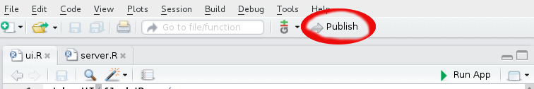

# Stat 545 shiny tutorial using Gapminder data
Julia Gustavsen  
2014-11-17  

# Getting your system ready

## Update Rstudio and R. 

To get started make sure you have the most up to date RStudio version (menu "Help" -> "Check for Updates") and R. 

##Installing Shiny and shinyapps

Then go ahead and install Shiny:

```
install.packages("shiny")
```

We will use another package to deploy our app to the web called `shinyapps`. Please install the most up to date version. 

```
library(devtools)
install_github("rstudio/shinyapps")
```

# ui.R and server.R files

Shiny makes it very easy to write your own app, but to keep things simple it does have some requirements for it to run.

To get started, within your Stat 547 course folder create a folder entitled: "Shiny-apps" and within that folder create a directory entitled "Gapminder-app". You can do this either from your terminal window or using your graphical directory to create these folder. Each Shiny app gets its own folder. [Skip here if you want to use Rstudio to help you set up your directory structure](#Rstudio_shiny_project)

Using the terminal (the "$" here represents your terminal prompt **NOT** your R console prompt) to make our folders:

```
$ mkdir Shiny-apps
$ cd Shiny-apps
$ mkdir Gapminder-app
$ cd Gapminder-app
```

Or use your RStudio files navigator to make these directories or in R:

```
dir.create("Shiny-apps")
dir.create("Shiny-app/Gapminder-app")
```

Your Stat-547 directory now probably looks something like this:

```
├───Stat-547
    ├───Amazing-homework
    ├───Brilliant-notes
    └───Shiny-apps
        └───Gapminder-app
```   

Shiny, in its most basic form, requires only 2 files: ui.R and server.R

Making sure we are in our "Gapminder-app" directory, create an empty R script entitled `ui.R` and an empty R script entitled `server.R`

```
├───Stat-547
    ├───Amazing-homework
    ├───Brilliant-notes
    └───Shiny-apps
        └───Gapminder-app
            ├───ui.R
            └───server.R
```

Your `ui.R` creates your **u**ser **i**nterface for your Shiny app. This is the part that controls the layout, the way you can insert images and where you specify how the user can interact with your app. 
Your `server.R` file serves up your data, reacts to the user input and contains the overall data processing "guts."

<a name="Rstudio_shiny_project"></a>

###  Using Rstudio to set up  a Shiny directory structure

In RStudio File menu choose: New Project > New Directory > Shiny Web Application. Choose to make a new directory in your Stat545 directory (which is under version control). This series of commands will set up a Shiny app that is based on `faithful` data set. 

# Deployment

When you are ready to show you app to the world you can deploy it to the web. What are your options?

## Stat UBC Shiny Pro server

* some students will use Jenny's server
* volunteers? Jenny will update

## Run apps from public Github repositories.

* `runGitHub()` is a way to run an app from github using Rstudio. 
* to use this push your server.R and ui.R files to a public github repo (in their own folder, remember Shiny is particular). `runGitHub()` takes a few arguments, if I had a public repo in the Stat545 organization called "julia_gustavsen_shiny" and I had pushed my Gapminder app `server.R` and `ui.R` (and any other necessary files) to that repo, we could run my app using `runGitHub("STAT545-UBC/julia_gustavsen_shiny",subdir = "Shiny-apps/Gapminder-app/"). The subdirectory argument refers to the subdirectory in the repository. 

## Deploy your app to www.shinyapps.io and send url to users

* From either your `server.R` or `ui.R` app click on the "Publish" button

* Follow the directions from the website which will basically be:
    * `library(devtools)`
    * ` devtools::install_github("rstudio/shinyapps")`
    * sign up for an account (I used my Github id to login)on [shinyapps.io](http://shinyapps.io)
    * choose your shinyapps.io username. It does not have to be the same as your login. 
    * under "Settings" choose "token"
    * let Rstudio know what your account is by running the token and secret code that the website gives you ( it will look something like this:  shinyapps::setAccountInfo(name='YourNameHere', token='GeneratedAlphaNumericCode', secret='YoursecretCodeHere')
    * then deploy your app from Rstudio `shinyapps::deployApp('Shiny-apps/Gapminder-app')` and it should deploy the app to a url under your account name (e.g. my gapminder app is here: https://jooolia.shinyapps.io/Gapminder-app/)
    
### Problems deploying:

  * if you get an error "bad signature" run `Sys.setlocale(locale="en_US.UTF-8")` on linux or mac and `Sys.setlocale(locale="English")` on Windows (thanks [Stack Overflow](http://stackoverflow.com/questions/20943687/shinyapps-setaccountinfo-error)) and then try setting your account info and then deploying the app again. 
  * If the deployment does not work from the console prompt try clicking into your `server.R` or `uir.R` script and then try deployment using the "Publish" button. 
  * If your publish button does not appear, run ` devtools::install_github("rstudio/shinyapps")` and then restart RStudio. 

