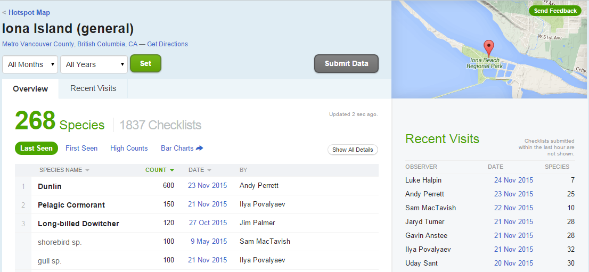

# Stat 545 getting data from the Web
Andrew MacDonald  
2015-11-24  


```r
library(dplyr)
library(knitr)
# library(devtools)
```


# Introduction

**All this and more is described at the [rOpenSci repository of R tools for interacting with the internet]( https://github.com/ropensci/webservices)**

There are many ways to obtain data from the Internet; let's consider four categories:

* *click-and-download* on the internet as a "flat" file, such as .csv, .xls
* *install-and-play* an API for which someone has written a handy R package
* *API-query* published with an unwrapped API
* *Scraping* implicit in an html website

# Click-and-Download

In the simplest case, the data you need is already on the internet in a tabular format. There are a couple of strategies here:

* use `read.csv` or `readr::read_csv` to read the data straight into R.

* use the command line program `curl` to do that work, and place it in a Makefile or shell script (see the Make lesson for how to do that).

The second case is most useful when the data you want has been provided in a format that needs cleanup. For example, the World Value Survey makes several datasets available as Excel sheets. The safest option here is to download the `.xls` file, then read it into R with `readxl::read_excel()` or something similar. An exception to this is data provided as Google Spreadsheets, which can be read straight into R using the [`googlesheets`](https://github.com/jennybc/googlesheets) package.

### from ropensci web services page:

* `downloader::download()` for SSL
* `curl::curl()` for SSL.
* `httr::GET` data read this way needs to be parsed later with read.table
* `rio::import()` can "read a number of common data formats directly from an https:// URL".  Isn't that very similar to the previous?


What about packages that install data?

# Data supplied on the web

Many times, the data that you want is not already organized into one or a few tables that you can read directly into R. More frequently, you find this data is given in the form of an API. **A**pplication **P**rogramming **I**nterfaces (APIs) are descriptions of the kind of requests that can be made of a certain piece of software, and descriptions of the kind of answers that are returned. Many sources of data -- databases, websites, services -- have made all (or part) of their data available via APIs over the internet. Computer programs ("clients") can make requests of the server, and the server will respond by sending data (or an error message). This client can be many kinds of other programs or websites, including R running from your laptop.

# install-and-play 

Many common web services and APIs have been "wrapped", i.e. R functions have been written around them which send your query to the server and format the response.

Why do we want this?

* provenance
* reproducible
* updating
* ease
* scaling

## Sightings of birds: `rebird`

[`rebird`](https://github.com/ropensci/rebird) is an R interface for the [ebird](http://ebird.org/content/ebird/) database. e-Bird lets birders upload sightings of birds, and allows everyone access to those data.

`rebird` is on CRAN.

```r
install.packages("rebird")
```


```r
library(rebird)
```

### Search birds by geography

the ebird website categorizes some popular locations as "Hotspots". These are areas where there are both lots of birds and lots of birders. Once such location is at Iona Island, near Vancouver. You can see data for this site at [http://ebird.org/ebird/hotspot/L261851](http://ebird.org/ebird/hotspot/L261851)

At that link, you can see a page like this:



The data already look to be organized in a data frame! `rebird` allows us to read these data directly into R. (The ID code for Iona Island is **"L261851**)


```r
ebirdhotspot(locID = "L261851") %>%
  head() %>%
  kable()
```

```
## Warning: `rbind_all()` is deprecated. Please use `bind_rows()` instead.
```


obsDt                     lng  locName                 obsValid   comName             obsReviewed   sciName              locationPrivate    howMany        lat  locID   
-----------------  ----------  ----------------------  ---------  ------------------  ------------  -------------------  ----------------  --------  ---------  --------
2015-11-24 11:41    -123.2111  Iona Island (general)   TRUE       Snow Goose          FALSE         Chen caerulescens    FALSE                   40   49.22133  L261851 
2015-11-24 11:41    -123.2111  Iona Island (general)   TRUE       Gadwall             FALSE         Anas strepera        FALSE                   10   49.22133  L261851 
2015-11-24 11:41    -123.2111  Iona Island (general)   TRUE       American Wigeon     FALSE         Anas americana       FALSE                   25   49.22133  L261851 
2015-11-24 11:41    -123.2111  Iona Island (general)   TRUE       Mallard             FALSE         Anas platyrhynchos   FALSE                   NA   49.22133  L261851 
2015-11-24 11:41    -123.2111  Iona Island (general)   TRUE       Northern Pintail    FALSE         Anas acuta           FALSE                   35   49.22133  L261851 
2015-11-24 11:41    -123.2111  Iona Island (general)   TRUE       Green-winged Teal   FALSE         Anas crecca          FALSE                   80   49.22133  L261851 


We can use the function `ebirdgeo` to get a list for an area. (Note that South and West are negative):

```r
vanbirds <- ebirdgeo(lat = 49.2500, lng = -123.1000)
```

```
## Warning: `rbind_all()` is deprecated. Please use `bind_rows()` instead.
```

```r
vanbirds %>%
  head %>%
	kable
```


obsDt                     lng  locName                   obsValid   comName             obsReviewed   sciName             locationPrivate    howMany        lat  locID   
-----------------  ----------  ------------------------  ---------  ------------------  ------------  ------------------  ----------------  --------  ---------  --------
2015-11-25 15:30    -123.1754  Sea Island--Ferguson Rd   TRUE       Song Sparrow        FALSE         Melospiza melodia   FALSE                    1   49.20665  L363627 
2015-11-25 15:30    -123.1754  Sea Island--Ferguson Rd   TRUE       European Starling   FALSE         Sturnus vulgaris    FALSE                    5   49.20665  L363627 
2015-11-25 15:30    -123.1754  Sea Island--Ferguson Rd   TRUE       Northwestern Crow   FALSE         Corvus caurinus     FALSE                    2   49.20665  L363627 
2015-11-25 15:30    -123.1754  Sea Island--Ferguson Rd   TRUE       Short-eared Owl     FALSE         Asio flammeus       FALSE                    2   49.20665  L363627 
2015-11-25 15:30    -123.1754  Sea Island--Ferguson Rd   TRUE       Northern Harrier    FALSE         Circus cyaneus      FALSE                    1   49.20665  L363627 
2015-11-25 15:30    -123.1754  Sea Island--Ferguson Rd   TRUE       Spotted Towhee      FALSE         Pipilo maculatus    FALSE                    2   49.20665  L363627 
**Note**: Check the defaults on this function. e.g. radius of circle, time of year.

We can also search by "region", which refers to short codes which serve as common shorthands for different political units. For example, France is represented by the letters **FR**

```r
frenchbirds <- ebirdregion("FR")

frenchbirds %>%
  head() %>%
  kable()
```


Find out *WHEN* a bird has been seen in a certain place! Choosing a name from `vanbirds` above (the Bald Eagle):


```r
eagle <- ebirdgeo(species = 'Haliaeetus leucocephalus', lat = 42, lng = -76)

eagle %>%
  head() %>%
  kable()
```

`rebird` **knows where you are**:

```r
ebirdgeo(species = 'Buteo lagopus')
```


## Searching geographic info: `geonames`

```r
# install.packages(geonames)
library(geonames)
```

There are two things we need to do to be able to use this package to access the geonames API

1. go to [the geonames site](www.geonames.org/login/) and register an account. 
2. click [here to enable the free web service](http://www.geonames.org/enablefreewebservice)
3. Tell R your geonames username. You could run the line

```` 

in R. However this is insecure. We don't want to risk committing this line and pushing it to our public github page! Instead, you should create a file in the same place as your `.Rproj` file. Name this file `.Rprofile`, and add 

```` 

To that file. 
**Important**: Make sure your `.Rprofile` ends with a blank line!

## using Geonames

What can we do? get access to lots of geographical information via the various "web services" see [here](http://www.geonames.org/export/ws-overview.html)


```r
countryInfo <- GNcountryInfo()
```


```r
countryInfo %>%
	head %>%
	kable
```


continent   capital            languages           geonameId   south              isoAlpha3   north              fipsCode   population   east               isoNumeric   areaInSqKm   countryCode   west               countryName                       continentName   currencyCode 
----------  -----------------  ------------------  ----------  -----------------  ----------  -----------------  ---------  -----------  -----------------  -----------  -----------  ------------  -----------------  --------------------------------  --------------  -------------
EU          Andorra la Vella   ca                  3041565     42.4284925987684   AND         42.6560438963      AN         84000        1.78654277783198   020          468.0        AD            1.40718671411128   Principality of Andorra           Europe          EUR          
AS          Abu Dhabi          ar-AE,fa,en,hi,ur   290557      22.6333293914795   ARE         26.0841598510742   AE         4975593      56.3816604614258   784          82880.0      AE            51.5833282470703   United Arab Emirates              Asia            AED          
AS          Kabul              fa-AF,ps,uz-AF,tk   1149361     29.377472          AFG         38.483418          AF         29121286     74.879448          004          647500.0     AF            60.478443          Islamic Republic of Afghanistan   Asia            AFN          
NA          Saint John’s       en-AG               3576396     16.996979          ATG         17.729387          AC         86754        -61.672421         028          443.0        AG            -61.906425         Antigua and Barbuda               North America   XCD          
NA          The Valley         en-AI               3573511     18.166815          AIA         18.283424          AV         13254        -62.971359         660          102.0        AI            -63.172901         Anguilla                          North America   XCD          
EU          Tirana             sq,el               783754      39.648361          ALB         42.665611          AL         2986952      21.068472          008          28748.0      AL            19.293972          Republic of Albania               Europe          ALL          

This country info dataset is very helpful for accessing the rest of the data, because it gives us the standardized codes for country and language.  

### remixing `geonames` and `rebird`:
What are the cities of France?

```r
francedata <- countryInfo %>%
	filter(countryName == "France")
```


```r
frenchcities <-	with(francedata,
			 GNcities(north = north, east = east, south = south,
			 				 west = west, maxRows = 500))
frenchcities %>% 
  head %>% 
  kable
```


lng                 geonameId   countrycode   name           fclName             toponymName    fcodeName                       wikipedia                                     lat                fcl   population   fcode 
------------------  ----------  ------------  -------------  ------------------  -------------  ------------------------------  --------------------------------------------  -----------------  ----  -----------  ------
2.3488              2988507     FR            Paris          city, village,...   Paris          capital of a political entity   en.wikipedia.org/wiki/Paris                   48.85341           P     2138551      PPLC  
4.34878349304199    2800866     BE            Brussels       city, village,...   Brussels       capital of a political entity   en.wikipedia.org/wiki/City_of_Brussels        50.8504450552593   P     1019022      PPLC  
7.44744300842285    2661552     CH            Bern           city, village,...   Bern           capital of a political entity   en.wikipedia.org/wiki/Bern                    46.9480943365053   P     121631       PPLC  
6.13                2960316     LU            Luxembourg     city, village,...   Luxembourg     capital of a political entity   en.wikipedia.org/wiki/Luxembourg_%28city%29   49.6116667         P     76684        PPLC  
7.4166667           2993458     MC            Monaco         city, village,...   Monaco         capital of a political entity   en.wikipedia.org/wiki/Monaco                  43.7333333         P     32965        PPLC  
-2.10491180419922   3042091     JE            Saint Helier   city, village,...   Saint Helier   capital of a political entity   en.wikipedia.org/wiki/Saint_Helier            49.1880427659223   P     28000        PPLC  


### Wikipedia searching 

We can use geonames to search for georeferenced Wikipedia articles. Here are those within 20 Km of Rio de Janerio, comparing results for English-language Wikipedia (`lang = "en"`) and Portuguese-language Wikipedia (`lang = "pt"`):

```r
rio_english <- GNfindNearbyWikipedia(lat = -22.9083, lng = -43.1964,
																		 radius = 20, lang = "en", maxRows = 500)
rio_portuguese <- GNfindNearbyWikipedia(lat = -22.9083, lng = -43.1964,
																				radius = 20, lang = "pt", maxRows = 500)
```


```r
nrow(rio_english)
```

```
## [1] 305
```

```r
nrow(rio_portuguese)
```

```
## [1] 349
```


## Searching the Public Library of Science: `rplos`
PLOS ONE is an open-access journal. They allow access to an impressive range of search tools, and allow you to obtain the full text of their articles. 


```r
install.packages("rplos")
## Do this only once:
```


```r
library(rplos)
```

```
## Loading required package: ggplot2
```
Immediately we get a message. It's a link to the [tutorial on the Ropensci website!](http://ropensci.org/tutorials/rplos_tutorial.html). How nice :)

* We also get instructions to [create a PLOS account](https://register.plos.org/ambra-registration/register.action)
* Then go to Article Level Metrics http://alm.plos.org/
* click on your name to find your key.


```r
Sys.setenv(PlosApiKey = "Paste your Key in here!!")
key <-  Sys.getenv("PlosApiKey")
```


### alternate strategy for keeping keys: `.Rprofile`
**Remember to protect your key! it is important for your privacy. You know, like a key**
* Now we follow the ROpenSci [tutorial on API keys](https://github.com/ropensci/rOpenSci/wiki/Installation-and-use-of-API-keys)
* ___Add `.Rprofile` to your `.gitignore` !!___
* Make a `.Rprofile` file [windows tips](http://cran.r-project.org/bin/windows/rw-FAQ.html#What-are-HOME-and-working-directories_003f) [mac tips](http://cran.r-project.org/bin/macosx/RMacOSX-FAQ.html#The-R-Console)
* Write the following in it:


```r
options(PlosApiKey = "YOUR_KEY")
```

* restart R (e.g. reopen your Rstudio project)

This code adds another element to the list of options, which you can see by calling `options()`. Part of the work done by `rplos::searchplos()` and friends is to go and obtain the value of this option with the function `getOption("PlosApiKey")`.  This indicates two things: 
  1. Spelling is important when you set the option in your `.Rprofile`
  2. you can do a similar process for an arbitrary package or key. For example:


```r
## in .Rprofile
options("this_is_my_key" = XXXX)

## later, in the R script:
key <- getOption("this_is_my_key")
```

This is a simple means to keep your keys private, especially if you are sharing the same authentication across several projects.

### A few timely reminders about your .Rprofile

```r
print("This is Andrew's Rprofile and you can't have it!")
options(PlosApiKey = "XXXXXXXXX")
```

* Note that it must end with a blank line!
* It lives in the project's working directory, i.e. the location of your `.Rproj`
* It must be gitignored

Remember that using `.Rprofile` makes your code un-reproducible.  In this case, that is exactly what we want!  

## Searching PLOS
Let's do some searches:

```r
searchplos(q= "Helianthus", fl= "id", limit = 5)
```


```r
searchplos("materials_and_methods:France",
					 fl = "title, materials_and_methods", key = key)
lat <- searchplos("materials_and_methods:study site",
									fl = "title, materials_and_methods", key = key)
aff <- searchplos("*:*", fl = "title, author_affiliate", key = key)
aff$author_affiliate[[2]]
searchplos("*:*", fl = "id", key = key)
```

here is a list of [options for the search](http://api.plos.org/solr/search-fields/) or can do `data(plosfields); plosfields`

### take a highbrow look!


```r
out <- highplos(q='alcohol', hl.fl = 'abstract', rows=10, , key = key)
highbrow(out)
```

## plots over time

```r
plot_throughtime(terms = "phylogeny", limit = 200, key = key)
```

## is it a boy or a girl? `gender` throughout US history

The gender package allows you access to American data on the gender of names. Because names change gender over the years, the probability of a name belonging to a man or a woman also depends on the *year*:


```r
library(gender)
gender("Kelsey")
gender("Kelsey", years = 1940)
```


