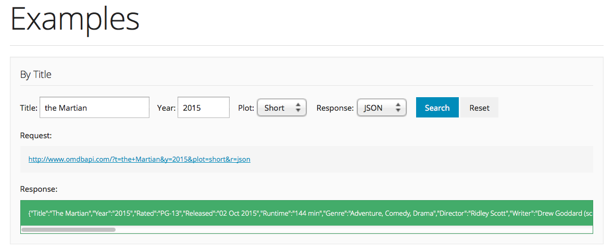
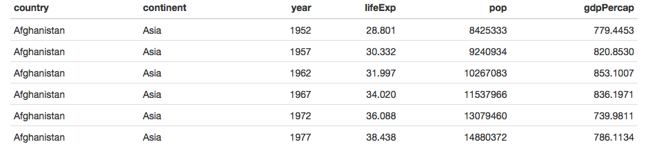

```{r message=FALSE, warning=FALSE}
library(knitr)
library(curl)
library(jsonlite)
library(XML)
library(httr)
library(rvest)
library(magrittr)
library(dplyr)
library(tidyr)
library(countrycode)
```


## Interacting with an API

On Monday we experimented with several packages that "wrapped" APIs.  That is, they handled the creation of the request and the formatting of the output. Today we're going to look at (part of) what these functions were doing.

First we're going to examine the structure of API requests via the  [Open Movie Database](http://www.omdbapi.com/). OMDb is very similar to IMDB, except it has a nice, simple API. We can go to the website, input some search parameters, and obtain both the XML query and the response from it. 

**EXERCISE** determine the shape of an API request:

You can play around with the parameters on the OMDB website, and look at the resulting API call and the query you get back:



Let's experiment with different values of the `title` and `year` fields. Notice the pattern in the request. For example for Title = Interstellar and Year = 2014, we get:

```http
http://www.omdbapi.com/?t=Interstellar&y=2014&plot=short&r=xml
```

Try pasting this link into the browser.  Also experiment with `json` and `xml`

How can we create this request in R?

```{r}
request <- paste0("http://www.omdbapi.com/?t=", "Interstellar", "&", "y=", "2014", "&", "plot=", "short", "&", "r=", "xml")
request
```

It works, but it's a bit ungainly.  Lets try to abstract that into a function:

```{r}
omdb <- function(Title, Year, Plot, Format){
  baseurl <- "http://www.omdbapi.com/?"
  params <- c("t=", "y=", "plot=", "r=")
  values <- c(Title, Year, Plot, Format)
  param_values <- Map(paste0, params, values)
  args <- paste0(param_values, collapse = "&")
  paste0(baseurl, args)
}

omdb("Interstellar", "2014", "short", "xml")
```

Now we have a handy function that returns the API query. We can paste in the link, but we can also obtain data from within R:

```{r}
request_interstellar <- omdb("Interstellar", "2014", "short", "xml")
con <-  curl(request_interstellar)
answer_xml <- readLines(con)
close(con)
answer_xml
```

```{r warning=FALSE}
request_interstellar <- omdb("Interstellar", "2014", "short", "json")
con <-  curl(request_interstellar)
answer_json <- readLines(con)
close(con)
answer_json %>% 
  prettify
```

We have a form of data that is obviously structured. What is it?

## intro to JSON and XML

These are the two common languages of web services: **J**ava**S**cript **O**bject **N**otation and e**X**tensible **M**arkup **L**anguage. 

Here's an example of JSON: from [this wonderful site](https://zapier.com/learn/apis/chapter-3-data-formats/)

```javascript
{
  "crust": "original",
  "toppings": ["cheese", "pepperoni", "garlic"],
  "status": "cooking",
  "customer": {
    "name": "Brian",
    "phone": "573-111-1111"
  }
}
```
And here is XML:

```XML
<order>
    <crust>original</crust>
    <toppings>
        <topping>cheese</topping>
        <topping>pepperoni</topping>
        <topping>garlic</topping>
    </toppings>
    <status>cooking</status>
</order>
```

You can see that both of these data structures are quite easy to read. They are "self-describing". In other words, they tell you how they are meant to be read.

There are easy means of taking these data types and creating R objects. Our JSON response above can be parsed using `jsonlite::fromJSON()`:

```{r}
answer_json %>% 
  fromJSON()
```

The output is a named list! A familiar and friendly R structure. Because data frames are lists, and because this list has no nested lists-within-lists, we can coerce it very simply:

```{r results='asis'}
answer_json %>% 
  fromJSON() %>% 
  as.data.frame() %>% 
  kable()
```

A similar process exists for XML formats:

```{r}

ans_xml_parsed <- xmlParse(answer_xml)
ans_xml_parsed
```
Not exactly the response we were hoping for! This shows us some of the XML document's structure: 

  * a `<root>` node with a single child, `<movie>`. 
  * the information we want is all stored as attributes

From Nolan and Lang 2014:

> The `xmlRoot()` function returns an object of class `XMLInternalElementNode`. This is a regular
XML node and not specific to the root node, i.e., all XML nodes will appear in R with this class
or a more specific class. An object of class XMLInternalElementNode has four fields: name,
attributes, children and value, which we access with the methods xmlName(), xmlAttrs(), xmlChildren(), and xmlValue()

| field | method |
|:-----:|:------:|
| name  | `xmlName()` |
| attributes | `xmlAttrs()` |
| children  | `xmlChildren()` |
| value    | `xmlValue()`


```{r}
ans_xml_parsed_root <- xmlRoot(ans_xml_parsed)[["movie"]]  # could also use [[1]]
ans_xml_parsed_root
ans_xml_attrs <- xmlAttrs(ans_xml_parsed_root)
ans_xml_attrs
```

```{r results='asis'}
kable(data.frame(t(ans_xml_attrs)))
```

## Introducing the Easy Way: `httr`

`httr` is yet another star in the hadleyverse, this one designed to facilitate all things HTTP from within R.  This includes the major HTTP verbs, which are:

    * __GET__: fetch an existing resource. The URL contains all the necessary information the server needs to locate and return the resource.
    * __POST__: create a new resource. POST requests usually carry a payload that specifies the data for the new resource.
    * __PUT__: update an existing resource. The payload may contain the updated data for the resource.
    * __DELETE__: delete an existing resource.
[Source: HTTP made really easy](http://www.jmarshall.com/easy/http/)

HTTP is the foundation for APIs; understanding how it works is the key to interacting with all the diverse APIs out there. An excellent beginning resource for APIs (including HTTP basics) is [this simple guide](https://zapier.com/learn/apis/)

`httr` also facilitates a variety of ___authentication___ protocols.

`httr` contains one function for every HTTP verb. The functions have the same names as the verbs (e.g. `GET()`, `POST()`).  They have more informative outputs than simply using `curl`, and come with some nice convenience functions for working with the output:
```{r}
interstellar_json <- omdb("Interstellar", "2014", "short", "json")
response_json <- GET(interstellar_json)
content(response_json, as = "parsed", type = "application/json")
```

```{r}
interstellar_xml <- omdb("Interstellar", "2014", "short", "xml")
response_xml <- GET(interstellar_xml)
content(response_xml, as = "parsed")
```

In addition, `httr` gives us access to lots of useful information about the quality of our response. For example, the header:

```{r}
headers(response_xml)
```

And also a handy means to extract specifically the HTTP status code:

```{r}
status_code(response_xml)
```

In fact, we didn't need to create `omdb()` at all! httr provides a straightforward means of making an http request:

```{r}
the_martian <- GET("http://www.omdbapi.com/?", query = list(t = "The Martian", y = 2015, plot = "short", r = "json"))

content(the_martian)
```

We get the same answer as before! With `httr`, we are able to pass in the named arguments to the API call as a named list. We are also able to use spaces in movie names; `httr` encodes these in the URL before making the GET request  

It is very good to [learn your http status codes](https://www.flickr.com/photos/girliemac/sets/72157628409467125).  
The documentation for `httr` includes a vignette of "best practices for writing an API package", which is useful for when you want to bring your favourite web resource into the world of R!

## Scraping

What if data is present on a website, but isn't provided in an API at all? It is possible to grab that information too.  How easy that is to do depends a lot on the quality of the website that we are using.

HTML is a structured way of displaying information. It is very similar in structure to XML (in fact many modern html sites are actually XHTML5, [which is also valid XML](http://www.w3.org/TR/html5/the-xhtml-syntax.html))


Two pieces of equipment

* `rvest`: `devtools::install_github("hadley/rvest")`
* SelectorGadget: [Install in your browser](http://selectorgadget.com/)

Before we go any further, [let's play a game together!](http://flukeout.github.io)

### Obtain a table

Let's make a simple HTML table and then parse it! 

* make a new, empty project
* make a totally empty .Rmd file called `"GapminderHead.Rmd"`
* copy this into the body:
```r
---
output: html_document
---

```{r echo=FALSE, results='asis'} #delete this comment
library(gapminder)
knitr::kable(head(gapminder))
```
```
**remember to delete the comment**

Then knit the document and click "View in Browser". It should look like this:


We have created a simple html table with the head of gapminder in it! We can get our data back by parsing this table into a dataframe again. Extracting data from html is called "scraping", and it is done with the R package `rvest`:

```{r eval=FALSE}
read_html("GapminderHead.html") %>%
  html_table
```

## scraping via CSS selectors

Let's practice scraping websites using our newfound abilities! Here is a table of research [publications by country](http://www.scimagojr.com/countryrank.php)


We can try to get this data directly into R:

```{r}
research <- read_html("http://www.scimagojr.com/countryrank.php") %>% 
  html_table(fill = TRUE)
```

If you look at the structure of `research` (e.g. with `str(research)`) you'll see that we've obtained a list of data.frames. The top of the page contains another table element. This was also scraped! 
Can we be more specific about what we obtain from this page? We can, by highlighting that table with css selectors:

```{r}

research <- read_html("http://www.scimagojr.com/countryrank.php") %>% 
  html_node(".tabla_datos") %>%
	html_table()

research %>% 
  head() %>% 
  kable()
```


### Random observations on scraping

* make sure you've obtained ONLY what you want! scroll over the whole page to ensure that selectorgadget hasn't found too many things
* if you are having trouble parsing, try selecting a smaller subset of the thing you are seeking (ie being more precise)

**MOST IMPORTANT** confirm that there is NO RopenSci package and NO API before you [spend hours scraping](https://rpubs.com/aammd/kivascrape) (the [API was right here](http://build.kiva.org/))

## Extras

## Airports

First go to this website about [Airports](https://www.developer.aero/Airport-API). Follow the link to get your API key (you will need to click a confirmation email)

All the airports of the planet:

```url
https://airport.api.aero/airport/?user_key={yourkey}
```
```
https://airport.api.aero/airport/match/toronto?user_key={yourkey}
```
```
https://airport.api.aero/airport/distance/YVR/LAX?user_key={yourkey}
```

Do you need just the US airports? this API does that [and is free](http://services.faa.gov/docs/services/airport/)

And even simpler API queries very simple data about the airports of the world:

```r
fromJSON(file = "http://airportcode.riobard.com/search?q=Toronto&fmt=JSON")
```

```r
fromJSON(file = "http://airportcode.riobard.com/airport/YVR?fmt=json")
```

perfectly possible to combine these into a handy `data.frame`. One way might be:

```{r, eval=FALSE }
tdot_data <- fromJSON("http://airportcode.riobard.com/search?q=Toronto&fmt=JSON")
```


